# Nacos 整体架构概览

> 本文件是理解 Nacos 源码的**第一步**，建议在阅读任何具体模块前先通读本文。  
> 对应源码版本：Nacos 2.x | 阅读导航：[00-reading-guide.md](./00-reading-guide.md)

---

## 目录

1. [整体架构分层](#1-整体架构分层)
2. [核心模块依赖关系](#2-核心模块依赖关系)
3. [全链路请求追踪](#3-全链路请求追踪)
   - 3.1 [服务实例注册全链路](#31-服务实例注册全链路)
   - 3.2 [服务订阅与推送全链路](#32-服务订阅与推送全链路)
   - 3.3 [配置发布全链路](#33-配置发布全链路)
4. [各模块职责边界](#4-各模块职责边界)
5. [关键设计决策](#5-关键设计决策)
6. [2.x vs 1.x 核心差异](#6-2x-vs-1x-核心差异)

---

## 1. 整体架构分层

Nacos 2.x 整体分为 **四层**：

```
┌─────────────────────────────────────────────────────────────────┐
│                        客户端 SDK 层                              │
│  NacosNamingService  │  NacosConfigService  │  NacosFactory      │
├─────────────────────────────────────────────────────────────────┤
│                        通信协议层                                  │
│  gRPC（2.x 主协议）  │  HTTP（1.x 兼容）  │  能力协商机制          │
├─────────────────────────────────────────────────────────────────┤
│                        服务端核心层                                │
│  注册中心（Naming）  │  配置中心（Config）  │  集群管理（Cluster）  │
├─────────────────────────────────────────────────────────────────┤
│                        基础设施层                                  │
│  一致性协议（JRaft/Distro）│ 存储（Derby/MySQL）│ 流量控制（TPS）  │
└─────────────────────────────────────────────────────────────────┘
```

### 端口规划

| 端口 | 协议 | 用途 | 对应类 |
|------|------|------|--------|
| `8848` | HTTP | 控制台 + 1.x API | `NacosApplicationListener` |
| `9848` | gRPC | 客户端 SDK 连接 | `GrpcSdkServer` |
| `9849` | gRPC | 集群节点间通信 | `GrpcClusterServer` |

> **规律**：gRPC 端口 = HTTP 端口 + 偏移量（SDK +1000，集群 +1001）

---

## 2. 核心模块依赖关系

### 2.1 整体模块依赖图

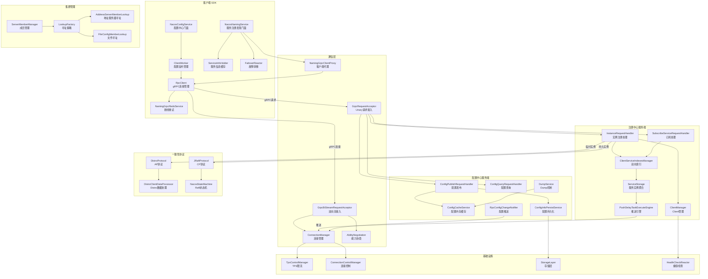

### 2.2 数据流向总览

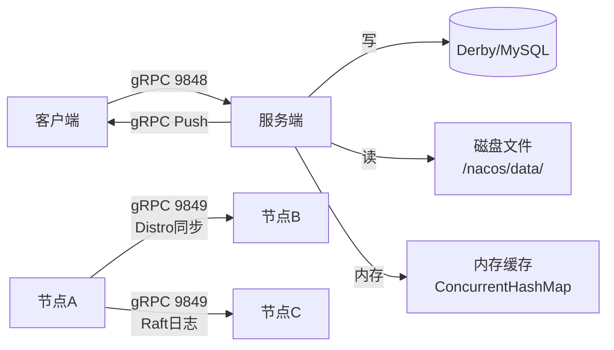

---

## 3. 全链路请求追踪

### 3.1 服务实例注册全链路

> 场景：Spring Boot 应用启动，向 Nacos 注册一个**临时实例**

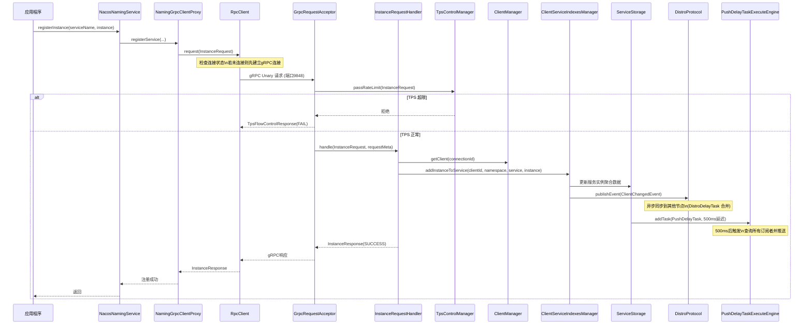

**关键路径说明：**

| 步骤 | 核心类 | 关键操作 |
|------|--------|---------|
| ① 客户端发起 | `NamingGrpcClientProxy` | 封装 `InstanceRequest`，调用 `RpcClient.request()` |
| ② TPS 检查 | `TpsControlRequestFilter` | 滑动窗口计数，超限返回 `TpsFlowControlResponse` |
| ③ 处理注册 | `InstanceRequestHandler` | 区分 `REGISTER`/`DEREGISTER` 操作类型 |
| ④ 更新索引 | `ClientServiceIndexesManager` | 维护 `clientId→services` 和 `service→clients` 双向 Map |
| ⑤ 触发推送 | `PushDelayTaskExecuteEngine` | 500ms 延迟合并，避免频繁推送 |
| ⑥ Distro 同步 | `DistroProtocol` | 异步同步到其他节点（AP 最终一致） |

---

### 3.2 服务订阅与推送全链路

> 场景：消费者订阅服务，服务提供者上线后消费者收到推送

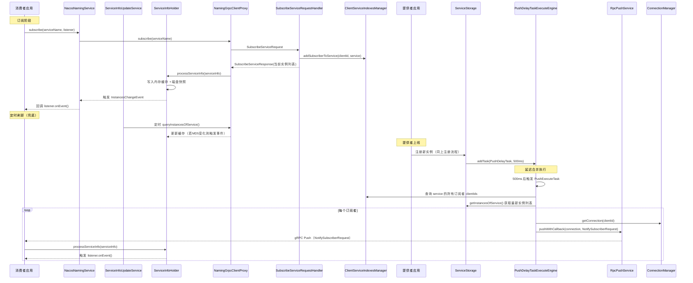

**推送失败重试机制：**

```
RpcPushService.pushWithCallback()
    ├── 第1次推送失败
    │   └── 延迟 1s 重试（最多3次）
    ├── 第2次推送失败
    │   └── 延迟 3s 重试
    └── 第3次推送失败
        └── 放弃，等待下次 ServiceInfoUpdateService 定时拉取兜底
```

---

### 3.3 配置发布全链路

> 场景：运维人员通过控制台修改配置，客户端实时感知变更

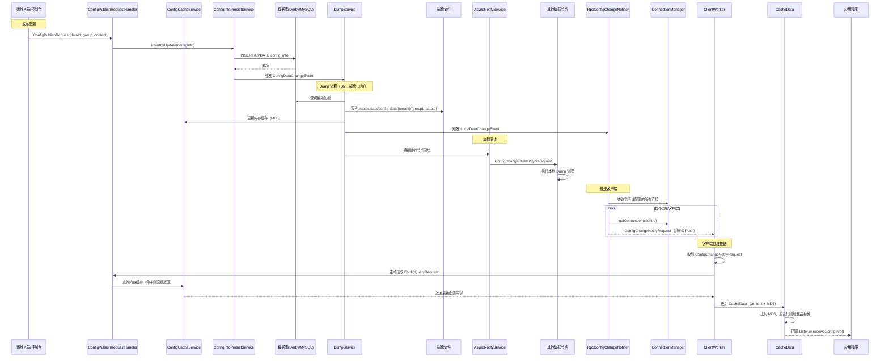

**三级查询策略（客户端查询配置）：**

```
NacosConfigService.getConfig()
    ├── 第1级：FailoverReactor（故障转移文件）
    │   └── 若 failover-mode 开关文件存在 → 直接读磁盘快照返回
    ├── 第2级：远程服务端（正常情况）
    │   └── ConfigQueryRequest → ConfigQueryRequestHandler
    │       ├── 优先读 ConfigCacheService 内存缓存
    │       └── 缓存未命中 → 读数据库
    └── 第3级：本地快照（服务端不可用时）
        └── 读 /nacos/data/config-data/ 磁盘文件
```

---

## 4. 各模块职责边界

### 4.1 客户端 SDK 模块

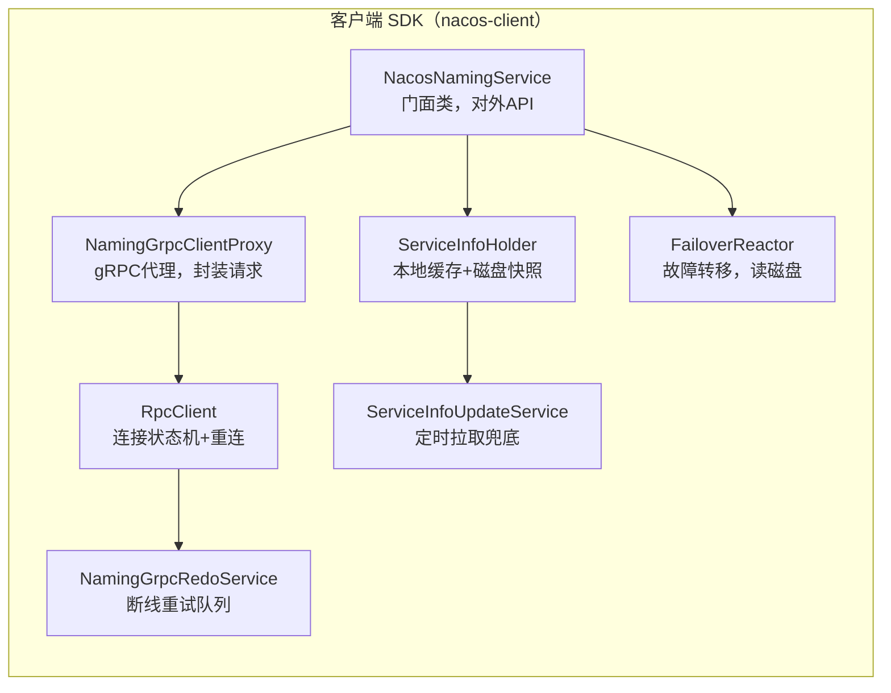

| 类 | 职责 | 边界 |
|----|------|------|
| `NacosNamingService` | 对外暴露 API（注册/注销/订阅/查询） | **不**直接操作网络，委托给 Proxy |
| `NamingGrpcClientProxy` | 封装 gRPC 请求，处理响应 | **不**管理连接生命周期，委托给 RpcClient |
| `RpcClient` | 管理 gRPC 连接（状态机：STARTING→RUNNING→UNHEALTHY→SHUTDOWN） | **不**关心业务逻辑，只负责连接 |
| `NamingGrpcRedoService` | 维护待重试操作队列（注册/订阅） | **只**在连接恢复时触发，不主动发起连接 |
| `ServiceInfoHolder` | 内存缓存 + 磁盘快照（`/nacos/naming/`） | **不**主动拉取，被动接收推送和定时刷新结果 |
| `FailoverReactor` | 读取故障转移磁盘文件，开关文件控制 | **只**在 failover 模式下生效，正常情况不介入 |

---

### 4.2 通信层模块

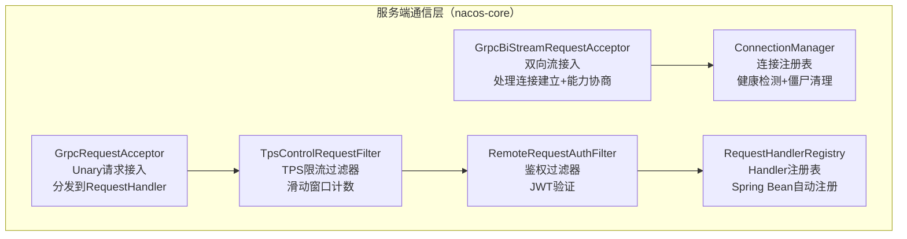

| 类 | 职责 | 边界 |
|----|------|------|
| `GrpcBiStreamRequestAcceptor` | 接受双向流，注册连接，处理能力协商 | **不**处理业务请求，只管连接生命周期 |
| `GrpcRequestAcceptor` | 接受 Unary 请求，经过过滤器链后分发 | **不**直接处理业务，委托给 RequestHandler |
| `ConnectionManager` | 维护 `connectionId→Connection` 注册表，定期检测僵尸连接 | **不**关心连接上的业务数据，只管连接本身 |
| `RequestHandlerRegistry` | Spring 启动时扫描所有 `RequestHandler` Bean 并注册 | **只**负责注册和查找，不执行处理逻辑 |
| `TpsControlRequestFilter` | 每个请求类型独立的 TPS 屏障（`NacosTpsBarrier`） | **只**做计数和限流，不修改请求内容 |

---

### 4.3 注册中心服务端模块

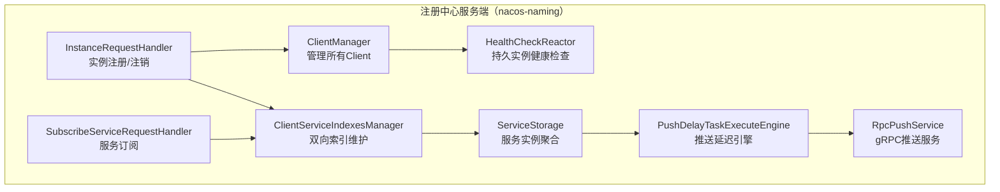

| 类 | 职责 | 边界 |
|----|------|------|
| `InstanceRequestHandler` | 处理注册/注销请求，区分临时/持久实例走不同路径 | **不**直接操作存储，委托给 `EphemeralClientOperationServiceImpl` |
| `ClientManager` | 管理 `clientId→Client` 映射，监听连接断开事件自动清理 | **不**关心 Client 内部的服务数据 |
| `ClientServiceIndexesManager` | 维护双向索引：`clientId→Set<Service>` 和 `Service→Set<clientId>` | **只**维护索引，不存储实例数据 |
| `ServiceStorage` | 聚合所有 Client 的实例数据，提供 `getInstancesOfService()` | **不**直接推送，发布事件触发推送引擎 |
| `PushDelayTaskExecuteEngine` | 500ms 延迟合并推送任务，避免频繁推送 | **不**直接发送 gRPC，委托给 `RpcPushService` |

---

### 4.4 配置中心服务端模块

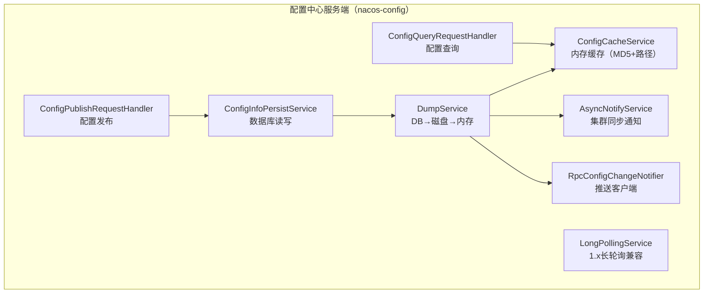

| 类 | 职责 | 边界 |
|----|------|------|
| `ConfigCacheService` | 内存缓存（`groupKey→MD5+文件路径`），提供快速查询 | **不**直接读数据库，只读内存和磁盘文件 |
| `ConfigInfoPersistService` | 数据库 CRUD，支持 Derby（嵌入式）和 MySQL | **不**更新内存缓存，写完 DB 后触发 Dump |
| `DumpService` | 启动时全量 Dump，运行时增量 Dump（DB→磁盘→内存） | **不**直接推送客户端，发布 `LocalDataChangeEvent` |
| `AsyncNotifyService` | 异步通知集群其他节点执行 Dump | **只**负责集群内同步，不推送客户端 |
| `RpcConfigChangeNotifier` | 监听 `LocalDataChangeEvent`，推送给监听该配置的客户端 | **只**发送通知（`ConfigChangeNotifyRequest`），不发送配置内容 |

---

### 4.5 一致性协议模块

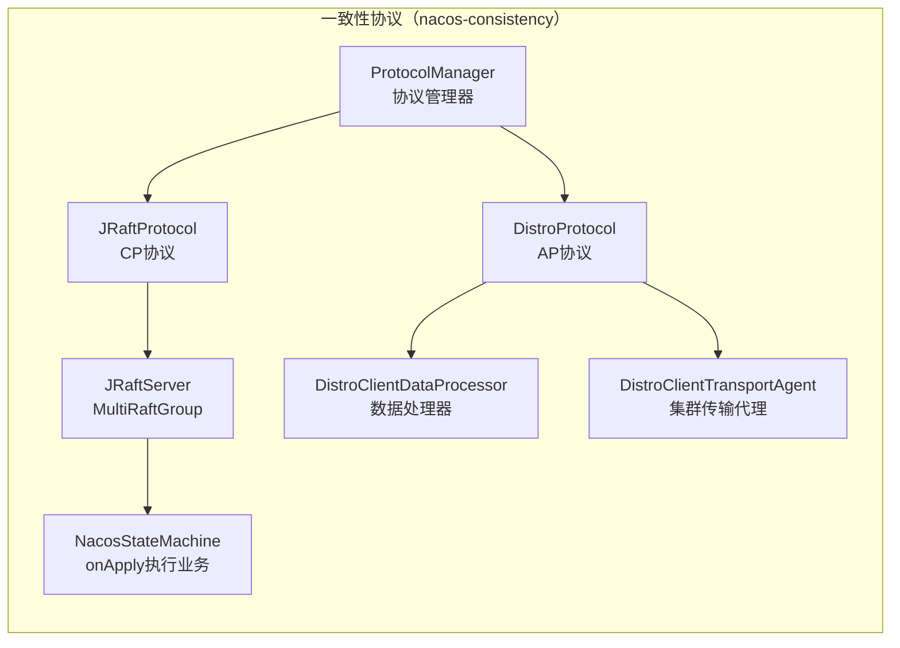

| 类 | 职责 | 边界 |
|----|------|------|
| `ProtocolManager` | 统一管理 JRaft 和 Distro 两种协议 | **不**直接处理数据，委托给具体协议实现 |
| `JRaftProtocol` | CP 协议，用于**持久实例**和**配置数据** | **只**处理需要强一致性的数据 |
| `DistroProtocol` | AP 协议，用于**临时实例**数据 | **只**处理临时实例，允许短暂不一致 |
| `NacosStateMachine` | Raft 日志应用，`onApply()` 执行实际业务操作 | **不**直接操作网络，通过 `RequestHandler` 执行 |
| `DistroClientDataProcessor` | 处理 Distro 数据的序列化/反序列化和同步 | **只**处理 Client 维度的数据（临时实例） |

---

### 4.6 集群管理模块

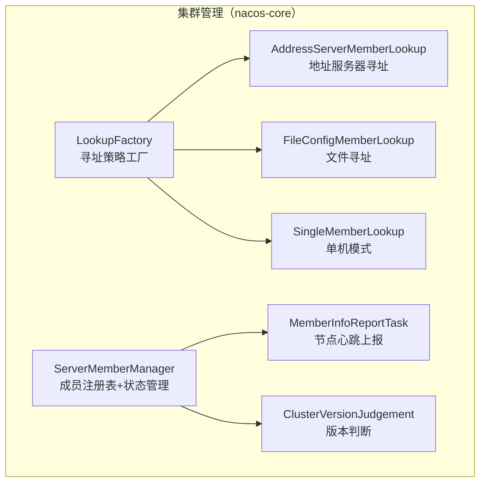

| 类 | 职责 | 边界 |
|----|------|------|
| `ServerMemberManager` | 维护集群成员列表，管理节点状态（UP/SUSPICIOUS/DOWN） | **不**直接发现节点，委托给 `MemberLookup` |
| `LookupFactory` | 根据配置选择寻址策略（SPI 扩展点） | **只**负责创建策略，不执行寻址 |
| `AddressServerMemberLookup` | 定期从地址服务器拉取成员列表（生产环境推荐） | **只**负责发现，不管理节点状态 |
| `FileConfigMemberLookup` | 监听 `cluster.conf` 文件变化（inotify 热更新） | **只**负责发现，不管理节点状态 |
| `ClusterVersionJudgement` | 判断集群是否全部升级到 2.x，控制兼容性开关 | **只**做版本判断，不执行升级操作 |

---

## 5. 关键设计决策

### 5.1 为什么同时使用 JRaft（CP）和 Distro（AP）？

```
临时实例（Ephemeral）
  ├── 特点：随客户端连接存在，连接断开自动删除
  ├── 一致性要求：最终一致即可（允许短暂不一致）
  ├── 性能要求：高吞吐（大量服务频繁注册/注销）
  └── 选择：Distro（AP）✅

持久实例（Persistent）
  ├── 特点：独立于客户端连接，需要主动注销
  ├── 一致性要求：强一致（不能丢失）
  ├── 性能要求：相对较低（变更不频繁）
  └── 选择：JRaft（CP）✅

配置数据
  ├── 特点：全局共享，变更需要立即生效
  ├── 一致性要求：强一致（配置错误影响全局）
  └── 选择：JRaft（CP）✅
```

### 5.2 为什么 gRPC 推送后还需要定时拉取兜底？

```
gRPC 推送（主动）
  ├── 优点：实时性好（毫秒级）
  ├── 缺点：推送失败无法保证送达（网络抖动、客户端重启）
  └── 失败处理：最多重试3次，之后放弃

定时拉取（兜底）
  ├── ServiceInfoUpdateService：自适应间隔（6s~60s）
  ├── 触发条件：推送失败 或 定时到期
  └── 保证：即使推送全部失败，最终也能感知变更

两者配合 = 实时性 + 可靠性
```

### 5.3 为什么配置推送只发通知不发内容？

```
错误设计（假设）：推送时直接携带配置内容
  └── 问题：推送是异步的，客户端收到时内容可能已经再次变更
      → 客户端拿到的是"过时"的内容

正确设计（实际）：推送只发 ConfigChangeNotifyRequest（不含内容）
  └── 客户端收到通知后，主动发起 ConfigQueryRequest 拉取最新内容
      → 客户端拿到的一定是"当前最新"的内容

本质：推送是"触发器"，拉取是"获取数据"，两者分离
```

### 5.4 为什么 PushDelayTask 要延迟 500ms？

```
场景：服务提供者批量上线（如滚动发布，10个实例依次启动）

无延迟合并（假设）：
  实例1上线 → 立即推送给100个消费者（100次推送）
  实例2上线 → 立即推送给100个消费者（100次推送）
  ...
  实例10上线 → 立即推送给100个消费者（100次推送）
  总计：1000次推送

有延迟合并（实际）：
  实例1~10在500ms内依次上线
  → 合并为1个 PushDelayTask
  → 只推送1次（100次推送）
  总计：100次推送（减少90%）
```

---

## 6. 2.x vs 1.x 核心差异

| 维度 | 1.x | 2.x | 改进点 |
|------|-----|-----|--------|
| **通信协议** | HTTP 长轮询 | gRPC 双向流 | 实时性：秒级→毫秒级 |
| **连接模型** | 无状态 HTTP | 有状态 gRPC 长连接 | 连接断开即删除临时实例 |
| **配置推送** | 客户端 29.5s 长轮询 | 服务端主动 gRPC Push | 推送延迟大幅降低 |
| **心跳机制** | 客户端定时 HTTP 心跳 | gRPC 连接保活（keepalive） | 减少心跳请求数量 |
| **实例健康** | 心跳超时标记不健康 | 连接断开立即删除 | 故障感知更快 |
| **集群通信** | HTTP 接口 | gRPC（端口9849） | 性能提升 |
| **能力协商** | 无 | `ClientAbilities`/`ServerAbilities` | 版本兼容性更好 |
| **TPS 控制** | 无 | 滑动窗口 + SPI 扩展 | 防止服务端过载 |
| **存储层** | 仅 MySQL | Derby（嵌入式）+ MySQL | 降低部署门槛 |
| **一致性** | Raft（全部数据） | JRaft（CP）+ Distro（AP） | 临时实例性能大幅提升 |

### 1.x → 2.x 迁移关键点

```
客户端升级：
  ├── SDK 版本：nacos-client 1.x → 2.x
  ├── 新增端口：需要开放 9848（gRPC）
  └── 兼容性：2.x 服务端兼容 1.x 客户端（HTTP 接口保留）

服务端升级：
  ├── 新增 gRPC 端口：9848、9849
  ├── 存储：Derby 嵌入式数据库（无需额外安装）
  └── 集群：Distro 协议替代原有 AP 实现
```

---

*文档生成时间：2026-03-05*  
*对应源码版本：Nacos 2.x*  
*上一篇：[00-reading-guide.md](./00-reading-guide.md) | 下一篇：[01-startup-flow.md](./01-startup-flow.md)*
