# Nacos 源码阅读导航

> 本文件是整个文档体系的**入口**，帮助你快速定位所需内容。  
> 文档版本：Nacos 2.x | 总计 **17 个文件，约 13,000+ 行**

---

## 目录

1. [文档全景地图](#1-文档全景地图)
2. [学习路径推荐](#2-学习路径推荐)
3. [核心类索引](#3-核心类索引)
4. [48 课程章节与文档对应关系](#4-48-课程章节与文档对应关系)
5. [高频面试题快速入口](#5-高频面试题快速入口)

---

## 1. 文档全景地图

```mermaid
graph TD
    A[00-reading-guide.md\n📖 本文件：阅读导航] --> B[01-startup-flow.md\n🚀 启动流程]
    A --> C[02-grpc-communication.md\n📡 gRPC客户端通信]
    A --> D[03-config-center.md\n⚙️ 配置中心]
    A --> E[04-naming-service.md\n🔍 服务注册发现]
    A --> F[05-consistency-protocol.md\n🔒 CP+AP一致性协议]
    A --> G[06-grpc-communication.md\n🖥️ gRPC服务端]
    A --> H[07-cluster-management.md\n🌐 集群管理]
    A --> I[08-health-check-mechanism.md\n❤️ 健康检查]
    A --> J[09-push-mechanism.md\n📨 推送机制]
    A --> K[10-auth-security.md\n🔐 鉴权安全]
    A --> L[11-storage-layer.md\n💾 存储层]
    A --> M[12-production-config-tuning.md\n🔧 生产调优]
    A --> N[13-interview-questions.md\n🎯 面试题汇总]
    A --> O[14-tps-control.md\n🚦 TPS限流]
    A --> P[15-ability-negotiation.md\n🤝 能力协商]
    A --> Q[nacos-source-code-outline.md\n📋 总大纲]
```



### 文件清单

| 文件 | 章节主题 | 行数 | 难度 |
|------|---------|------|------|
| [00-reading-guide.md](./00-reading-guide.md) | 阅读导航（本文件） | ~600 | ⭐ |
| [01-startup-flow.md](./01-startup-flow.md) | 启动流程与模块初始化 | ~824 | ⭐⭐ |
| [02-grpc-communication.md](./02-grpc-communication.md) | gRPC 客户端通信机制 | ~879 | ⭐⭐⭐ |
| [03-config-center.md](./03-config-center.md) | 配置中心核心原理 | ~840 | ⭐⭐⭐ |
| [04-naming-service.md](./04-naming-service.md) | 服务注册与发现 | ~972 | ⭐⭐⭐ |
| [05-consistency-protocol.md](./05-consistency-protocol.md) | CP（JRaft）与 AP（Distro） | ~980 | ⭐⭐⭐⭐ |
| [06-grpc-communication.md](./06-grpc-communication.md) | gRPC 服务端通信机制 | ~813 | ⭐⭐⭐ |
| [07-cluster-management.md](./07-cluster-management.md) | 集群管理与节点发现 | ~660 | ⭐⭐⭐ |
| [08-health-check-mechanism.md](./08-health-check-mechanism.md) | 健康检查机制 | ~572 | ⭐⭐⭐ |
| [09-push-mechanism.md](./09-push-mechanism.md) | 推送机制（Push） | ~711 | ⭐⭐⭐ |
| [10-auth-security.md](./10-auth-security.md) | 鉴权与安全 | ~473 | ⭐⭐ |
| [11-storage-layer.md](./11-storage-layer.md) | 存储层设计 | ~707 | ⭐⭐ |
| [12-production-config-tuning.md](./12-production-config-tuning.md) | 生产配置与调优 | ~681 | ⭐⭐ |
| [13-interview-questions.md](./13-interview-questions.md) | 高频面试题汇总（50题） | ~1503 | ⭐⭐⭐ |
| [14-tps-control.md](./14-tps-control.md) | TPS 限流与连接控制 | ~470 | ⭐⭐⭐ |
| [15-ability-negotiation.md](./15-ability-negotiation.md) | 能力协商机制 | ~492 | ⭐⭐ |
| [nacos-source-code-outline.md](./nacos-source-code-outline.md) | 总大纲（速查） | ~1246 | ⭐ |

---

## 2. 学习路径推荐

### 🟢 入门路径（3-5天）

适合：刚接触 Nacos 源码，想快速建立整体认知

```
第1天：整体架构
  └── nacos-source-code-outline.md（大纲速览，30分钟）
  └── 01-startup-flow.md（启动流程，了解模块初始化顺序）

第2天：配置中心
  └── 03-config-center.md（重点：长轮询、Dump机制、gRPC推送）

第3天：服务注册发现
  └── 04-naming-service.md（重点：临时/持久实例、注册流程、Distro分片）

第4天：通信机制
  └── 06-grpc-communication.md（服务端 gRPC 架构）
  └── 02-grpc-communication.md（客户端 SDK 内部机制）

第5天：面试准备
  └── 13-interview-questions.md（第一部分~第五部分，Q1-Q20）
```

### 🟡 进阶路径（5-7天）

适合：已有基础，想深入理解核心机制

```
第1-2天：一致性协议（最难，需要 Raft 基础）
  └── 05-consistency-protocol.md（JRaft + Distro 完整实现）

第3天：集群管理
  └── 07-cluster-management.md（节点发现、扩缩容时序、MembersChangeEvent）

第4天：健康检查
  └── 08-health-check-mechanism.md（两阶段淘汰、RT自适应、gRPC保活）

第5天：推送机制
  └── 09-push-mechanism.md（NacosTaskExecuteEngine 双引擎体系）

第6-7天：面试强化
  └── 13-interview-questions.md（第六部分~第十部分，Q21-Q38）
```

### 🔴 深入路径（3-5天）

适合：准备高级面试或参与 Nacos 开发

```
第1天：流量控制
  └── 14-tps-control.md（滑动窗口、SPI扩展、动态规则更新）

第2天：能力协商
  └── 15-ability-negotiation.md（版本兼容、SPI初始化器链）

第3天：鉴权与存储
  └── 10-auth-security.md（JWT、插件化鉴权）
  └── 11-storage-layer.md（Derby/MySQL/RocksDB）

第4天：生产调优
  └── 12-production-config-tuning.md（JVM、连接数、监控指标）

第5天：面试终极
  └── 13-interview-questions.md（第十一部分~第十四部分，Q39-Q50）
```

---

## 3. 核心类索引

按字母顺序排列，快速定位类所在的文档章节。

### A

| 类名 | 所在文档 | 核心职责 |
|------|---------|---------|
| `AbstractMemberLookup` | [07-cluster-management.md](./07-cluster-management.md) | 成员发现抽象基类 |
| `AbstractRequestFilter` | [06-grpc-communication.md](./06-grpc-communication.md) | gRPC 请求过滤器基类 |
| `AddressServerMemberLookup` | [07-cluster-management.md](./07-cluster-management.md) | 地址服务器寻址（生产常用） |
| `AsyncNotifyService` | [03-config-center.md](./03-config-center.md) | 配置变更异步通知集群节点 |

### B

| 类名 | 所在文档 | 核心职责 |
|------|---------|---------|
| `BaseGrpcServer` | [06-grpc-communication.md](./06-grpc-communication.md) | gRPC 服务端基类 |
| `BeatReactor` | [02-grpc-communication.md](./02-grpc-communication.md) | 客户端心跳管理（1.x兼容） |

### C

| 类名 | 所在文档 | 核心职责 |
|------|---------|---------|
| `CacheData` | [03-config-center.md](./03-config-center.md) | 客户端配置缓存，含 MD5 比对和监听器管理 |
| `ClientAbilities` | [15-ability-negotiation.md](./15-ability-negotiation.md) | 客户端能力集合（gRPC 握手时上报） |
| `ClientBeatCheckTaskV2` | [08-health-check-mechanism.md](./08-health-check-mechanism.md) | 临时实例心跳超时检查（5秒周期） |
| `ClientManager` | [04-naming-service.md](./04-naming-service.md) | 管理所有 Client（连接维度） |
| `ClientServiceIndexesManager` | [04-naming-service.md](./04-naming-service.md) | 维护 Client→Service 和 Service→Client 双向索引 |
| `ClientWorker` | [02-grpc-communication.md](./02-grpc-communication.md) | 配置中心客户端核心，管理 CacheData 和长轮询 |
| `ClusterVersionJudgement` | [07-cluster-management.md](./07-cluster-management.md) | 判断集群是否全部升级到 2.x |
| `ConfigBatchListenRequest` | [03-config-center.md](./03-config-center.md) | 批量 MD5 比对请求（2.x 替代长轮询） |
| `ConfigCacheService` | [03-config-center.md](./03-config-center.md) | 服务端配置内存缓存（MD5 + 磁盘路径） |
| `ConfigChangeClusterSyncRequestHandler` | [03-config-center.md](./03-config-center.md) | 集群间配置同步处理器 |
| `ConfigInfoPersistService` | [03-config-center.md](./03-config-center.md) | 配置持久化服务（数据库读写） |
| `ConfigPublishRequestHandler` | [03-config-center.md](./03-config-center.md) | gRPC 配置发布处理器 |
| `ConfigQueryRequestHandler` | [03-config-center.md](./03-config-center.md) | gRPC 配置查询处理器 |
| `ConnectionBasedClient` | [04-naming-service.md](./04-naming-service.md) | 基于 gRPC 连接的 Client（临时实例） |
| `ConnectionControlManager` | [14-tps-control.md](./14-tps-control.md) | 连接数控制管理器（SPI） |
| `ConnectionManager` | [06-grpc-communication.md](./06-grpc-communication.md) | 管理所有 gRPC 连接，含健康检测 |
| `ControlManagerCenter` | [14-tps-control.md](./14-tps-control.md) | 流量控制统一入口（单例） |

### D

| 类名 | 所在文档 | 核心职责 |
|------|---------|---------|
| `DistroClientDataProcessor` | [05-consistency-protocol.md](./05-consistency-protocol.md) | Distro 数据处理器（订阅/发布事件） |
| `DistroClientTransportAgent` | [05-consistency-protocol.md](./05-consistency-protocol.md) | Distro 集群客户端（数据同步传输） |
| `DistroDelayTask` | [05-consistency-protocol.md](./05-consistency-protocol.md) | Distro 延迟合并任务 |
| `DistroFilter` | [04-naming-service.md](./04-naming-service.md) | 请求转发过滤器（非负责节点时转发） |
| `DistroMapper` | [04-naming-service.md](./04-naming-service.md) | 计算实例归属节点（哈希分片） |
| `DistroProtocol` | [05-consistency-protocol.md](./05-consistency-protocol.md) | Distro AP 协议核心实现 |
| `DumpService` | [03-config-center.md](./03-config-center.md) | 配置 Dump 服务（DB→磁盘→内存） |

### E

| 类名 | 所在文档 | 核心职责 |
|------|---------|---------|
| `EphemeralClientOperationServiceImpl` | [04-naming-service.md](./04-naming-service.md) | 临时实例注册/注销操作服务 |
| `ExpiredInstanceChecker` | [08-health-check-mechanism.md](./08-health-check-mechanism.md) | 心跳超时 30s 删除实例 |

### F

| 类名 | 所在文档 | 核心职责 |
|------|---------|---------|
| `FailoverReactor` | [04-naming-service.md](./04-naming-service.md) | 故障转移（磁盘快照读写，开关文件控制） |
| `FileConfigMemberLookup` | [07-cluster-management.md](./07-cluster-management.md) | 基于 cluster.conf 的成员发现（inotify热更新） |

### G

| 类名 | 所在文档 | 核心职责 |
|------|---------|---------|
| `GrpcBiStreamRequestAcceptor` | [06-grpc-communication.md](./06-grpc-communication.md) | 接受 gRPC 双向流，处理连接建立和能力协商 |
| `GrpcClusterServer` | [06-grpc-communication.md](./06-grpc-communication.md) | 集群内部 gRPC 服务（端口 9849） |
| `GrpcConnection` | [06-grpc-communication.md](./06-grpc-communication.md) | gRPC 连接封装，持有 ClientAbilities |
| `GrpcRequestAcceptor` | [06-grpc-communication.md](./06-grpc-communication.md) | 处理 gRPC Unary 请求，分发到 RequestHandler |
| `GrpcSdkServer` | [06-grpc-communication.md](./06-grpc-communication.md) | 客户端 SDK gRPC 服务（端口 9848） |

### H

| 类名 | 所在文档 | 核心职责 |
|------|---------|---------|
| `HealthCheckCommonV2` | [08-health-check-mechanism.md](./08-health-check-mechanism.md) | 持久实例探测公共处理（checkOk/checkFail/EWMA） |
| `HealthCheckReactor` | [08-health-check-mechanism.md](./08-health-check-mechanism.md) | 健康检查任务调度器 |
| `HealthCheckTaskV2` | [08-health-check-mechanism.md](./08-health-check-mechanism.md) | 持久实例探测任务（动态间隔） |
| `HttpHealthCheckProcessor` | [08-health-check-mechanism.md](./08-health-check-mechanism.md) | HTTP 探测处理器 |

### I

| 类名 | 所在文档 | 核心职责 |
|------|---------|---------|
| `InstanceRequestHandler` | [04-naming-service.md](./04-naming-service.md) | gRPC 实例注册/注销请求处理器 |
| `IpPortBasedClient` | [04-naming-service.md](./04-naming-service.md) | 基于 IP:Port 的 Client（持久实例） |

### J

| 类名 | 所在文档 | 核心职责 |
|------|---------|---------|
| `JRaftProtocol` | [05-consistency-protocol.md](./05-consistency-protocol.md) | JRaft CP 协议实现 |
| `JRaftServer` | [05-consistency-protocol.md](./05-consistency-protocol.md) | JRaft 服务器封装（MultiRaftGroup） |

### L

| 类名 | 所在文档 | 核心职责 |
|------|---------|---------|
| `LocalSimpleCountRateCounter` | [14-tps-control.md](./14-tps-control.md) | 环形数组滑动窗口计数器（10槽位） |
| `LongPollingService` | [03-config-center.md](./03-config-center.md) | 配置长轮询服务（1.x HTTP 机制） |
| `LookupFactory` | [07-cluster-management.md](./07-cluster-management.md) | 成员发现策略工厂（SPI） |

### M

| 类名 | 所在文档 | 核心职责 |
|------|---------|---------|
| `MysqlHealthCheckProcessor` | [08-health-check-mechanism.md](./08-health-check-mechanism.md) | MySQL 探测处理器（JDBC执行SQL） |
| `Member` | [07-cluster-management.md](./07-cluster-management.md) | 集群节点信息（含 ServerAbilities） |
| `MemberInfoReportTask` | [07-cluster-management.md](./07-cluster-management.md) | 节点心跳上报任务（2秒周期） |

### N

| 类名 | 所在文档 | 核心职责 |
|------|---------|---------|
| `NacosApplicationListener` | [01-startup-flow.md](./01-startup-flow.md) | Spring Boot 启动监听器 |
| `NacosConfigService` | [03-config-center.md](./03-config-center.md) | 配置中心客户端门面类 |
| `NacosNamingService` | [04-naming-service.md](./04-naming-service.md) | 服务注册发现客户端门面类 |
| `NacosStateMachine` | [05-consistency-protocol.md](./05-consistency-protocol.md) | JRaft 状态机（onApply 执行业务逻辑） |
| `NacosTaskExecuteEngine` | [09-push-mechanism.md](./09-push-mechanism.md) | 任务执行引擎（延迟合并/立即执行） |
| `NacosTpsBarrier` | [14-tps-control.md](./14-tps-control.md) | TPS 屏障（每个接口对应一个） |
| `NacosTpsControlManager` | [14-tps-control.md](./14-tps-control.md) | TPS 限流管理器（含指标上报） |
| `NamingGrpcClientProxy` | [02-grpc-communication.md](./02-grpc-communication.md) | 服务注册发现 gRPC 客户端代理 |
| `NamingGrpcRedoService` | [04-naming-service.md](./04-naming-service.md) | 断线重连后操作自动重试服务 |

### P

| 类名 | 所在文档 | 核心职责 |
|------|---------|---------|
| `PersistentInstanceRequestHandler` | [05-consistency-protocol.md](./05-consistency-protocol.md) | 持久实例注册处理器（走 JRaft） |
| `ProtocolManager` | [05-consistency-protocol.md](./05-consistency-protocol.md) | 一致性协议管理器（JRaft + Distro） |
| `PushDelayTask` | [09-push-mechanism.md](./09-push-mechanism.md) | 推送延迟合并任务（500ms 延迟） |
| `PushDelayTaskExecuteEngine` | [09-push-mechanism.md](./09-push-mechanism.md) | 推送延迟任务引擎 |
| `PushExecuteTask` | [09-push-mechanism.md](./09-push-mechanism.md) | 推送执行任务（查询订阅者并推送） |

### R

| 类名 | 所在文档 | 核心职责 |
|------|---------|---------|
| `RemoteRequestAuthFilter` | [10-auth-security.md](./10-auth-security.md) | gRPC 请求鉴权过滤器 |
| `RequestHandlerRegistry` | [06-grpc-communication.md](./06-grpc-communication.md) | RequestHandler 注册表（Spring Bean 自动注册） |
| `RpcClient` | [02-grpc-communication.md](./02-grpc-communication.md) | 客户端 gRPC 连接管理（状态机+重连） |
| `RpcConfigChangeNotifier` | [03-config-center.md](./03-config-center.md) | 配置变更 gRPC 推送通知器 |
| `RpcPushService` | [09-push-mechanism.md](./09-push-mechanism.md) | gRPC 推送服务（含重试机制） |

### S

| 类名 | 所在文档 | 核心职责 |
|------|---------|---------|
| `ServerAbilities` | [15-ability-negotiation.md](./15-ability-negotiation.md) | 服务端能力集合 |
| `ServerAbilityInitializerHolder` | [15-ability-negotiation.md](./15-ability-negotiation.md) | 服务端能力初始化器持有者（SPI加载） |
| `ServerMemberManager` | [07-cluster-management.md](./07-cluster-management.md) | 集群成员管理核心类 |
| `ServiceInfoHolder` | [04-naming-service.md](./04-naming-service.md) | 客户端服务信息缓存（内存+磁盘快照） |
| `ServiceInfoUpdateService` | [04-naming-service.md](./04-naming-service.md) | 客户端定时拉取服务信息（自适应间隔） |
| `ServiceStorage` | [04-naming-service.md](./04-naming-service.md) | 服务端服务实例聚合存储 |
| `StartingApplicationListener` | [01-startup-flow.md](./01-startup-flow.md) | 启动监听器（Banner、运行模式、系统属性） |
| `SubscribeServiceRequestHandler` | [04-naming-service.md](./04-naming-service.md) | gRPC 服务订阅请求处理器 |

### T

| 类名 | 所在文档 | 核心职责 |
|------|---------|---------|
| `TcpHealthCheckProcessor` | [08-health-check-mechanism.md](./08-health-check-mechanism.md) | TCP 探测处理器（NIO SocketChannel） |
| `TpsControlRequestFilter` | [14-tps-control.md](./14-tps-control.md) | gRPC TPS 限流过滤器 |

### U

| 类名 | 所在文档 | 核心职责 |
|------|---------|---------|
| `UnhealthyInstanceChecker` | [08-health-check-mechanism.md](./08-health-check-mechanism.md) | 心跳超时 15s 标记不健康 |

---

## 4. 48 课程章节与文档对应关系

> 课程章节来源：Nacos 源码学习系列（共 48 讲）

| 课程章节 | 核心内容 | 对应文档 | 文档小节 |
|---------|---------|---------|---------|
| **第1讲** | 构建简单客户端，实现客户端服务实例注册功能(一) | [02-grpc-communication.md](./02-grpc-communication.md) | 第1部分：RpcClient 数据结构 |
| **第2讲** | 构建简单客户端，实现客户端服务实例注册功能(二) | [02-grpc-communication.md](./02-grpc-communication.md) | 第2部分：gRPC 连接建立流程 |
| **第3讲** | 构建简单客户端，实现客户端服务实例注册功能(三) | [02-grpc-communication.md](./02-grpc-communication.md) | 第2部分：NamingGrpcClientProxy |
| **第4讲** | 构建简单客户端，实现客户端服务实例注册功能(四) | [04-naming-service.md](./04-naming-service.md) | 第1部分：服务注册数据模型 |
| **第5讲** | 构建简单客户端，实现客户端服务实例注册功能(五) | [04-naming-service.md](./04-naming-service.md) | 第2部分：注册流程时序图 |
| **第6讲** | 完善 RpcClient 类，实现客户端心跳检测、断线重连功能 | [02-grpc-communication.md](./02-grpc-communication.md) | 第3部分：状态机与重连机制 |
| **第7讲** | 引入 NamingGrpcRedoService，实现连接恢复后操作自动重试(一) | [04-naming-service.md](./04-naming-service.md) | 第1.3节：NamingGrpcRedoService |
| **第8讲** | 引入 NamingGrpcRedoService，实现连接恢复后操作自动重试(二) | [04-naming-service.md](./04-naming-service.md) | 第1.3节：RedoType 状态机 |
| **第9讲** | 引入 ServiceInfoHolder、ServiceInfoUpdateService，实现客户端订阅、刷新服务功能 | [04-naming-service.md](./04-naming-service.md) | 第1.4节：ServiceInfoHolder |
| **第10讲** | 构建事件通知体系，实现客户端事件的监听功能 | [04-naming-service.md](./04-naming-service.md) | 第1.6节：事件通知体系 |
| **第11讲** | 引入 FailoverReactor，实现故障转移功能，完善客户端注销服务、取消订阅功能 | [04-naming-service.md](./04-naming-service.md) | 第1.5节：FailoverReactor |
| **第12讲** | 引入 GrpcServer、NacosApplicationListener，实现注册中心服务端的启动(一) | [01-startup-flow.md](./01-startup-flow.md) | 第1部分：启动流程 |
| **第13讲** | 引入 GrpcServer、NacosApplicationListener，实现注册中心服务端的启动(二) | [06-grpc-communication.md](./06-grpc-communication.md) | 第1部分：GrpcServer 数据结构 |
| **第14讲** | 引入 Acceptor、ConnectionManager，实现服务端接收客户端连接和请求功能(一) | [06-grpc-communication.md](./06-grpc-communication.md) | 第2部分：连接建立流程 |
| **第15讲** | 引入 Acceptor、ConnectionManager，实现服务端接收客户端连接和请求功能(二) | [06-grpc-communication.md](./06-grpc-communication.md) | 第2部分：ConnectionManager |
| **第16讲** | 引入 Acceptor、ConnectionManager，实现服务端接收客户端连接和请求功能(三) | [06-grpc-communication.md](./06-grpc-communication.md) | 第2部分：请求处理链 |
| **第17讲** | 引入 RequestHandler 模块，引入 Client 模块，初步实现服务端缓存服务实例功能(一) | [06-grpc-communication.md](./06-grpc-communication.md) | 第3部分：RequestHandlerRegistry |
| **第18讲** | 重构 ConnectionManager 连接管理器，实现服务端健康检测功能 | [06-grpc-communication.md](./06-grpc-communication.md) | 第2.4节：健康检测与僵尸连接清理 |
| **第19讲** | 构建 Client 体系，初步实现服务端缓存服务实例功能(二) | [04-naming-service.md](./04-naming-service.md) | 第1.1节：Client 体系设计 |
| **第20讲** | 构建 Client 体系，初步实现服务端缓存服务实例功能(三) | [04-naming-service.md](./04-naming-service.md) | 第1.2节：ConnectionBasedClient vs IpPortBasedClient |
| **第21讲** | 引入 ClientServiceIndexesManager，完成服务端订阅服务实例功能(一) | [04-naming-service.md](./04-naming-service.md) | 第1.5节：ClientServiceIndexesManager |
| **第22讲** | 引入 ServiceStorage，完成服务端订阅服务实例功能(二) | [04-naming-service.md](./04-naming-service.md) | 第1.6节：ServiceStorage |
| **第23讲** | 构建 NacosTaskExecuteEngine 体系，实现服务端主动推送客户端最新服务信息功能(一) | [09-push-mechanism.md](./09-push-mechanism.md) | 第1部分：任务引擎数据结构 |
| **第24讲** | 构建 NacosTaskExecuteEngine 体系，实现服务端主动推送客户端最新服务信息功能(二) | [09-push-mechanism.md](./09-push-mechanism.md) | 第2部分：延迟任务引擎流程 |
| **第25讲** | 构建 NacosTaskExecuteEngine 体系，实现服务端主动推送客户端最新服务信息功能(三) | [09-push-mechanism.md](./09-push-mechanism.md) | 第2部分：双引擎协作 |
| **第26讲** | 简单剖析 distro 一致性协议，引入 ServerMemberManager，初步构建 distro 集群(一) | [05-consistency-protocol.md](./05-consistency-protocol.md) | 第2部分：Distro 协议设计 |
| **第27讲** | 简单剖析 distro 一致性协议，重构 ServerMemberManager，完善 distro 集群(二) | [07-cluster-management.md](./07-cluster-management.md) | 第2部分：ServerMemberManager |
| **第28讲** | 引入 DistroClientDataProcessor 和 DistroProtocol，分析 distro 集群可发布和订阅的事件类型(一) | [05-consistency-protocol.md](./05-consistency-protocol.md) | 第2.3节：DistroClientDataProcessor |
| **第29讲** | 引入 DistroClientDataProcessor 和 DistroProtocol，实现数据在 distro 集群中同步(二) | [05-consistency-protocol.md](./05-consistency-protocol.md) | 第2.4节：数据同步流程 |
| **第30讲** | 引入 DistroClientDataProcessor 和 DistroProtocol，实现数据在 distro 集群中同步(三) | [05-consistency-protocol.md](./05-consistency-protocol.md) | 第2.4节：DistroDelayTask 合并 |
| **第31讲** | 完善 DistroClientDataProcessor 和 DistroProtocol，实现数据在 distro 集群中同步(四) | [05-consistency-protocol.md](./05-consistency-protocol.md) | 第2.5节：启动数据加载 |
| **第32讲** | 构建 Task 体系，引入 DistroClientTransportAgent，实现数据在 distro 集群中同步(五) | [05-consistency-protocol.md](./05-consistency-protocol.md) | 第2.6节：DistroClientTransportAgent |
| **第33讲** | 回顾 jraft 框架的 MultiRaftGroup 模式，分析 nacos 中 raft 集群的构建模式 | [05-consistency-protocol.md](./05-consistency-protocol.md) | 第1部分：JRaft 架构概览 |
| **第34讲** | 引入 JRaftProtocol 和 JRaftServer，实现 jraft 集群的构建和启动(一) | [05-consistency-protocol.md](./05-consistency-protocol.md) | 第1.2节：JRaftServer 启动流程 |
| **第35讲** | 引入 JRaftProtocol 和 JRaftServer，实现 jraft 集群的构建和启动(二) | [05-consistency-protocol.md](./05-consistency-protocol.md) | 第1.3节：JRaftProtocol |
| **第36讲** | 引入 NacosStateMachine 状态机，实现 jraft 集群应用日志功能 | [05-consistency-protocol.md](./05-consistency-protocol.md) | 第1.4节：NacosStateMachine |
| **第37讲** | 引入 PersistentInstanceRequestHandler，实现服务端注册非临时服务实例功能 | [05-consistency-protocol.md](./05-consistency-protocol.md) | 第1.5节：PersistentInstanceRequestHandler |
| **第38讲** | 引入 NacosConfigService，实现配置中心客户端发布、查询配置信息功能(一) | [03-config-center.md](./03-config-center.md) | 第1部分：NacosConfigService |
| **第39讲** | 引入 NacosConfigService，实现配置中心客户端发布、查询配置信息功能(二) | [03-config-center.md](./03-config-center.md) | 第2部分：三级查询策略 |
| **第40讲** | 引入 ClientWorker，实现配置中心客户端监听配置信息变更功能(一) | [03-config-center.md](./03-config-center.md) | 第3部分：ClientWorker |
| **第41讲** | 引入 CacheData，实现配置中心客户端监听配置信息变更功能(二) | [03-config-center.md](./03-config-center.md) | 第3.2节：CacheData 防重复触发 |
| **第42讲** | 引入 ConfigPublishRequestHandler 和 ConfigCacheService，实现配置中心服务端存储配置信息功能(一) | [03-config-center.md](./03-config-center.md) | 第4部分：ConfigPublishRequestHandler |
| **第43讲** | 引入 ConfigInfoPersistService，实现配置中心服务端存储配置信息功能(二) | [03-config-center.md](./03-config-center.md) | 第4.2节：ConfigInfoPersistService |
| **第44讲** | 引入 ConfigQueryRequestHandler，实现配置中心服务端查询配置信息功能(一) | [03-config-center.md](./03-config-center.md) | 第5部分：ConfigQueryRequestHandler |
| **第45讲** | 重构 ConfigInfoPersistService，实现配置中心服务端查询配置信息功能(二) | [03-config-center.md](./03-config-center.md) | 第5.2节：查询优先级 |
| **第46讲** | 引入 DumpService 类，实现配置中心服务端配置变更功能 | [03-config-center.md](./03-config-center.md) | 第6部分：DumpService |
| **第47讲** | 引入 RpcConfigChangeNotifier，实现配置中心服务端向客户端推送最新配置信息功能 | [03-config-center.md](./03-config-center.md) | 第7部分：RpcConfigChangeNotifier |
| **第48讲** | 引入 ConfigChangeClusterSyncRequestHandler，实现配置中心集群同步配置信息功能 | [03-config-center.md](./03-config-center.md) | 第8部分：集群配置同步 |

---

## 5. 高频面试题快速入口

> 完整 50 题详见 [13-interview-questions.md](./13-interview-questions.md)

### 🔥 必背 TOP 15

| 题号 | 题目 | 难度 | 所在文档 |
|------|------|------|---------|
| Q1 | 配置中心如何实现实时推送？长轮询 vs gRPC | ⭐⭐⭐ | [03-config-center.md](./03-config-center.md) |
| Q2 | Dump 机制是什么？有什么作用？ | ⭐⭐ | [03-config-center.md](./03-config-center.md) |
| Q4 | 临时实例和持久实例的区别？ | ⭐⭐⭐ | [04-naming-service.md](./04-naming-service.md) |
| Q6 | Distro 协议如何工作？数据分片+异步同步 | ⭐⭐⭐ | [05-consistency-protocol.md](./05-consistency-protocol.md) |
| Q8 | 为什么同时使用 CP 和 AP 两种协议？ | ⭐⭐⭐ | [05-consistency-protocol.md](./05-consistency-protocol.md) |
| Q10 | 2.x 相比 1.x 有哪些核心改进？ | ⭐⭐ | [nacos-source-code-outline.md](./nacos-source-code-outline.md) |
| Q14 | gRPC 连接断开后如何自动清理实例？ | ⭐⭐⭐ | [06-grpc-communication.md](./06-grpc-communication.md) |
| Q18 | JRaft 选举流程？Leader 如何产生？ | ⭐⭐⭐ | [05-consistency-protocol.md](./05-consistency-protocol.md) |
| Q22 | Distro 启动时如何加载全量数据？ | ⭐⭐ | [05-consistency-protocol.md](./05-consistency-protocol.md) |
| Q27 | 推送延迟合并如何避免频繁推送？ | ⭐⭐ | [09-push-mechanism.md](./09-push-mechanism.md) |
| Q33 | 集群节点状态有哪几种？DOWN 状态会自动删除吗？ | ⭐⭐ | [07-cluster-management.md](./07-cluster-management.md) |
| Q39 | 断线重连后实例如何自动恢复？NamingGrpcRedoService | ⭐⭐⭐ | [04-naming-service.md](./04-naming-service.md) |
| Q42 | CacheData 如何避免重复触发监听器？ | ⭐⭐ | [03-config-center.md](./03-config-center.md) |
| Q44 | TPS 限流如何实现？滑动窗口+双模式 | ⭐⭐⭐ | [14-tps-control.md](./14-tps-control.md) |
| Q49 | NacosTaskExecuteEngine 为什么需要两种引擎？ | ⭐⭐⭐ | [09-push-mechanism.md](./09-push-mechanism.md) |

### 关键数字速查

| 数值 | 含义 | 来源 |
|------|------|------|
| `8848` | HTTP 端口 | Nacos 默认配置 |
| `9848` | gRPC 客户端端口（= 8848 + 1000） | `GrpcSdkServer` |
| `9849` | gRPC 集群端口（= 8848 + 1001） | `GrpcClusterServer` |
| `29.5s` | 长轮询挂起时间（30000 - 500ms） | `LongPollingService` |
| `5s` | 临时实例心跳间隔 | `Constants.DEFAULT_HEART_BEAT_INTERVAL` |
| `15s` | 临时实例心跳超时（标记不健康） | `Constants.DEFAULT_HEART_BEAT_TIMEOUT` |
| `30s` | 临时实例删除超时 | `Constants.DEFAULT_IP_DELETE_TIMEOUT` |
| `5000ms` | RpcClient 心跳间隔 | `RpcClient.KEEP_ALIVE_TIME` |
| `3次` | RpcClient 心跳重试次数 | `RpcClient` |
| `3000ms` | NamingGrpcRedoService 重试间隔 | `NamingGrpcRedoService` |
| `10s` | FailoverReactor 磁盘写入间隔 | `FailoverReactor` |
| `60s` | ServiceInfoUpdateService 最大刷新间隔 | `ServiceInfoUpdateService` |
| `500ms` | PushDelayTask 延迟时间 | `PushDelayTask` |
| `100ms` | 延迟任务引擎扫描间隔 | `NacosDelayTaskExecuteEngine` |
| `10个` | TPS 滑动窗口槽位数 | `LocalSimpleCountRateCounter` |
| `3次` | 持久实例探测防抖计数（checkTimes） | `HealthCheckCommonV2` |
| `500ms~5000ms` | 持久实例探测 RT 自适应范围 | `SwitchDomain.TcpHealthParams` |
| `0.1` | EWMA 平滑因子（factor） | `SwitchDomain.TcpHealthParams` |

---

*文档生成时间：2026-03-05*  
*对应源码版本：Nacos 2.x*  
*文档总量：17 个文件，约 13,000+ 行*
