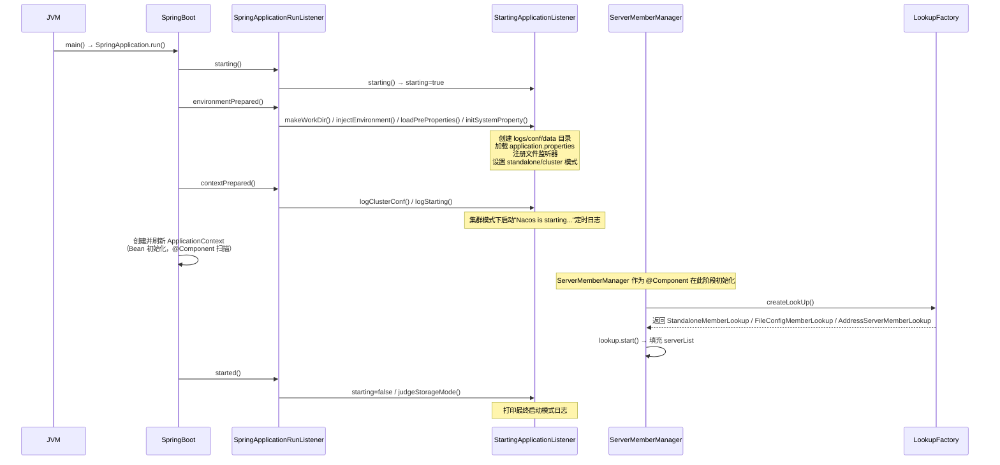
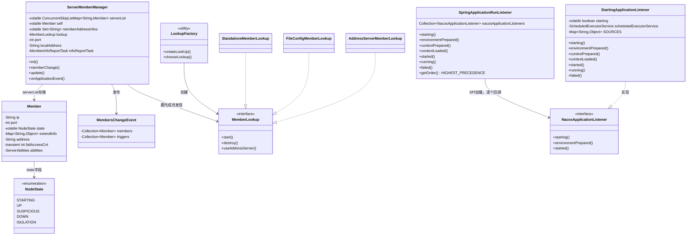

# Nacos 启动流程与模块初始化 深度解析

> 基于 Nacos 2.x 源码分析  
> 方法论：程序 = 数据结构 + 算法  
> 源码路径：`/data/workspace/nacos`

---

## 第 0 部分：核心原理 ⭐

### 0.1 本质是什么？

Nacos 启动流程的本质是：**在 Spring Boot 生命周期的各个钩子点，依次完成"环境初始化 → 集群成员发现 → 一致性协议启动 → 通信层就绪 → 业务模块加载"五个阶段的初始化**，最终使节点具备对外提供服务的能力。

### 0.2 为什么需要这样设计？

Nacos 是一个分布式系统，启动时面临三个核心问题：

1. **顺序依赖**：集群成员必须在一致性协议之前就绪（Raft 需要知道 Peer 列表），gRPC 通信层必须在业务模块之前就绪（业务模块依赖 gRPC 接收请求）。如果乱序启动，会导致 NPE 或服务注册失败。

2. **环境多样性**：单机模式（standalone）和集群模式（cluster）的初始化路径完全不同——单机不需要 Raft 选举，不需要 Distro 数据同步，不需要集群成员发现。必须在最早期就确定运行模式。

3. **配置热加载**：`application.properties` 文件变更后需要实时生效，必须在启动时注册文件监听器（`WatchFileCenter`），而不是每次读取时重新加载。

### 0.3 怎么解决？

Nacos 通过**自定义 `SpringApplicationRunListener`**，在 Spring Boot 的 7 个生命周期回调点（`starting → environmentPrepared → contextPrepared → contextLoaded → started → running → failed`）中插入初始化逻辑，并通过 **SPI 机制**加载所有 `NacosApplicationListener` 实现类，实现各模块的解耦初始化。

### 0.4 为什么用 SPI 而不是直接 @Component？

`SpringApplicationRunListener` 在 Spring 容器**完全启动之前**就开始执行（`starting()` 阶段 Spring 容器还未创建），此时无法使用 `@Autowired` 注入 Bean。SPI（`NacosServiceLoader.load(NacosApplicationListener.class)`）是纯 Java 机制，不依赖 Spring 容器，可以在任意时机加载实现类。

---

## 第 1 部分：数据结构全景 ⭐

### 1.1 数据结构清单

| 结构名 | 源码位置 | 核心作用 |
|--------|----------|----------|
| `Member` | `core/cluster/Member.java` | 集群节点的完整描述，是集群管理的基本单元 |
| `NodeState` | `core/cluster/NodeState.java` | 节点生命周期状态枚举 |
| `ConcurrentSkipListMap<String, Member>` | `ServerMemberManager.serverList` | 集群节点字典，key=`ip:port`，有序 |
| `MembersChangeEvent` | `core/cluster/MembersChangeEvent.java` | 集群成员变更事件，驱动 Raft/Distro 响应 |
| `SOURCES (ConcurrentHashMap)` | `StartingApplicationListener.SOURCES` | 配置文件属性缓存，支持热更新 |
| `LookupType` | `LookupFactory.LookupType` | 成员发现策略枚举 |

---

### 1.2 `Member` — 集群节点的完整描述

#### 问题推导

**问题**：集群中每个节点需要被其他节点识别和管理，需要什么信息？

**需要什么信息？**
- 最基本的：IP + 端口，用于网络通信 → `ip`, `port`, `address`
- 节点当前是否可用？→ `state`（不能只有 UP/DOWN，还需要中间态 SUSPICIOUS）
- 节点有哪些能力？（2.x 引入能力协商）→ `abilities`
- 节点的扩展元数据（权重、机房、版本）→ `extendInfo`
- 连续访问失败次数（用于判断是否降级为 SUSPICIOUS）→ `failAccessCnt`

**推导出的结构**：一个包含网络标识 + 状态 + 能力 + 元数据的 POJO，`address` 作为唯一标识（`equals` 优先基于 `address` 字符串比较，`hashCode` 基于 `Objects.hash(ip, port)`）。

#### 真实数据结构

```java
// core/src/main/java/com/alibaba/nacos/core/cluster/Member.java:40
public class Member implements Comparable<Member>, Cloneable, Serializable {

    private String ip;                                          // 节点 IP
    private int port = -1;                                      // 节点端口，默认 8848
    private volatile NodeState state = NodeState.UP;            // 节点状态，volatile 保证可见性
    private Map<String, Object> extendInfo =                    // 扩展元数据：版本/权重/机房/最后刷新时间
            Collections.synchronizedMap(new TreeMap<>());       // TreeMap 保证序列化顺序一致
    private String address = "";                                // ip:port 缓存，避免重复拼接
    private transient int failAccessCnt = 0;                    // 连续访问失败次数，transient 不序列化
    private ServerAbilities abilities = new ServerAbilities();  // 节点能力集（gRPC/配置/命名等）
    
    // ★ 构造函数中预置了三个默认 extendInfo 值（来自 nacos.core.member.meta.* 配置）
    public Member() {
        extendInfo.put(MemberMetaDataConstants.SITE_KEY,
                EnvUtil.getProperty("nacos.core.member.meta.site", "unknow"));  // 机房标识，默认 "unknow"
        extendInfo.put(MemberMetaDataConstants.AD_WEIGHT,
                EnvUtil.getProperty("nacos.core.member.meta.adWeight", "0"));   // 权重（管理员设置），默认 0
        extendInfo.put(MemberMetaDataConstants.WEIGHT,
                EnvUtil.getProperty("nacos.core.member.meta.weight", "1"));     // 权重（自动），默认 1
    }
}
```

**推导 vs 实际**：与推导基本一致，但有两个细节值得注意：
1. `extendInfo` 用 `TreeMap` 而非 `HashMap`，是为了保证序列化时字段顺序一致，避免 MD5 比对时因顺序不同产生误判。
2. **构造函数预置了三个默认值**（`SITE_KEY`/`AD_WEIGHT`/`WEIGHT`），这些值可通过 `nacos.core.member.meta.*` 配置覆盖，是节点元数据的初始状态。
3. `failAccessCnt` 标记为 `transient`，因为它是运行时状态，不需要持久化或网络传输。

#### 完整字段分析

| 字段 | 类型 | 含义 | 生命周期 |
|------|------|------|---------|
| `ip` | `String` | 节点 IP | 构造时设置，IP 变更事件时更新 |
| `port` | `int` | HTTP 端口（默认 8848） | 构造时设置，不变 |
| `state` | `volatile NodeState` | 节点状态 | 初始 UP，心跳失败→SUSPICIOUS→DOWN，恢复→UP |
| `extendInfo` | `Map<String,Object>` | 扩展元数据（version/weight/site/lastRefreshTime） | 节点上报时更新 |
| `address` | `String` | `ip:port` 字符串缓存 | 首次调用 `getAddress()` 时生成 |
| `failAccessCnt` | `transient int` | 连续访问失败次数 | `MemberUtil.onFail()` 递增，`onSuccess()` 清零 |
| `abilities` | `ServerAbilities` | 节点能力集 | 启动时初始化，通过心跳上报给其他节点 |

#### 设计决策

- **为什么 `state` 用 `volatile`？** `ServerMemberManager` 中多个线程（心跳任务、HTTP 回调）会并发修改节点状态，`volatile` 保证可见性，避免读到旧状态。
- **为什么实现 `Comparable<Member>`？** `serverList` 使用 `ConcurrentSkipListMap`，需要 key 可比较。`compareTo` 基于 `address` 字符串（`getAddress().compareTo(o.getAddress())`），保证节点列表有序（便于 Distro 分片计算的确定性）。
- **`equals` vs `hashCode` 不对称**：`equals` 优先用 `address` 字符串比较（`StringUtils.equals(address, that.address)`），`hashCode` 用 `Objects.hash(ip, port)`。这是一个刻意设计：`address` 为空时退化为 `ip+port` 比较，保证在 `address` 未初始化时也能正确判等。

---

### 1.3 `NodeState` — 节点生命周期状态

#### 真实数据结构

```java
// core/src/main/java/com/alibaba/nacos/core/cluster/NodeState.java:30
public enum NodeState {
    STARTING,    // 节点正在启动，不对外提供服务
    UP,          // 节点正常，可以处理请求
    SUSPICIOUS,  // 节点可疑（心跳超时但未确认宕机）
    DOWN,        // 节点宕机，停止服务
    ISOLATION,   // 节点被隔离（人工干预）
}
```

**注意**：大纲文档中写的是"UP/DOWN/SUSPICIOUS 三种状态"，实际源码有 **5 种状态**，多了 `STARTING` 和 `ISOLATION`。

#### 状态转换图

```
STARTING ──(WebServer就绪)──▶ UP
    UP ──(心跳失败N次)──▶ SUSPICIOUS
    UP ──(人工隔离)──▶ ISOLATION
SUSPICIOUS ──(心跳恢复)──▶ UP
SUSPICIOUS ──(确认宕机)──▶ DOWN
    DOWN ──(节点恢复上报)──▶ UP
```

---

### 1.4 `ConcurrentSkipListMap<String, Member>` — 集群节点字典

#### 问题推导

**问题**：`ServerMemberManager` 需要管理集群所有节点，需要什么操作？
- 按 `ip:port` 快速查找节点 → 需要 Map
- 多线程并发读写（心跳任务、HTTP 回调、Distro 同步）→ 需要线程安全
- Distro 分片计算需要节点列表**有序且确定**（所有节点看到相同的顺序）→ 需要有序

**推导出的结构**：有序 + 线程安全的 Map → `ConcurrentSkipListMap`

#### 真实数据结构

```java
// core/src/main/java/com/alibaba/nacos/core/cluster/ServerMemberManager.java:88
/**
 * Cluster node list.
 */
private volatile ConcurrentSkipListMap<String, Member> serverList;
// key = "ip:port"（如 "192.168.1.1:8848"）
// value = Member 对象
```

**为什么 `serverList` 本身也是 `volatile`？**  
`memberChange()` 方法会整体替换 `serverList`（`serverList = tmpMap`），而不是在原 Map 上修改。`volatile` 保证其他线程立即看到新的 Map 引用，避免读到旧的节点列表。

#### 设计决策

- **为什么用 `ConcurrentSkipListMap` 而不是 `ConcurrentHashMap`？**  
  Distro 协议按节点列表的**有序索引**分配数据分片（`DistroMapper` 用 `indexOf` 计算归属节点）。`ConcurrentHashMap` 无序，每次迭代顺序可能不同，导致不同节点计算出不同的分片结果，产生数据混乱。`ConcurrentSkipListMap` 按 key（`ip:port` 字符串）字典序排列，所有节点看到相同的顺序。

---

### 1.5 `MembersChangeEvent` — 集群成员变更事件

#### 真实数据结构

```java
// core/src/main/java/com/alibaba/nacos/core/cluster/MembersChangeEvent.java:36
public class MembersChangeEvent extends Event {
    private final Collection<Member> members;   // 变更后的完整成员列表（不可变）
    private final Collection<Member> triggers;  // 触发本次变更的节点，内部用 HashSet 存储（可为空集合，非 null）
    
    // ★ triggers 在构造时被包装为 HashSet，hasTriggers() 判断是否为空
    // ★ 通过 builder 模式构建：MembersChangeEvent.builder().members(...).trigger(...).build()
}
```

**谁监听这个事件？**（源码注释中明确列出）
- `ProtocolManager`：通知 JRaft 更新 Peer 列表
- `DistroMapper`（`naming/core/`）：更新 Distro 分片映射
- `RaftPeerSet`：更新 Raft 投票集合

这是一个**扇出事件**：一次集群变更，同时驱动多个子系统响应。

---

### 1.6 `SOURCES (ConcurrentHashMap)` — 配置文件属性缓存

#### 真实数据结构

```java
// core/src/main/java/com/alibaba/nacos/core/listener/StartingApplicationListener.java:72
private static final Map<String, Object> SOURCES = new ConcurrentHashMap<>();
// key = 配置项名（如 "nacos.core.auth.enabled"）
// value = 配置项值
```

**生命周期**：
1. `environmentPrepared()` 阶段：从 `application.properties` 加载所有配置项到 `SOURCES`
2. 注入到 Spring `Environment`（`addLast`，优先级最低，不覆盖命令行参数）
3. `WatchFileCenter` 监听文件变更 → `SOURCES.putAll(tmp)` → 发布 `ServerConfigChangeEvent`

---

## 第 2 部分：算法/流程分析

### 2.1 核心启动流程概览



---

### 2.2 `StartingApplicationListener` 各阶段详解

#### 阶段一：`starting()` — 标记启动中

```java
// StartingApplicationListener.java:80
@Override
public void starting() {
    starting = true;  // ★ 标记启动中，用于 logStarting() 的定时日志判断
}
```

**作用**：仅设置 `starting = true` 标志位，供后续定时任务判断是否还在启动中。

---

#### 阶段二：`environmentPrepared()` — 最关键的初始化阶段

```java
// StartingApplicationListener.java:85
@Override
public void environmentPrepared(ConfigurableEnvironment environment) {
    makeWorkDir();           // ★ 创建 logs/conf/data 三个工作目录
    injectEnvironment(environment);  // ★ 将 Spring Environment 注入 EnvUtil（全局访问点）
    loadPreProperties(environment);  // ★ 加载 application.properties + 注册文件监听
    initSystemProperty();    // ★ 设置 nacos.mode / nacos.function.mode / nacos.local.ip
}
```

**`loadPreProperties()` 深入分析**：

```java
// StartingApplicationListener.java:131
private void loadPreProperties(ConfigurableEnvironment environment) {
    try {
        // 1. 从 ${nacos.home}/conf/application.properties 加载所有配置项
        SOURCES.putAll(EnvUtil.loadProperties(EnvUtil.getApplicationConfFileResource()));
        
        // 2. 以最低优先级注入 Spring Environment（addLast，不覆盖命令行/系统属性）
        environment.getPropertySources()
                .addLast(new OriginTrackedMapPropertySource(NACOS_APPLICATION_CONF, SOURCES));
        
        // 3. 注册文件变更监听器，实现配置热更新
        registerWatcher();
    } catch (Exception e) {
        throw new NacosRuntimeException(NacosException.SERVER_ERROR, e);
    }
}

private void registerWatcher() throws NacosException {
    WatchFileCenter.registerWatcher(EnvUtil.getConfPath(), new FileWatcher() {
        @Override
        public void onChange(FileChangeEvent event) {
            // 文件变更时：重新加载 → 更新 SOURCES → 发布 ServerConfigChangeEvent
            Map<String, ?> tmp = EnvUtil.loadProperties(EnvUtil.getApplicationConfFileResource());
            SOURCES.putAll(tmp);                                    // ★ 热更新配置缓存
            NotifyCenter.publishEvent(ServerConfigChangeEvent.newEvent()); // ★ 通知订阅者
        }
        
        @Override
        public boolean interest(String context) {
            return StringUtils.contains(context, "application.properties"); // 只监听该文件
        }
    });
}
```

**`initSystemProperty()` 深入分析**：

```java
// StartingApplicationListener.java:152
private void initSystemProperty() {
    // 设置运行模式（standalone / cluster）
    if (EnvUtil.getStandaloneMode()) {
        System.setProperty(MODE_PROPERTY_KEY_STAND_MODE, NACOS_MODE_STAND_ALONE);
    } else {
        System.setProperty(MODE_PROPERTY_KEY_STAND_MODE, NACOS_MODE_CLUSTER);
    }
    // 设置功能模式（All / config / naming）
    if (EnvUtil.getFunctionMode() == null) {
        System.setProperty(MODE_PROPERTY_KEY_FUNCTION_MODE, DEFAULT_FUNCTION_MODE); // "All"
    } else if (EnvUtil.FUNCTION_MODE_CONFIG.equals(EnvUtil.getFunctionMode())) {
        System.setProperty(MODE_PROPERTY_KEY_FUNCTION_MODE, EnvUtil.FUNCTION_MODE_CONFIG);
    } else if (EnvUtil.FUNCTION_MODE_NAMING.equals(EnvUtil.getFunctionMode())) {
        System.setProperty(MODE_PROPERTY_KEY_FUNCTION_MODE, EnvUtil.FUNCTION_MODE_NAMING);
    }
    // 设置本机 IP（供其他模块通过 System.getProperty 获取）
    System.setProperty(LOCAL_IP_PROPERTY_KEY, InetUtils.getSelfIP());
}
```

---

#### 阶段三：`contextLoaded()` — 自定义环境变量

```java
// StartingApplicationListener.java:96（源码实际存在，文档之前遗漏此阶段）
@Override
public void contextLoaded(ConfigurableApplicationContext context) {
    EnvUtil.customEnvironment();  // ★ 应用自定义环境变量（如 nacos.core.env.first.properties 中的配置）
}
```

**作用**：在 Spring 容器加载完成（Bean 定义已注册但未初始化）后，允许通过 `EnvUtil.customEnvironment()` 对 Spring Environment 做最后一次定制化修改。这是 `environmentPrepared` 之后、Bean 初始化之前的最后一个环境配置时机。

---

#### 阶段四：`contextPrepared()` — 日志与监控

```java
// StartingApplicationListener.java:92
@Override
public void contextPrepared(ConfigurableApplicationContext context) {
    logClusterConf();  // 集群模式下打印 cluster.conf 中的节点列表
    logStarting();     // 集群模式下启动定时日志（每秒打印 "Nacos is starting..."）
}
```

`logStarting()` 创建了一个单线程定时任务，每秒打印一次启动日志，直到 `started()` 阶段将 `starting` 置为 `false`：

```java
// StartingApplicationListener.java:228
private void logStarting() {
    if (!EnvUtil.getStandaloneMode()) {
        scheduledExecutorService = ExecutorFactory.newSingleScheduledExecutorService(
                new NameThreadFactory("com.alibaba.nacos.core.nacos-starting"));
        scheduledExecutorService.scheduleWithFixedDelay(() -> {
            if (starting) {
                LOGGER.info("Nacos is starting...");  // ★ 只在 starting=true 时打印
            }
        }, 1, 1, TimeUnit.SECONDS);
    }
}
```

---

#### 阶段五：Spring 容器刷新（Bean 初始化）

这个阶段不在 `StartingApplicationListener` 中，而是 Spring Boot 自动完成的。**`ServerMemberManager` 作为 `@Component` 在此阶段被初始化**，这是集群管理的核心初始化时机。

---

#### 阶段六：`started()` — 启动完成

```java
// StartingApplicationListener.java:98
@Override
public void started(ConfigurableApplicationContext context) {
    starting = false;          // ★ 关闭启动中标志，停止定时日志
    closeExecutor();           // 关闭定时日志线程池
    ApplicationUtils.setStarted(true);  // ★ 全局标记：服务已就绪
    judgeStorageMode(context.getEnvironment());  // 打印存储模式日志
}
```

`judgeStorageMode()` 的判断逻辑：

```java
// StartingApplicationListener.java:243
private void judgeStorageMode(ConfigurableEnvironment env) {
    String platform = this.getDatasourcePlatform(env);
    // 非 derby 且非空 → 使用外部存储（MySQL）
    boolean useExternalStorage =
            !DEFAULT_DATASOURCE_PLATFORM.equalsIgnoreCase(platform) && !DERBY_DATABASE.equalsIgnoreCase(platform);
    
    if (!useExternalStorage) {
        // 单机模式 OR 显式开启 embeddedStorage → 使用嵌入式存储
        boolean embeddedStorage = EnvUtil.getStandaloneMode() || Boolean.getBoolean("embeddedStorage");
        if (!embeddedStorage) {
            useExternalStorage = true;  // 集群模式默认强制使用外部存储
        }
    }
    
    LOGGER.info("Nacos started successfully in {} mode. use {} storage",
            System.getProperty(MODE_PROPERTY_KEY_STAND_MODE),
            useExternalStorage ? DATASOURCE_MODE_EXTERNAL : DATASOURCE_MODE_EMBEDDED);
}
```

**存储模式判断规则**（源码级）：

| 条件 | 存储模式 |
|------|---------|
| `spring.sql.init.platform=mysql`（或旧版 `spring.datasource.platform=mysql`） | 外部存储（MySQL） |
| 单机模式（`-Dnacos.standalone=true`） | 嵌入式存储（Derby） |
| 集群模式 + 未配置 platform | 外部存储（MySQL，强制） |
| 集群模式 + `-DembeddedStorage=true` | 嵌入式存储（Derby，分布式） |

---

### 2.3 `ServerMemberManager.init()` — 集群成员管理初始化

```java
// ServerMemberManager.java:120
protected void init() throws NacosException {
    Loggers.CORE.info("Nacos-related cluster resource initialization");
    
    // 1. 确定本节点的 HTTP 端口（默认 8848）
    this.port = EnvUtil.getProperty(SERVER_PORT_PROPERTY, Integer.class, DEFAULT_SERVER_PORT);
    
    // 2. 构建本节点地址标识 "ip:port"
    this.localAddress = InetUtils.getSelfIP() + ":" + port;
    
    // 3. 解析本节点 Member 对象
    this.self = MemberUtil.singleParse(this.localAddress);
    this.self.setExtendVal(MemberMetaDataConstants.VERSION, VersionUtils.version); // 设置版本号
    
    // 4. 初始化本节点能力集（通过 SPI 加载 ServerAbilityInitializer）
    this.self.setAbilities(initMemberAbilities());
    
    // 5. 将自身加入节点列表（此时列表只有自己）
    serverList.put(self.getAddress(), self);
    
    // 6. 注册集群变更事件发布者 + IP 变更监听器
    registerClusterEvent();
    
    // 7. 初始化并启动成员发现（Lookup）
    initAndStartLookup();
    
    // 8. 校验：如果节点列表为空则启动失败
    if (serverList.isEmpty()) {
        throw new NacosException(NacosException.SERVER_ERROR, "cannot get serverlist, so exit.");
    }
}
```

---

### 2.4 `LookupFactory.createLookUp()` — 成员发现策略选择

```java
// LookupFactory.java:50
public static MemberLookup createLookUp(ServerMemberManager memberManager) throws NacosException {
    if (!EnvUtil.getStandaloneMode()) {
        // 集群模式：根据配置或文件存在性选择策略
        String lookupType = EnvUtil.getProperty(LOOKUP_MODE_TYPE); // "nacos.core.member.lookup.type"
        LookupType type = chooseLookup(lookupType);
        LOOK_UP = find(type);
        currentLookupType = type;
    } else {
        // 单机模式：直接使用 StandaloneMemberLookup（只有自己）
        LOOK_UP = new StandaloneMemberLookup();
    }
    LOOK_UP.injectMemberManager(memberManager);
    return LOOK_UP;
}

// 策略选择逻辑
private static LookupType chooseLookup(String lookupType) {
    if (StringUtils.isNotBlank(lookupType)) {
        // 显式配置了 lookup 类型，直接使用
        LookupType type = LookupType.sourceOf(lookupType);
        if (Objects.nonNull(type)) {
            return type;
        }
    }
    // 自动判断：cluster.conf 文件存在 OR 配置了 nacos.member.list → 文件模式
    File file = new File(EnvUtil.getClusterConfFilePath());
    if (file.exists() || StringUtils.isNotBlank(EnvUtil.getMemberList())) {
        return LookupType.FILE_CONFIG;
    }
    // 否则使用地址服务器模式
    return LookupType.ADDRESS_SERVER;
}
```

**三种 Lookup 策略对比**：

| 策略 | 类名 | 触发条件 | 工作方式 |
|------|------|---------|---------|
| 单机 | `StandaloneMemberLookup` | `standalone=true` | 只有自身节点，不需要发现 |
| 文件 | `FileConfigMemberLookup` | `cluster.conf` 存在 | 读取文件中的 `ip:port` 列表，监听文件变更 |
| 地址服务器 | `AddressServerMemberLookup` | 无 `cluster.conf` | 定期 HTTP 请求地址服务器获取节点列表 |

---

### 2.5 `MemberInfoReportTask` — 节点心跳上报

`ServerMemberManager` 在 `WebServerInitializedEvent`（Web 服务器就绪）后启动心跳任务：

```java
// ServerMemberManager.java:310
@Override
public void onApplicationEvent(WebServerInitializedEvent event) {
    getSelf().setState(NodeState.UP);  // ★ Web 服务器就绪后才将自身状态设为 UP
    if (!EnvUtil.getStandaloneMode()) {
        // 集群模式：延迟 5 秒后启动心跳上报任务
        GlobalExecutor.scheduleByCommon(this.infoReportTask, DEFAULT_TASK_DELAY_TIME); // 5000ms
    }
}
```

心跳任务的执行逻辑（`MemberInfoReportTask.executeBody()`）：

```java
// ServerMemberManager.java:360（内部类）
@Override
protected void executeBody() {
    List<Member> members = ServerMemberManager.this.allMembersWithoutSelf();
    if (members.isEmpty()) { return; }
    
    // ★ 轮询策略：cursor 递增取模，每次只上报给一个节点（避免广播风暴）
    this.cursor = (this.cursor + 1) % members.size();
    Member target = members.get(cursor);
    
    // 向目标节点 POST /nacos/v1/core/cluster/report，携带自身 Member 信息
    asyncRestTemplate.post(url, header, Query.EMPTY, getSelf(), reference.getType(),
        new Callback<String>() {
            @Override
            public void onReceive(RestResult<String> result) {
                if (result.ok()) {
                    handleReportResult(result.getData(), target); // 成功：更新目标节点信息
                } else {
                    MemberUtil.onFail(ServerMemberManager.this, target); // 失败：递增 failAccessCnt
                }
            }
        });
}

@Override
protected void after() {
    // ★ 每次执行完后，延迟 2 秒再次调度（非固定频率，避免任务堆积）
    GlobalExecutor.scheduleByCommon(this, 2_000L);
}
```

**设计决策**：为什么用轮询而不是广播？
- 广播：每次向所有 N-1 个节点发送，网络开销 O(N)
- 轮询：每次只向 1 个节点发送，网络开销 O(1)，但最终每个节点都能收到（最终一致）
- 对于节点元数据同步（非强一致场景），轮询足够，且更节省资源

---

## 第 3 部分：运行时验证

### 3.1 验证计划

| 验证目标 | 验证方法 | 预期结果 |
|---------|---------|---------|
| `NodeState` 实际有几个状态 | 读取源码枚举 | 5 个（STARTING/UP/SUSPICIOUS/DOWN/ISOLATION） |
| `serverList` 的类型 | 读取源码字段声明 | `ConcurrentSkipListMap<String, Member>` |
| 心跳上报间隔 | 读取 `after()` 方法 | 2000ms |
| Web 服务器就绪后延迟多久启动心跳 | 读取 `DEFAULT_TASK_DELAY_TIME` | 5000ms |
| Lookup 策略选择逻辑 | 读取 `chooseLookup()` | 有 cluster.conf → FILE_CONFIG，否则 ADDRESS_SERVER |

### 3.2 验证结果（源码直接验证）

**验证 1：NodeState 枚举值数量**

```java
// NodeState.java:30-55（已读取完整源码）
public enum NodeState {
    STARTING,    // ✅ 存在
    UP,          // ✅ 存在
    SUSPICIOUS,  // ✅ 存在
    DOWN,        // ✅ 存在
    ISOLATION,   // ✅ 存在（大纲文档未提及，已在文档中补充）
}
// 结论：5 个状态，大纲文档中"3种状态"的描述不完整
```

**验证 2：心跳上报间隔**

```java
// ServerMemberManager.java（MemberInfoReportTask.after()）
protected void after() {
    GlobalExecutor.scheduleByCommon(this, 2_000L);  // ✅ 2 秒
}
// 结论：心跳上报间隔为 2 秒（非固定，是上次完成后延迟 2 秒）
```

**验证 3：Web 服务器就绪延迟**

```java
// ServerMemberManager.java:310
private static final long DEFAULT_TASK_DELAY_TIME = 5_000L;  // ✅ 5 秒
GlobalExecutor.scheduleByCommon(this.infoReportTask, DEFAULT_TASK_DELAY_TIME);
// 结论：Web 服务器就绪后延迟 5 秒才启动心跳任务
```

**验证 4：`serverList` 类型**

```java
// ServerMemberManager.java:88
private volatile ConcurrentSkipListMap<String, Member> serverList;
// ✅ 确认是 ConcurrentSkipListMap，有序 + 线程安全
```

**验证 5：`SpringApplicationRunListener` 的优先级**

```java
// SpringApplicationRunListener.java:103
@Override
public int getOrder() {
    return HIGHEST_PRECEDENCE;  // ✅ 最高优先级，在 EventPublishingRunListener 之前执行
}
// 类注释原文："before EventPublishingRunListener execution" ✅ 与文档描述一致
```

**验证 6：`contextLoaded()` 阶段存在**

```java
// StartingApplicationListener.java:96
@Override
public void contextLoaded(ConfigurableApplicationContext context) {
    EnvUtil.customEnvironment();  // ✅ 确认存在，之前文档遗漏了此阶段，已补充
}
```

**验证 7：`Member` 构造函数预置默认 extendInfo**

```java
// Member.java:62
public Member() {
    String prefix = "nacos.core.member.meta.";
    extendInfo.put(MemberMetaDataConstants.SITE_KEY,
            EnvUtil.getProperty(prefix + MemberMetaDataConstants.SITE_KEY, "unknow"));  // ✅ 默认 "unknow"
    extendInfo.put(MemberMetaDataConstants.AD_WEIGHT,
            EnvUtil.getProperty(prefix + MemberMetaDataConstants.AD_WEIGHT, "0"));      // ✅ 默认 "0"
    extendInfo.put(MemberMetaDataConstants.WEIGHT,
            EnvUtil.getProperty(prefix + MemberMetaDataConstants.WEIGHT, "1"));         // ✅ 默认 "1"
}
// 结论：Member 创建时 extendInfo 已有 3 个默认值，不是空 Map
```
// 类注释原文："before EventPublishingRunListener execution"
// nacosApplicationListeners 字段（包级访问，非 private）：
Collection<NacosApplicationListener> nacosApplicationListeners = 
    NacosServiceLoader.load(NacosApplicationListener.class);  // ✅ SPI 加载，字段初始化时即完成
```

---

## 数据结构关系图



---

## 总结

### 数据结构层面

| 结构 | 核心特征 |
|------|---------|
| `Member` | 节点完整描述，`volatile NodeState` 保证状态可见性，`TreeMap extendInfo` 保证序列化顺序 |
| `NodeState` | **5 个状态**（非 3 个）：STARTING/UP/SUSPICIOUS/DOWN/ISOLATION |
| `ConcurrentSkipListMap<String,Member>` | 有序（Distro 分片依赖）+ 线程安全 + `volatile` 引用（支持整体替换） |
| `MembersChangeEvent` | 扇出事件，同时驱动 JRaft/Distro/RaftPeerSet 三个子系统响应 |
| `SOURCES (ConcurrentHashMap)` | 配置文件属性缓存，支持热更新，以最低优先级注入 Spring Environment |

### 算法层面

| 算法/流程 | 核心设计决策 |
|----------|------------|
| 启动生命周期钩子 | SPI 加载 `NacosApplicationListener`，解耦各模块初始化；`HIGHEST_PRECEDENCE` 保证在 Spring 事件发布前执行 |
| 配置热更新 | `WatchFileCenter` 监听文件变更 → 更新 `SOURCES` → 发布 `ServerConfigChangeEvent`，无需重启 |
| 成员发现策略选择 | 自动判断（cluster.conf 存在 → FILE_CONFIG，否则 ADDRESS_SERVER），也支持显式配置 |
| 心跳上报 | **轮询**（非广播），每次只向 1 个节点上报，O(1) 网络开销；Web 服务器就绪后延迟 5 秒启动，避免启动期间的无效心跳 |
| 节点状态更新 | `volatile serverList` 整体替换（而非原地修改），保证读操作的原子性 |

---

*文档生成时间：2026-03-04*  
*对应源码版本：Nacos 2.x*  
*下一篇：[02-grpc-communication.md](./02-grpc-communication.md) — gRPC 长连接通信机制*
