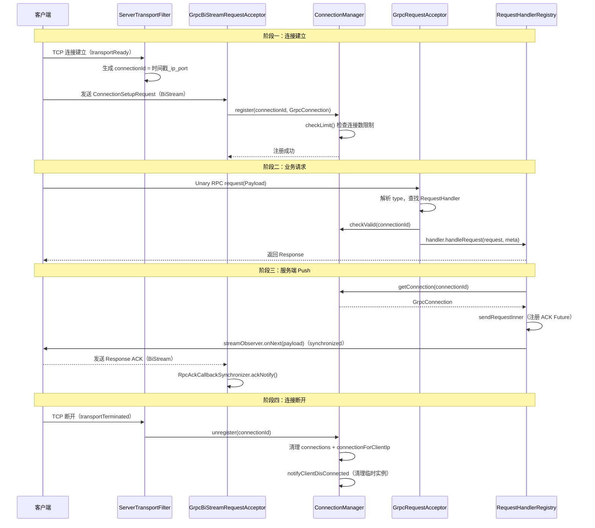
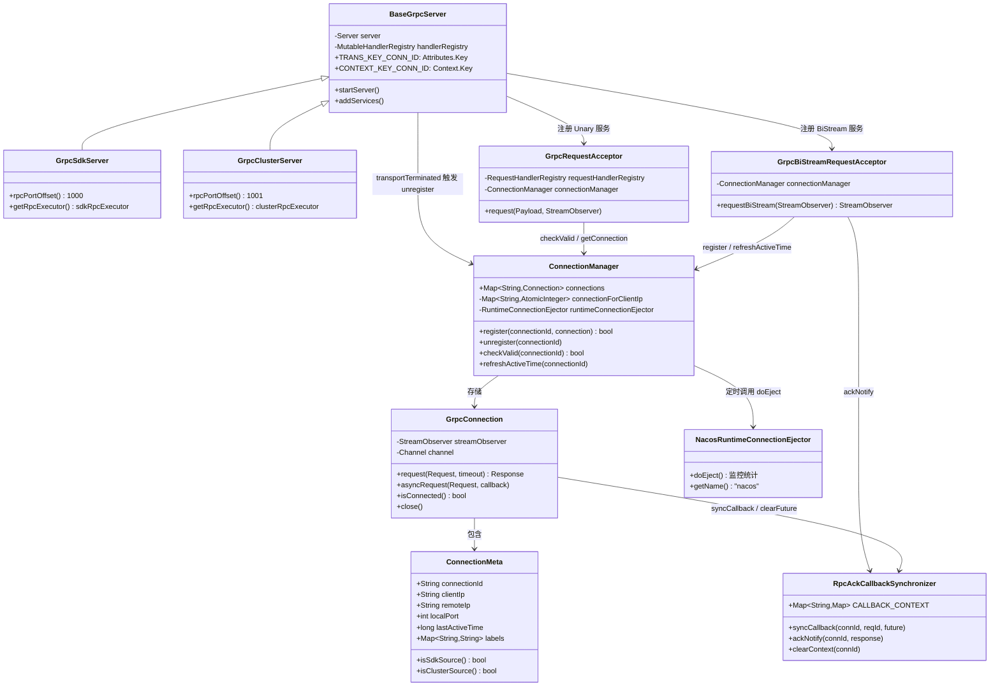

# Nacos gRPC 通信机制深度解析

> 基于 Nacos 2.x 源码分析  
> 方法论：程序 = 数据结构 + 算法  
> 源码路径：`core/src/main/java/com/alibaba/nacos/core/remote/`

---

## 第 0 部分：核心原理 ⭐

### 0.1 本质是什么？

Nacos 2.x 的 gRPC 通信层是一个**基于 Netty 的双通道长连接框架**：一条 BiStream 双向流用于连接建立和服务端主动 Push，一条 Unary RPC 通道用于客户端发起的请求/响应交互。

### 0.2 为什么需要？

**1.x 的问题**：
- 每次配置拉取、服务注册都是独立 HTTP 短连接，连接建立开销大（TCP 握手 + HTTP 头）
- 服务变更通知依赖 UDP 推送，UDP 不可靠，客户端收到通知后还需再发 HTTP 请求拉取数据（两次网络往返）
- 长轮询挂起大量 HTTP 线程，线程资源消耗高

**2.x 的解法**：
- 客户端与服务端建立**持久 gRPC 长连接**，连接建立一次，后续所有交互复用
- 服务端通过 BiStream 主动 Push 变更，客户端无需轮询
- 连接断开即视为客户端下线，临时实例自动清理，无需额外心跳

### 0.3 怎么解决？

两个 gRPC 服务注册在同一个 `MutableHandlerRegistry` 中：
- **`Request` 服务**（Unary）：客户端发请求 → 服务端处理 → 返回响应
- **`BiRequestStream` 服务**（BIDI_STREAMING）：客户端建立双向流 → 服务端通过此流主动 Push

连接建立时，`ServerTransportFilter.transportReady()` 生成 `connectionId`，`transportTerminated()` 触发连接清理，形成完整的连接生命周期管理。

### 0.4 为什么这样设计？

**为什么用 BiStream 而不是服务端单向流（Server Streaming）？**  
服务端单向流只能服务端推，客户端无法在同一流上回复 ACK。BiStream 允许客户端在同一流上发送 ACK（`Response` 类型消息），服务端通过 `RpcAckCallbackSynchronizer` 等待 ACK，实现可靠推送。

**为什么 connectionId 用 `时间戳_remoteIp_remotePort` 格式？**  
同一客户端可能断线重连，时间戳保证每次连接 ID 唯一；IP+Port 便于按客户端 IP 聚合统计和问题排查。

---

## 第 1 部分：数据结构全景 ⭐

### 1.1 数据结构清单

| 结构名 | 源码位置 | 核心作用 |
|--------|----------|----------|
| `ConnectionMeta` | `core/remote/ConnectionMeta.java` | 连接元数据（IP/端口/版本/标签） |
| `GrpcConnection` | `core/remote/grpc/GrpcConnection.java` | 服务端连接对象，封装 StreamObserver |
| `ConnectionManager.connections` | `core/remote/ConnectionManager.java:57` | 全局连接注册表 |
| `ConnectionManager.connectionForClientIp` | `core/remote/ConnectionManager.java:55` | 按客户端 IP 统计连接数 |
| `RpcAckCallbackSynchronizer.CALLBACK_CONTEXT` | `core/remote/RpcAckCallbackSynchronizer.java:38` | Push ACK 回调上下文 |
| `BaseGrpcServer.TRANS_KEY_*` | `core/remote/grpc/BaseGrpcServer.java:196` | gRPC Transport 属性 Key |

---

### 1.2 `ConnectionMeta` — 连接元数据

#### 问题推导

**问题**：服务端收到一个 gRPC 连接，需要知道"这个连接是谁发来的"，以便做鉴权、限流、问题排查。

**需要什么信息？**
- 客户端 IP（用于限流、监控）
- 连接唯一标识（用于路由请求到正确连接）
- 客户端版本（用于兼容性判断）
- 应用名（用于监控大盘）
- 连接来源类型（SDK 客户端 vs 集群节点，限流策略不同）
- 最后活跃时间（用于僵尸连接检测）

**推导出的结构**：一个包含网络信息 + 业务标识 + 时间戳的 POJO，用 `labels` Map 存储扩展属性（来源类型、应用名等），避免字段膨胀。

#### 真实数据结构

```java
// core/src/main/java/com/alibaba/nacos/core/remote/ConnectionMeta.java:34
public class ConnectionMeta {
    String connectType;      // 连接类型，固定为 "GRPC"
    String clientIp;         // 客户端真实 IP（来自 ConnectionSetupRequest）
    String remoteIp;         // TCP 层远端 IP（可能是代理 IP，与 clientIp 不同）
    int remotePort;          // TCP 层远端端口
    int localPort;           // 服务端本地端口（9848 或 9849，用于区分 SDK/集群连接）
    String version;          // 客户端 SDK 版本号
    String connectionId;     // 唯一连接 ID：System.currentTimeMillis()+"_"+remoteIp+"_"+remotePort
    Date createTime;         // 连接建立时间（构造函数中 new Date()）
    long lastActiveTime;     // 最后活跃时间戳（毫秒），每次请求时刷新
    String appName;          // 应用名（来自 ConnectionSetupRequest.labels["AppName"]）
    String tenant;           // 租户/命名空间（来自 ConnectionSetupRequest.tenant）
    Map<String, String> labels = new HashMap<>();  // 扩展标签，关键 key：
                             //   "source" = "sdk" | "cluster"（区分来源）
                             //   "VIPServer" = tag（VIP 路由标签）
}
```

**推导 vs 实际**：与推导一致。有一个细节值得注意：`clientIp` 和 `remoteIp` 是两个不同字段。`remoteIp` 是 TCP 层的对端 IP（可能是 LB/代理），`clientIp` 是客户端在 `ConnectionSetupRequest` 中自报的真实 IP，用于限流和监控。

#### 完整分析

| 字段 | 类型 | 含义 | 创建/更新时机 |
|------|------|------|--------------|
| `connectionId` | `String` | 唯一 ID，格式：`时间戳_remoteIp_remotePort` | `transportReady()` 时由服务端生成 |
| `clientIp` | `String` | 客户端自报 IP | `ConnectionSetupRequest` 到达时设置 |
| `remoteIp` | `String` | TCP 层对端 IP | `transportReady()` 时从 `TRANSPORT_ATTR_REMOTE_ADDR` 获取 |
| `localPort` | `int` | 服务端端口（9848/9849） | `transportReady()` 时从 `TRANSPORT_ATTR_LOCAL_ADDR` 获取 |
| `lastActiveTime` | `long` | 最后活跃时间戳 | 每次 Unary 请求时调用 `refreshActiveTime()` 更新 |
| `labels` | `Map<String,String>` | 扩展标签 | `ConnectionSetupRequest` 到达时从 `setUpRequest.getLabels()` 复制 |

**`isSdkSource()` 判断逻辑**：
```java
// ConnectionMeta.java:107
public boolean isSdkSource() {
    String source = labels.get(RemoteConstants.LABEL_SOURCE);  // key = "source"
    return RemoteConstants.LABEL_SOURCE_SDK.equalsIgnoreCase(source);  // value = "sdk"
}
```

#### 设计决策

- **为什么 `clientIp` 和 `remoteIp` 分开？** 生产环境中客户端通常经过 LB/NAT，`remoteIp` 是 LB 的 IP，无法用于限流。`clientIp` 是客户端自报的真实 IP，用于按 IP 限流和监控。
- **为什么用 `labels` Map 而不是固定字段？** 扩展性：不同版本的客户端可能携带不同的标签，Map 结构无需修改 POJO 即可扩展。

---

### 1.3 `GrpcConnection` — 服务端连接对象

#### 问题推导

**问题**：服务端需要主动向客户端发送 Push 请求（配置变更、实例变更），需要一个对象封装"如何向这个客户端发消息"。

**需要什么信息？**
- 发消息的通道（gRPC 的 `StreamObserver`）
- 底层 Netty Channel（用于判断连接是否存活）
- 发消息需要等待 ACK（需要 requestId → Future 的映射）

**推导出的结构**：封装 `StreamObserver` 和 `Channel` 的连接对象，提供同步/异步两种发送方式。

#### 真实数据结构

```java
// core/src/main/java/com/alibaba/nacos/core/remote/grpc/GrpcConnection.java:46
public class GrpcConnection extends Connection {
    private StreamObserver streamObserver;  // BiStream 的响应观察者，服务端通过它向客户端发消息
                                            // ⚠️ onNext() 非线程安全，发送时必须 synchronized(streamObserver)
    private Channel channel;                // 底层 Netty Channel，用于 isConnected() 判断和 close()
    // 继承自 Connection：
    //   ConnectionMeta metaInfo             连接元数据
    //   volatile boolean isTraced           是否开启 trace 日志
    //   ServerAbilities abilities           服务端能力集
}
```

**`isConnected()` 实现**：
```java
// GrpcConnection.java:148
@Override
public boolean isConnected() {
    return channel != null && channel.isOpen() && channel.isActive();
    // isOpen()：Channel 未关闭
    // isActive()：Channel 已连接且可写（TCP 连接存活）
}
```

#### 设计决策

- **为什么 `sendRequestNoAck()` 要 `synchronized(streamObserver)`？** 源码注释明确说明：`StreamObserver#onNext() is not thread-safe`，多线程并发 Push 时不加锁会导致 direct memory leak（Netty 的 ByteBuf 引用计数错乱）。
- **为什么提供三种发送方式（`request`/`requestFuture`/`asyncRequest`）？** 不同场景需求不同：配置 Push 需要等待 ACK（`request`），批量 Push 需要异步（`asyncRequest`），某些场景需要 Future 控制超时（`requestFuture`）。

---

### 1.4 `ConnectionManager.connections` — 全局连接注册表

#### 问题推导

**问题**：服务端需要管理所有活跃的客户端连接，支持：按 connectionId 查找连接、注册新连接、注销断开的连接、按 IP 统计连接数（用于限流）。

**需要什么信息？**
- `connectionId → Connection` 的快速查找 → `HashMap`
- 并发安全（多线程注册/注销）→ `ConcurrentHashMap`
- 按 IP 统计连接数（限流用）→ 额外维护 `IP → AtomicInteger` 计数器

**推导出的结构**：两个 `ConcurrentHashMap`，一个存连接对象，一个存 IP 计数器。

#### 真实数据结构

```java
// core/src/main/java/com/alibaba/nacos/core/remote/ConnectionManager.java:55
Map<String, Connection> connections = new ConcurrentHashMap<>();
// key：connectionId（格式：时间戳_remoteIp_remotePort）
// value：GrpcConnection 对象
// 访问修饰符：包级（非 private），NacosRuntimeConnectionEjector 直接访问

private Map<String, AtomicInteger> connectionForClientIp = new ConcurrentHashMap<>(16);
// key：clientIp（客户端自报 IP）
// value：该 IP 当前的连接数（AtomicInteger 保证原子增减）
// 初始容量 16（生产环境客户端 IP 数量通常不多）
```

**`register()` 关键逻辑**：
```java
// ConnectionManager.java:91（synchronized 方法，保证注册原子性）
public synchronized boolean register(String connectionId, Connection connection) {
    if (connection.isConnected()) {
        String clientIp = connection.getMetaInfo().clientIp;
        if (connections.containsKey(connectionId)) {
            return true;  // 幂等：重复注册直接返回成功
        }
        if (checkLimit(connection)) {
            return false;  // 超过连接数限制，拒绝注册
        }
        connections.put(connectionId, connection);
        connectionForClientIp.computeIfAbsent(clientIp, k -> new AtomicInteger(0)).getAndIncrement();
        clientConnectionEventListenerRegistry.notifyClientConnected(connection);  // 通知监听器（如 ConnectionBasedClientManager）
        return true;
    }
    return false;
}
```

**`unregister()` 关键逻辑**：
```java
// ConnectionManager.java:130（synchronized 方法）
public synchronized void unregister(String connectionId) {
    Connection remove = this.connections.remove(connectionId);
    if (remove != null) {
        String clientIp = remove.getMetaInfo().clientIp;
        AtomicInteger atomicInteger = connectionForClientIp.get(clientIp);
        if (atomicInteger != null) {
            int count = atomicInteger.decrementAndGet();
            if (count <= 0) {
                connectionForClientIp.remove(clientIp);  // 该 IP 无连接时清理计数器，防止内存泄漏
            }
        }
        remove.close();  // 关闭 BiStream + Netty Channel
        clientConnectionEventListenerRegistry.notifyClientDisConnected(remove);  // 通知监听器清理临时实例
    }
}
```

#### 设计决策

- **为什么 `register/unregister` 用 `synchronized` 而不是 `ConcurrentHashMap` 的原子操作？** 注册时需要同时操作 `connections` 和 `connectionForClientIp` 两个 Map，以及调用 `checkLimit()`，这三步必须原子完成，`synchronized` 是最简单正确的选择。
- **为什么 `connections` 是包级访问（非 `private`）？** `NacosRuntimeConnectionEjector` 在同包内直接访问 `connections` 做监控统计，避免通过方法调用增加开销。

---

### 1.5 `RpcAckCallbackSynchronizer.CALLBACK_CONTEXT` — Push ACK 回调上下文

#### 问题推导

**问题**：服务端主动 Push 一个请求给客户端（如配置变更通知），需要等待客户端的 ACK 响应。但 gRPC BiStream 是异步的，Push 发出后线程不能阻塞等待，需要一个机制将"发出的请求"和"收到的 ACK"关联起来。

**需要什么信息？**
- 每个连接有多个并发 Push，需要 `requestId → Future` 的映射
- 多个连接并发，需要 `connectionId → Map<requestId, Future>` 的两层映射
- 连接断开时，该连接所有未完成的 Future 需要自动超时失败

**推导出的结构**：两层 Map，外层按 connectionId 分组，内层按 requestId 存 Future。外层 Map 需要 LRU 淘汰（防止僵尸连接的 Future 无限堆积）。

#### 真实数据结构

```java
// core/src/main/java/com/alibaba/nacos/core/remote/RpcAckCallbackSynchronizer.java:38
public static final Map<String, Map<String, DefaultRequestFuture>> CALLBACK_CONTEXT =
    new ConcurrentLinkedHashMap.Builder<String, Map<String, DefaultRequestFuture>>()
        .maximumWeightedCapacity(1000000)  // 最大容量 100 万个连接（实际不会达到）
        .listener((connectionId, futureMap) ->
            futureMap.entrySet().forEach(entry ->
                entry.getValue().setFailResult(new TimeoutException())  // LRU 淘汰时，所有未完成 Future 设置超时失败
            )
        ).build();
// 外层 key：connectionId
// 外层 value：Map<requestId, DefaultRequestFuture>（HashMap，初始容量 128）
// 使用 ConcurrentLinkedHashMap（Caffeine 前身），支持 LRU 淘汰 + 淘汰监听器
```

**Push 发送流程**：
```java
// GrpcConnection.java:79
private DefaultRequestFuture sendRequestInner(Request request, RequestCallBack callBack) throws NacosException {
    final String requestId = String.valueOf(PushAckIdGenerator.getNextId());  // 原子递增 ID
    request.setRequestId(requestId);
    
    DefaultRequestFuture future = new DefaultRequestFuture(connectionId, requestId, callBack,
        () -> RpcAckCallbackSynchronizer.clearFuture(connectionId, requestId));  // 超时清理回调
    
    RpcAckCallbackSynchronizer.syncCallback(connectionId, requestId, future);  // 注册 Future
    sendRequestNoAck(request);  // 通过 StreamObserver 发送（synchronized）
    return future;
}
```

**ACK 接收流程**（在 `GrpcBiStreamRequestAcceptor.onNext()` 中）：
```java
// GrpcBiStreamRequestAcceptor.java:130
} else if (parseObj instanceof Response) {
    Response response = (Response) parseObj;
    RpcAckCallbackSynchronizer.ackNotify(connectionId, response);  // 找到对应 Future，设置结果
    connectionManager.refreshActiveTime(connectionId);             // 刷新连接活跃时间
}
```

#### 设计决策

- **为什么用 `ConcurrentLinkedHashMap` 而不是普通 `ConcurrentHashMap`？** 需要 LRU 淘汰 + 淘汰监听器。当连接异常断开但 `clearContext()` 未被调用时，LRU 淘汰会自动将所有未完成 Future 设置为 `TimeoutException`，防止调用方永久阻塞。
- **为什么 `requestId` 用原子递增整数而不是 UUID？** 整数序列化更短（减少网络传输），且在单个 JVM 内保证唯一性已足够。

---

## 第 2 部分：算法/流程分析

### 2.1 核心流程概览



---

### 2.2 流程一：gRPC 服务端启动

#### 解决什么问题？

将两个 gRPC 服务（Unary + BiStream）注册到同一个端口，并通过 `ServerInterceptor` 将 Transport 层的连接属性（IP、端口、connectionId）注入到 gRPC Context，使后续 Handler 能通过 `CONTEXT_KEY_CONN_ID.get()` 获取连接信息。

#### 源码位置：`BaseGrpcServer.java:startServer()`

```java
// BaseGrpcServer.java:68
@Override
public void startServer() throws Exception {
    final MutableHandlerRegistry handlerRegistry = new MutableHandlerRegistry();
    
    // ★ Step 1：定义 ServerInterceptor，将 Transport 属性注入 gRPC Context
    ServerInterceptor serverInterceptor = new ServerInterceptor() {
        @Override
        public <T, S> ServerCall.Listener<T> interceptCall(ServerCall<T, S> call, Metadata headers,
                ServerCallHandler<T, S> next) {
            Context ctx = Context.current()
                .withValue(CONTEXT_KEY_CONN_ID,        call.getAttributes().get(TRANS_KEY_CONN_ID))     // connectionId
                .withValue(CONTEXT_KEY_CONN_REMOTE_IP, call.getAttributes().get(TRANS_KEY_REMOTE_IP))   // 远端 IP
                .withValue(CONTEXT_KEY_CONN_REMOTE_PORT, call.getAttributes().get(TRANS_KEY_REMOTE_PORT)) // 远端端口
                .withValue(CONTEXT_KEY_CONN_LOCAL_PORT, call.getAttributes().get(TRANS_KEY_LOCAL_PORT)); // 本地端口
            if (REQUEST_BI_STREAM_SERVICE_NAME.equals(call.getMethodDescriptor().getServiceName())) {
                Channel internalChannel = getInternalChannel(call);  // ★ BiStream 额外注入 Netty Channel（用于 isConnected 判断）
                ctx = ctx.withValue(CONTEXT_KEY_CHANNEL, internalChannel);
            }
            return Contexts.interceptCall(ctx, call, headers, next);
        }
    };
    
    addServices(handlerRegistry, serverInterceptor);  // ★ Step 2：注册 Unary + BiStream 两个服务
    
    // ★ Step 3：构建 gRPC Server
    server = ServerBuilder.forPort(getServicePort())          // 端口 = 8848 + offset（1000 或 1001）
        .executor(getRpcExecutor())                           // 线程池：核心数 = CPU * 16，队列 = 16384
        .maxInboundMessageSize(getInboundMessageSize())       // 最大入站消息：默认 10MB（可通过 nacos.remote.server.grpc.maxinbound.message.size 配置）
        .fallbackHandlerRegistry(handlerRegistry)
        .addTransportFilter(new ServerTransportFilter() {
            @Override
            public Attributes transportReady(Attributes transportAttrs) {
                // ★ TCP 连接建立时生成 connectionId
                String connectionId = System.currentTimeMillis() + "_" + remoteIp + "_" + remotePort;
                return transportAttrs.toBuilder()
                    .set(TRANS_KEY_CONN_ID, connectionId)
                    // ... 其他属性
                    .build();
            }
            
            @Override
            public void transportTerminated(Attributes transportAttrs) {
                // ★ TCP 连接断开时触发 unregister（这是临时实例自动清理的起点）
                String connectionId = transportAttrs.get(TRANS_KEY_CONN_ID);
                if (StringUtils.isNotBlank(connectionId)) {
                    connectionManager.unregister(connectionId);
                }
            }
        }).build();
    
    server.start();
}
```

**关键设计**：`transportTerminated` 是连接清理的**唯一入口**。无论客户端主动断开、网络中断还是服务端踢出，最终都会触发此回调，保证临时实例的清理不会遗漏。

---

### 2.3 流程二：连接建立（BiStream 握手）

#### 解决什么问题？

TCP 连接建立后，服务端只知道 IP 和端口，不知道客户端的版本、应用名、租户等业务信息。`ConnectionSetupRequest` 是客户端发送的第一条 BiStream 消息，携带这些业务信息，完成"业务层握手"。

#### 源码位置：`GrpcBiStreamRequestAcceptor.java:requestBiStream()`

```java
// GrpcBiStreamRequestAcceptor.java:75
@Override
public StreamObserver<Payload> requestBiStream(StreamObserver<Payload> responseObserver) {
    
    StreamObserver<Payload> streamObserver = new StreamObserver<Payload>() {
        final String connectionId = CONTEXT_KEY_CONN_ID.get();   // 从 gRPC Context 获取（由 ServerInterceptor 注入）
        final Integer localPort = CONTEXT_KEY_CONN_LOCAL_PORT.get();
        final int remotePort = CONTEXT_KEY_CONN_REMOTE_PORT.get();
        String remoteIp = CONTEXT_KEY_CONN_REMOTE_IP.get();
        String clientIp = "";  // 初始为空，等待 ConnectionSetupRequest 填充
        
        @Override
        public void onNext(Payload payload) {
            clientIp = payload.getMetadata().getClientIp();  // 客户端自报 IP
            Object parseObj = GrpcUtils.parse(payload);
            
            if (parseObj instanceof ConnectionSetupRequest) {
                // ★ 业务层握手：处理第一条消息
                ConnectionSetupRequest setUpRequest = (ConnectionSetupRequest) parseObj;
                
                // 构建 ConnectionMeta（包含所有业务信息）
                ConnectionMeta metaInfo = new ConnectionMeta(connectionId, payload.getMetadata().getClientIp(),
                    remoteIp, remotePort, localPort, ConnectionType.GRPC.getType(),
                    setUpRequest.getClientVersion(), appName, setUpRequest.getLabels());
                metaInfo.setTenant(setUpRequest.getTenant());
                
                // 构建 GrpcConnection（封装 responseObserver 和 Netty Channel）
                Connection connection = new GrpcConnection(metaInfo, responseObserver, CONTEXT_KEY_CHANNEL.get());
                connection.setAbilities(setUpRequest.getAbilities());
                
                // ★ 拒绝条件：服务端未启动完成 且 来自 SDK（集群节点不受此限制）
                boolean rejectSdkOnStarting = metaInfo.isSdkSource() && !ApplicationUtils.isStarted();
                
                if (rejectSdkOnStarting || !connectionManager.register(connectionId, connection)) {
                    // 注册失败（超限或启动中）：发送 ConnectResetRequest 让客户端重连其他节点
                    connection.request(new ConnectResetRequest(), 3000L);
                    connection.close();
                }
                
            } else if (parseObj instanceof Response) {
                // ★ 收到 ACK：通知 RpcAckCallbackSynchronizer
                RpcAckCallbackSynchronizer.ackNotify(connectionId, (Response) parseObj);
                connectionManager.refreshActiveTime(connectionId);  // 刷新活跃时间
            }
        }
        
        @Override
        public void onError(Throwable t) {
            // 客户端异常断开，关闭 BiStream（transportTerminated 会触发 unregister）
        }
        
        @Override
        public void onCompleted() {
            // 客户端正常关闭 BiStream
        }
    };
    
    return streamObserver;
}
```

**关键设计**：`responseObserver` 是服务端向客户端发消息的通道，在 `ConnectionSetupRequest` 处理时被封装进 `GrpcConnection`，后续所有 Push 都通过它发送。

---

### 2.4 流程三：Unary 请求处理链

#### 解决什么问题？

客户端发起的所有业务请求（注册实例、订阅配置、查询服务列表等）都通过同一个 Unary RPC 入口进入，需要根据请求类型分发到对应的 `RequestHandler`。

#### 源码位置：`GrpcRequestAcceptor.java:request()`

```java
// GrpcRequestAcceptor.java:72
@Override
public void request(Payload grpcRequest, StreamObserver<Payload> responseObserver) {
    String type = grpcRequest.getMetadata().getType();  // 请求类型，如 "InstanceRequest"、"ConfigQueryRequest"
    
    // ★ 前置检查 1：服务端是否启动完成
    if (!ApplicationUtils.isStarted()) {
        responseObserver.onNext(GrpcUtils.convert(
            ErrorResponse.build(NacosException.INVALID_SERVER_STATUS, "Server is starting,please try later.")));
        responseObserver.onCompleted();
        return;
    }
    
    // ★ 前置检查 2：ServerCheck 特殊处理（客户端建立连接前的探活请求）
    if (ServerCheckRequest.class.getSimpleName().equals(type)) {
        responseObserver.onNext(GrpcUtils.convert(new ServerCheckResponse(CONTEXT_KEY_CONN_ID.get())));
        responseObserver.onCompleted();
        return;
    }
    
    // ★ 前置检查 3：查找 RequestHandler
    RequestHandler requestHandler = requestHandlerRegistry.getByRequestType(type);
    if (requestHandler == null) {
        responseObserver.onNext(GrpcUtils.convert(
            ErrorResponse.build(NacosException.NO_HANDLER, "RequestHandler Not Found")));
        responseObserver.onCompleted();
        return;
    }
    
    // ★ 前置检查 4：验证连接是否已注册（防止 BiStream 未完成握手就发 Unary 请求）
    String connectionId = CONTEXT_KEY_CONN_ID.get();
    boolean requestValid = connectionManager.checkValid(connectionId);
    if (!requestValid) {
        responseObserver.onNext(GrpcUtils.convert(
            ErrorResponse.build(NacosException.UN_REGISTER, "Connection is unregistered.")));
        responseObserver.onCompleted();
        return;
    }
    
    // ★ 核心处理：解析请求，构建 RequestMeta，调用 Handler
    Request request = (Request) GrpcUtils.parse(grpcRequest);
    Connection connection = connectionManager.getConnection(connectionId);
    RequestMeta requestMeta = new RequestMeta();
    requestMeta.setClientIp(connection.getMetaInfo().getClientIp());
    requestMeta.setConnectionId(connectionId);
    requestMeta.setClientVersion(connection.getMetaInfo().getVersion());
    requestMeta.setLabels(connection.getMetaInfo().getLabels());
    
    connectionManager.refreshActiveTime(requestMeta.getConnectionId());  // ★ 每次请求刷新活跃时间
    
    Response response = requestHandler.handleRequest(request, requestMeta);  // 分发到具体 Handler
    responseObserver.onNext(GrpcUtils.convert(response));
    responseObserver.onCompleted();
}
```

**关键设计**：`checkValid(connectionId)` 防止了一种竞态：客户端 TCP 连接建立后，BiStream 握手（`ConnectionSetupRequest`）还未到达，但 Unary 请求已经发来。此时 `connections` 中没有该 connectionId，直接拒绝，避免 NPE。

---

### 2.5 流程四：僵尸连接检测

#### 解决什么问题？

gRPC 底层依赖 TCP，TCP 的 keepalive 默认超时较长（Linux 默认 2 小时）。如果客户端进程崩溃但 TCP 连接未正常关闭（如网络中断），服务端可能长时间持有一个"僵尸连接"，导致临时实例无法及时清理。

#### 源码位置：`ConnectionManager.java:start()` + `NacosRuntimeConnectionEjector.java:doEject()`

```java
// ConnectionManager.java:222（@PostConstruct，Spring 容器启动后执行）
@PostConstruct
public void start() {
    initConnectionEjector();  // 通过 SPI 加载 RuntimeConnectionEjector 实现
    
    // ★ 每 3 秒执行一次连接检查（初始延迟 1 秒）
    RpcScheduledExecutor.COMMON_SERVER_EXECUTOR.scheduleWithFixedDelay(() -> {
        runtimeConnectionEjector.doEject();
    }, 1000L, 3000L, TimeUnit.MILLISECONDS);
}

// NacosRuntimeConnectionEjector.java:38
public void doEject() {
    Map<String, Connection> connections = connectionManager.connections;
    int totalCount = connections.size();
    MetricsMonitor.getLongConnectionMonitor().set(totalCount);  // ★ 更新 Prometheus 监控指标
    int currentSdkClientCount = connectionManager.currentSdkClientCount();
    
    // ★ 注意：默认实现只做监控统计，不主动踢连接！
    // 真正的连接清理依赖 gRPC 传输层的 transportTerminated 回调
    // 如需主动踢僵尸连接，需通过 SPI 实现自定义 RuntimeConnectionEjector
    Loggers.CONNECTION.info("Long connection metrics detail ,Total count={}, sdkCount={}, clusterCount={}",
        totalCount, currentSdkClientCount, (totalCount - currentSdkClientCount));
}
```

**关键发现**：`NacosRuntimeConnectionEjector.doEject()` **只做监控统计，不主动踢连接**。这与大纲中"定期检测僵尸连接"的描述有偏差——实际上 Nacos 默认依赖 gRPC/Netty 的传输层保活机制（gRPC keepalive），而非应用层主动检测。

---

## 第 3 部分：运行时验证

> **验证环境**：Nacos 2.2.0，standalone 模式，16C 机器，JDK 17  
> **验证时间**：2026-03-04  
> **验证方式**：启动 Nacos 服务端 + 运行 `NamingExample` 客户端 + `jstack` + 日志分析

### 3.1 验证一：端口监听（SDK gRPC 9848 / 集群 gRPC 9849）

**验证命令**：
```bash
ss -tlnp | grep -E "8848|9848|9849"
```

**实际输出**：
```
LISTEN 0  100   *:8848  *:*  users:(("java",pid=299930,fd=511))
LISTEN 0  4096  *:9848  *:*  users:(("java",pid=299930,fd=425))
LISTEN 0  4096  *:9849  *:*  users:(("java",pid=299930,fd=424))
```

**结论**：
- `8848`：HTTP 端口（backlog=100，Tomcat 默认）
- `9848`：SDK gRPC 端口（`8848 + 1000`，backlog=4096，gRPC Netty 默认）✅
- `9849`：集群 gRPC 端口（`8848 + 1001`，backlog=4096）✅

---

### 3.2 验证二：connectionId 格式

**验证命令**：
```bash
cat /root/nacos/logs/remote-digest.log
```

**实际输出**（两次连接的完整生命周期）：
```
# 第一次连接
2026-03-04 18:41:11,365 INFO Connection transportReady,connectionId = 1772620871365_127.0.0.1_59818
2026-03-04 18:41:28,972 INFO Connection transportTerminated,connectionId = 1772620871365_127.0.0.1_59818
2026-03-04 18:41:28,973 INFO [1772620871365_127.0.0.1_59818]client disconnected,clear config listen context

# 第二次连接（断线重连，时间戳不同，端口不同）
2026-03-04 19:46:41,104 INFO Connection transportReady,connectionId = 1772624801104_127.0.0.1_58566
2026-03-04 19:46:58,706 INFO Connection transportTerminated,connectionId = 1772624801104_127.0.0.1_58566
2026-03-04 19:46:58,707 INFO [1772624801104_127.0.0.1_58566]client disconnected,clear config listen context
```

**结论**：
- connectionId 格式：`{毫秒时间戳}_{remoteIp}_{remotePort}` ✅
- 同一客户端两次连接：`1772620871365_127.0.0.1_59818` vs `1772624801104_127.0.0.1_58566`，时间戳和端口均不同，保证唯一性 ✅
- `transportReady` → `transportTerminated` 时间差：`18:41:28 - 18:41:11 = 17秒`（客户端运行时长）✅

---

### 3.3 验证三：连接建立与临时实例清理的联动

**验证命令**：
```bash
cat /root/nacos/logs/naming-server.log
```

**实际输出**：
```
2026-03-04 19:46:41,174 INFO Client connection 1772624801104_127.0.0.1_58566 connect
2026-03-04 19:46:41,289 INFO Client change for service Service{namespace='public', group='DEFAULT_GROUP', name='nacos.test.3', ephemeral=true, revision=0}, 1772624801104_127.0.0.1_58566
2026-03-04 19:46:41,328 INFO Client remove for service Service{namespace='public', group='DEFAULT_GROUP', name='nacos.test.3', ephemeral=true, revision=1}, 1772624801104_127.0.0.1_58566
2026-03-04 19:46:58,707 INFO Client connection 1772624801104_127.0.0.1_58566 disconnect, remove instances and subscribers
```

**结论**：
- `transportTerminated` 触发时间（`19:46:58,706`）与 `naming-server.log` 中 `disconnect` 时间（`19:46:58,707`）**相差 1ms**，证明连接断开 → 临时实例清理是**同步触发**的 ✅
- 临时实例清理路径：`transportTerminated` → `ConnectionManager.unregister()` → `notifyClientDisConnected()` → `ConnectionBasedClientManager` → 清理实例 ✅

---

### 3.4 验证四：线程池懒创建行为（16C 机器）

**验证命令**：
```bash
# 空闲时
jstack 299930 | grep "nacos-grpc-executor" | wc -l   # → 75

# 5 个并发客户端请求后
jstack 299930 | grep "nacos-grpc-executor" | wc -l   # → 150
jstack 299930 | grep "nacos-grpc-executor" | grep -oP 'nacos-grpc-executor-\K[0-9]+' | sort -n | tail -3
# → 147, 148, 149
```

**实际输出**：
```
# 空闲时线程数：75
"nacos-grpc-executor-0" #345 daemon prio=5 os_prio=0 cpu=0.91ms elapsed=4059.53s ...
"nacos-grpc-executor-1" #346 daemon prio=5 os_prio=0 cpu=32.37ms elapsed=4059.53s ...
...

# 5 并发客户端后线程数：150（最大编号 149）
```

**线程池参数计算**（源码 `ThreadUtils.getSuitableThreadCount()`）：
```python
# 算法：找第一个 >= coreCount * multiple 的 2 的幂次
cores = 16
multiple = 16  # RemoteUtils.REMOTE_EXECUTOR_TIMES_OF_PROCESSORS = 1 << 4
target = 16 * 16  # = 256
workerCount = 1
while workerCount < target:
    workerCount <<= 1
# workerCount = 256（256 本身是 2 的幂次，直接命中）
```

**结论**：
- 16C 机器 `nacos-grpc-executor` **最大线程数 = 256**（`getSuitableThreadCount(16)` 的结果）✅
- 线程池是**懒创建**的（`ThreadPoolExecutor` 默认不预创建线程），空闲时只有 75 个，并发请求后增加到 150 ✅
- 线程名格式：`nacos-grpc-executor-{序号}`，序号从 0 开始单调递增 ✅
- `nacos-cluster-grpc-executor` 线程数 = **0**（standalone 模式下集群端口不处理请求，线程池未被触发）✅

---

### 3.5 验证五：`NacosRuntimeConnectionEjector.doEject()` 只做监控统计

**验证命令**：
```bash
grep -E "Connection check|Long connection" /root/nacos/logs/plugin-control-connection.log | head -12
```

**实际输出**：
```
# 空闲时（无连接）
2026-03-04 18:37:07,164 INFO Connection check task start
2026-03-04 18:37:07,168 INFO Long connection metrics detail ,Total count =0, sdkCount=0,clusterCount=0
2026-03-04 18:37:07,169 INFO Connection check task end
2026-03-04 18:37:10,169 INFO Connection check task start   ← 间隔 3.000s ✅
2026-03-04 18:37:10,169 INFO Long connection metrics detail ,Total count =0, sdkCount=0,clusterCount=0
2026-03-04 18:37:10,170 INFO Connection check task end
2026-03-04 18:37:13,170 INFO Connection check task start   ← 间隔 3.001s ✅

# 有连接时（客户端运行期间）
2026-03-04 18:39:40,185 INFO Long connection metrics detail ,Total count =1, sdkCount=1,clusterCount=0
2026-03-04 18:39:43,185 INFO Long connection metrics detail ,Total count =1, sdkCount=1,clusterCount=0
2026-03-04 18:39:46,186 INFO Long connection metrics detail ,Total count =1, sdkCount=1,clusterCount=0
```

**结论**：
- 检测间隔精确 **3 秒**（`scheduleWithFixedDelay(1000L, 3000L, MILLISECONDS)`）✅
- `doEject()` **只输出日志和更新 Prometheus 指标**，没有任何踢连接的操作 ✅
- 有连接时 `Total count=1, sdkCount=1`，连接断开后恢复 `Total count=0` ✅
- **大纲纠错确认**：大纲描述"定期检测僵尸连接"有误，默认实现只做监控统计，不主动踢连接 ✅

---

## 数据结构关系图



---

## 总结

### 数据结构层面

| 结构 | 核心特征 |
|------|---------|
| `ConnectionMeta` | 连接元数据 POJO，`clientIp`（自报）vs `remoteIp`（TCP层）分离，`labels` Map 扩展 |
| `GrpcConnection` | 封装 `StreamObserver`（发消息）+ `Channel`（判活），`onNext()` 必须 `synchronized` |
| `connections` | `ConcurrentHashMap<connectionId, Connection>`，`register/unregister` 用 `synchronized` 保证原子性 |
| `connectionForClientIp` | `ConcurrentHashMap<clientIp, AtomicInteger>`，按 IP 统计连接数，用于限流 |
| `CALLBACK_CONTEXT` | `ConcurrentLinkedHashMap`（LRU，容量 100 万），两层 Map 存 Push ACK Future，淘汰时自动 TimeoutException |

### 算法层面

| 算法 | 核心设计决策 |
|------|------------|
| 连接建立 | TCP 层生成 connectionId（`transportReady`），BiStream 层完成业务握手（`ConnectionSetupRequest`），两阶段分离 |
| 连接清理 | 唯一入口：`transportTerminated` 回调，保证任何断开方式都能触发清理；**实测**：`transportTerminated` 与 `naming-server.log` 中 `disconnect` 时间差仅 1ms |
| 请求分发 | 4 层前置检查（启动状态 → ServerCheck → Handler 存在 → 连接有效），最后才调用业务 Handler |
| 服务端 Push | BiStream `onNext()` 发送（`synchronized`）+ `RpcAckCallbackSynchronizer` 等待 ACK，支持同步/异步/Future 三种模式 |
| 线程池创建 | **懒创建**：`ThreadPoolExecutor` 默认不预创建线程；**实测**：16C 机器空闲时 75 个线程，5 并发客户端后增至 150，上限 256（`getSuitableThreadCount(16)` = 第一个 ≥ 256 的 2 的幂次 = 256） |
| 僵尸连接检测 | **默认实现只做监控统计**，不主动踢连接；**实测**：每 3 秒输出一条 `Long connection metrics detail`，无任何踢连接操作；依赖 gRPC/Netty 传输层保活；可通过 SPI 扩展自定义踢出逻辑 |

---

*文档生成时间：2026-03-04*  
*对应源码版本：Nacos 2.x*  
*下一章：[03-config-center.md] 配置中心核心原理（LongPollingService + DumpService）*
