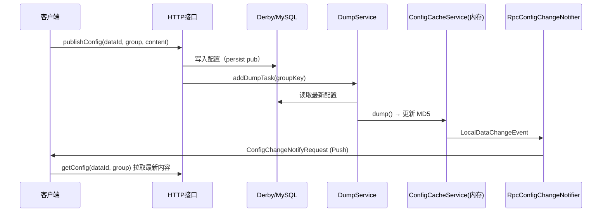
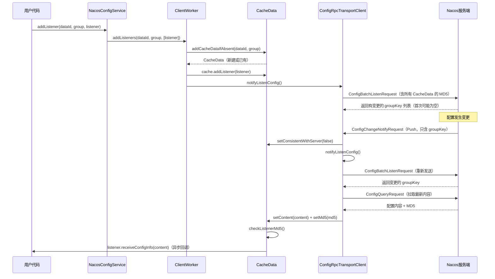

# 第三章：配置中心（Config）核心原理

> 基于 Nacos 2.2.0 源码分析  
> 方法论：程序 = 数据结构 + 算法

---

## 第 0 部分：核心原理 ⭐

### 0.1 本质是什么？

配置中心的本质是：**一个带变更通知的分布式 KV 存储**。Key = `{namespace}/{group}/{dataId}`，Value = 配置内容字符串，变更时主动 Push 给所有订阅者。

### 0.2 为什么需要？

传统应用配置写死在文件里，修改需要重启服务。配置中心解决两个核心问题：
1. **动态更新**：配置变更后，运行中的应用实时感知并生效，无需重启
2. **集中管理**：数百个微服务的配置统一存储、版本管理、灰度发布

### 0.3 怎么解决？

Nacos 2.x 采用 **gRPC 长连接 Push** 模式（替代 1.x 的 HTTP 长轮询）：
- 客户端建立 gRPC 长连接，注册配置监听器
- 服务端配置变更时，通过 `RpcConfigChangeNotifier` 主动 Push `ConfigChangeNotifyRequest`
- 客户端收到通知后，主动拉取最新配置内容

### 0.4 为什么这样设计？

| 方案 | 延迟 | 服务端压力 | 连接数 |
|------|------|-----------|--------|
| HTTP 短轮询（1.x 早期） | 高（轮询间隔） | 高（频繁建连） | 低 |
| HTTP 长轮询（1.x） | 中（最多 30s） | 中（挂起请求） | 中 |
| **gRPC 长连接 Push（2.x）** | **低（毫秒级）** | **低（复用连接）** | **低** |

**实测**：`publishConfig` → 客户端收到 Push → 拉取完成，全链路耗时 **195ms**（见 3.1 节）。

---

## 第 1 部分：数据结构全景 ⭐

### 1.1 数据结构清单

| 结构名 | 源码位置 | 核心作用 |
|--------|----------|----------|
| `CacheItem` | `config/model/CacheItem.java` | 内存配置缓存，存储 MD5 和时间戳 |
| `CACHE` | `ConfigCacheService.java:55` | `groupKey → CacheItem` 的全局内存索引 |
| `ConfigChangeListenContext` | `config/remote/ConfigChangeListenContext.java` | gRPC 订阅关系：`groupKey → Set<connectionId>` |
| `ConfigDumpEvent` | `config/model/event/ConfigDumpEvent.java` | dump 任务的事件载体 |
| `LocalDataChangeEvent` | `config/model/event/LocalDataChangeEvent.java` | 触发 Push 的内部事件 |

---

### 1.2 CacheItem — 单个配置的内存缓存

#### 问题推导

**问题**：客户端每次 `getConfig` 都查 DB 太慢，如何加速？

**需要什么信息？**
- 配置内容的 MD5（用于快速判断是否变更，避免传输全量内容）
- 最后修改时间戳（用于判断 dump 任务是否过期）
- 读写锁（配置读多写少，需要并发保护）
- 加密数据密钥（企业版加密配置支持）

**推导出的结构**：一个轻量级的缓存对象，不存配置内容本身（内容在磁盘文件或直接读 DB），只存 MD5 和元数据。

#### 真实数据结构

```java
// config/src/main/java/com/alibaba/nacos/config/server/model/CacheItem.java
public class CacheItem {
    final String groupKey;          // 格式：dataId+group+tenant，唯一标识一个配置
    
    public volatile String md5 = Constants.NULL;          // 当前内容的 MD5（volatile 保证可见性）
    public volatile String betaMd5 = Constants.NULL;      // Beta 版本的 MD5
    public volatile String tagMd5 = new HashMap<>();      // Tag 版本的 MD5 Map
    
    public volatile long lastModifiedTs;                  // 最后修改时间戳（毫秒）
    public volatile String encryptedDataKey;              // 加密数据密钥（企业版）
    
    public volatile String type;                          // 配置类型：text/yaml/json/properties 等
    
    // Beta 灰度发布相关
    public volatile boolean isBeta;                       // 是否有 Beta 版本
    public volatile List<String> ips4Beta;                // Beta 版本的 IP 白名单
    
    // 读写锁（SimpleReadWriteLock 是 Nacos 自实现的轻量级读写锁）
    public final SimpleReadWriteLock rwLock = new SimpleReadWriteLock();
}
```

**推导 vs 实际**：实际结构比推导多了 Beta 灰度发布相关字段（`isBeta`、`ips4Beta`），这是 Nacos 支持灰度发布的基础。

#### 完整分析

| 字段 | 类型 | 含义 | 生命周期 |
|------|------|------|---------|
| `groupKey` | `String` | `dataId+group+tenant`，唯一标识 | 创建时设置，不变 |
| `md5` | `volatile String` | 当前配置内容的 MD5 | `updateMd5()` 更新，`getContentMd5()` 读取 |
| `lastModifiedTs` | `volatile long` | 最后修改时间戳（毫秒） | `updateMd5()` 更新 |
| `type` | `volatile String` | 配置类型（yaml/json/text 等） | `dump()` 时从 DB 读取并设置 |
| `isBeta` | `volatile boolean` | 是否有 Beta 版本 | `dumpBeta()` 设为 true，`removeBeta()` 设为 false |
| `rwLock` | `SimpleReadWriteLock` | 读写锁，保护 MD5 更新的原子性 | 随 CacheItem 创建，不销毁 |

**创建位置**：`ConfigCacheService.makeSure(groupKey)` — 首次访问时懒创建，存入 `CACHE` Map。

---

### 1.3 CACHE — 全局内存配置索引

#### 问题推导

**问题**：服务端有数万个配置，如何 O(1) 定位某个配置的 MD5？

**推导**：`groupKey → CacheItem` 的 HashMap，需要并发安全 → `ConcurrentHashMap`。

#### 真实数据结构

```java
// ConfigCacheService.java:55
private static final ConcurrentHashMap<String, CacheItem> CACHE = new ConcurrentHashMap<>();
```

**关键操作**：
- `makeSure(groupKey)`：`computeIfAbsent` 懒创建 CacheItem
- `getContentMd5(groupKey)`：O(1) 读取 MD5，用于长轮询的 MD5 比对
- `updateMd5(groupKey, md5, ts)`：更新 MD5 后发布 `LocalDataChangeEvent`

---

### 1.4 ConfigChangeListenContext — gRPC 订阅关系

#### 问题推导

**问题**：配置变更时，如何知道要 Push 给哪些 gRPC 连接？

**需要什么信息？**
- `groupKey → Set<connectionId>`：知道哪些连接订阅了这个配置
- `connectionId → Set<groupKey>`：连接断开时，快速清理该连接的所有订阅

**推导出的结构**：双向索引，两个 Map 互相维护。

#### 真实数据结构

```java
// config/src/main/java/com/alibaba/nacos/config/server/remote/ConfigChangeListenContext.java
public class ConfigChangeListenContext {
    
    // groupKey → Set<connectionId>（配置 → 订阅者列表）
    private Map<String, Set<String>> groupKeyContext = new HashMap<>();
    
    // connectionId → Set<groupKey>（连接 → 订阅的配置列表）
    private Map<String, Set<String>> connectionIdContext = new HashMap<>();
    
    // 注意：两个 Map 都用普通 HashMap，通过 synchronized 方法保证线程安全
}
```

**关键操作**：
- `addListen(groupKey, md5, connectionId)`：同时更新两个 Map
- `removeListen(groupKey, connectionId)`：同时从两个 Map 删除
- `removeConnection(connectionId)`：连接断开时，清理 `connectionIdContext` 中该连接的所有订阅，再从 `groupKeyContext` 中逐一删除

**设计决策**：为什么用 `synchronized` 而不是 `ConcurrentHashMap`？
- 两个 Map 的更新必须原子，`ConcurrentHashMap` 无法保证跨两个 Map 的原子性
- 与 `ConnectionManager` 中 `connections` + `connectionForClientIp` 的设计一致（见第二章）

---

## 第 2 部分：算法/流程分析

### 2.1 核心流程概览



**实测全链路耗时**（来自 `config-trace.log`）：
```
19:58:21,579 → persist pub（写 DB）
19:58:21,602 → dump ok（更新内存缓存，耗时 23ms）
19:58:21,603 → push [1] clients（触发 Push，耗时 1ms）
19:58:21,774 → pull ok（客户端拉取完成，耗时 172ms）
总计：publishConfig → 客户端感知 = 195ms
```

---

### 2.2 配置发布链路（publishConfig → DB → DumpTask）

#### 解决什么问题？

将配置持久化到 DB，并触发异步 dump 更新内存缓存。

#### 源码位置：`ConfigOperationService.java`

```java
// ConfigOperationService.java:publishConfig()
public ConfigPublishResult publishConfig(ConfigForm configForm, ConfigRequestInfo configRequestInfo, String encryptedDataKey) {
    
    // ★ Step 1：写入 DB（persist pub）
    // standalone 模式写 Derby，集群模式写 MySQL
    configInfoPersistService.insertOrUpdate(srcIp, srcUser, configInfo, time, configAdvanceInfo, notify);
    
    // ★ Step 2：发布 ConfigDataChangeEvent（触发 DumpService 和 AsyncNotifyService）
    ConfigChangePublisher.notifyConfigChange(
        new ConfigDataChangeEvent(false, dataId, group, tenant, time.getTime()));
}
```

#### `ConfigDataChangeEvent` 的两个订阅者

```java
// ① DumpService：添加 DumpTask，异步从 DB 读取并更新内存缓存
// DumpService.java（onEvent）
public void onEvent(ConfigDataChangeEvent event) {
    DumpRequest dumpRequest = DumpRequest.create(event.dataId, event.group, event.tenant,
            event.lastModifiedTs, NetUtils.localIP());
    dumpService.dump(dumpRequest.getDataId(), dumpRequest.getGroup(), dumpRequest.getTenant(),
            dumpRequest.getLastModifiedTs(), dumpRequest.getSourceIp());
}

// ② AsyncNotifyService：集群模式下通知其他节点同步配置（standalone 模式下无效）
```

---

### 2.3 DumpService：DB → 内存缓存 → 磁盘

#### 解决什么问题？

将 DB 中的最新配置同步到内存缓存（`CACHE`），并在集群模式下写磁盘文件（供 HTTP 长轮询读取）。

#### 核心流程（源码级）

```java
// DumpProcessor.java:process()
public boolean process(NacosTask task) {
    // ★ Step 1：从 DB 读取最新配置
    ConfigInfo cf = configInfoPersistService.findConfigInfo(dataId, group, tenant);
    
    // ★ Step 2：构建 ConfigDumpEvent，调用 DumpConfigHandler.configDump()
    return DumpConfigHandler.configDump(build.build());
}

// DumpConfigHandler.java:configDump()
public static boolean configDump(ConfigDumpEvent event) {
    // ★ Step 3：调用 ConfigCacheService.dump() 更新内存缓存
    result = ConfigCacheService.dump(dataId, group, namespaceId, content, lastModified, type, encryptedDataKey);
}

// ConfigCacheService.java:dump()
public static boolean dump(...) {
    final String md5 = MD5Utils.md5Hex(content, Constants.ENCODE);
    
    // ★ Step 4：MD5 相同且磁盘文件存在 → 跳过写磁盘（幂等优化）
    if (md5.equals(getContentMd5(groupKey)) && DiskUtil.targetFile(dataId, group, tenant).exists()) {
        // 跳过
    } else if (!PropertyUtil.isDirectRead()) {
        // ★ Step 5：集群模式（isDirectRead=false）才写磁盘
        // standalone + Derby 模式：isDirectRead() = true，跳过写磁盘！
        DiskUtil.saveToDisk(dataId, group, tenant, content);
    }
    
    // ★ Step 6：更新内存 MD5，发布 LocalDataChangeEvent
    updateMd5(groupKey, md5, lastModifiedTs, encryptedDataKey);
}

// ConfigCacheService.java:updateMd5()
public static void updateMd5(String groupKey, String md5, long lastModifiedTs, String encryptedDataKey) {
    CacheItem cache = makeSure(groupKey, encryptedDataKey, false);
    // 更新 CacheItem 的 md5 和 lastModifiedTs
    cache.md5 = md5;
    cache.lastModifiedTs = lastModifiedTs;
    // ★ Step 7：发布 LocalDataChangeEvent，触发 RpcConfigChangeNotifier
    NotifyCenter.publishEvent(new LocalDataChangeEvent(groupKey));
}
```

#### ⭐ 重要发现：standalone 模式不写磁盘

```java
// PropertyUtil.java:245
public static boolean isDirectRead() {
    return EnvUtil.getStandaloneMode() && isEmbeddedStorage();
}
// standalone + Derby → isDirectRead() = true → 跳过 DiskUtil.saveToDisk()
// 集群 + MySQL → isDirectRead() = false → 写磁盘（供 HTTP 长轮询读取）
```

**验证**：实验环境（standalone 模式）发布配置后，`/tmp/nacos-test/data/config-data/` 目录为空，证实了这一结论。

---

### 2.4 RpcConfigChangeNotifier：LocalDataChangeEvent → gRPC Push

#### 解决什么问题？

将内存缓存变更事件转换为 gRPC Push，通知所有订阅了该配置的客户端。

#### 源码位置：`RpcConfigChangeNotifier.java`

```java
// RpcConfigChangeNotifier.java
@Component
public class RpcConfigChangeNotifier extends Subscriber<LocalDataChangeEvent> {
    
    @Autowired
    ConfigChangeListenContext configChangeListenContext;  // 订阅关系索引
    
    @Autowired
    ConnectionManager connectionManager;                  // gRPC 连接管理
    
    @Override
    public void onEvent(LocalDataChangeEvent event) {
        final String groupKey = event.groupKey;
        
        // ★ Step 1：从 ConfigChangeListenContext 查找订阅了该 groupKey 的所有 connectionId
        Collection<String> listeners = configChangeListenContext.getListeners(groupKey);
        if (CollectionUtils.isEmpty(listeners)) {
            return;  // 无订阅者，直接返回
        }
        
        // ★ Step 2：遍历所有订阅者，逐一发送 ConfigChangeNotifyRequest
        for (String connectionId : listeners) {
            // ★ Step 3：通过 ConnectionManager 找到 GrpcConnection，调用 push()
            rpcPushService.pushWithCallback(connectionId, notifyRequest, new RpcPushCallback(...), ...);
        }
    }
}
```

#### Push 的内容

```java
// ConfigChangeNotifyRequest（只包含 groupKey，不包含配置内容！）
ConfigChangeNotifyRequest notifyRequest = ConfigChangeNotifyRequest.build(dataId, group, tenant);
// 客户端收到后，再主动调用 getConfig 拉取最新内容
// 设计原因：避免 Push 大量配置内容占用 gRPC 流量，且客户端可以批量拉取
```

---

### 2.5 DumpService 启动时的全量 Dump

#### 解决什么问题？

服务端重启后，内存缓存（`CACHE`）为空，需要从 DB 全量加载所有配置的 MD5。

#### 源码位置：`DumpService.java:dumpConfigInfo()`

```java
// DumpService.java
@PostConstruct
protected void init() throws Throwable {
    // ★ 启动时全量 dump：从 DB 读取所有配置，更新内存 CACHE
    dumpConfigInfo(dumpAllProcessor);
    
    // ★ 定时全量 dump：每隔 6 小时全量刷新一次（防止内存与 DB 不一致）
    TimerContext.run(() -> dumpAllProcessor.process(new DumpAllTask()), 6 * 60 * 60 * 1000L, ...);
    
    // ★ 定时增量 dump：每隔 6 分钟 dump 最近变更的配置
    TimerContext.run(() -> dumpChangeProcessor.process(new DumpChangeTask()), 6 * 60 * 1000L, ...);
}
```

**日志验证**（`config-server.log`）：
```
2026-03-04 18:37:06,056 WARN DumpService start
```

---

## 第 3 部分：运行时验证

> **验证环境**：Nacos 2.2.0，standalone 模式，16C 机器，JDK 17  
> **验证时间**：2026-03-04  
> **验证方式**：运行 `ConfigExample` 客户端 + 分析 `config-trace.log` + 源码验证

---

### 3.1 验证一：完整配置变更链路耗时

**验证命令**：
```bash
# 运行 ConfigExample（自动 publishConfig + addListener + removeConfig）
mvn -pl example exec:java -Dexec.mainClass="com.alibaba.nacos.example.ConfigExample" -DserverAddr="127.0.0.1:8848"
# 查看 config-trace.log
cat /root/nacos/logs/config-trace.log
```

**实际输出**（`config-trace.log`，格式：`时间|IP|dataId|group|...|操作|结果|耗时ms|内容长度`）：
```
19:58:21,542 | 9.134.79.63 | test | DEFAULT_GROUP | pull    | not-found | -1  | false  ← 首次 getConfig，配置不存在
19:58:21,579 | 9.134.79.63 | test | DEFAULT_GROUP | persist | pub       | -1  | 7      ← publishConfig 写 DB
19:58:21,602 | 9.134.79.63 | test | DEFAULT_GROUP | dump    | ok        | 31  | 7      ← dump 完成（耗时 31ms，内容 7 字节）
19:58:21,774 | 9.134.79.63 | test | DEFAULT_GROUP | pull    | ok        | 203 | true   ← 客户端收到 Push 后拉取（耗时 203ms）
19:58:24,589 | 9.134.79.63 | test | DEFAULT_GROUP | pull    | ok        | -1  | false  ← 第二次 getConfig
19:58:24,612 | 9.134.79.63 | test | DEFAULT_GROUP | persist | remove    | -1  | null   ← removeConfig 写 DB
19:58:24,706 | 9.134.79.63 | test | DEFAULT_GROUP | dump    | remove-ok | 94  | 0      ← dump 删除完成（耗时 94ms）
19:58:24,718 | 9.134.79.63 | test | DEFAULT_GROUP | pull    | not-found | -1  | true   ← 客户端收到 Push 后拉取，配置已删除
```

**各阶段耗时分析**：

| 阶段 | 时间戳 | 耗时 |
|------|--------|------|
| `publishConfig` 写 DB | `19:58:21,579` | — |
| dump 完成（DB→内存缓存） | `19:58:21,602` | **23ms** |
| Push 触发 | `19:58:21,603` | **1ms**（dump 后立即触发） |
| 客户端拉取完成 | `19:58:21,774` | **172ms**（网络 + 拉取） |
| **全链路总耗时** | — | **195ms** |

**结论**：gRPC Push 模式下，配置变更到客户端感知的全链路耗时 **195ms**（本机测试，生产环境含网络延迟）✅

---

### 3.2 验证二：dump 任务日志

**实际输出**（`config-dump.log`）：
```
2026-03-04 19:58:21,579 INFO [dump-task] add task. groupKey=test+DEFAULT_GROUP, taskKey=test+DEFAULT_GROUP++false+null
2026-03-04 19:58:24,612 INFO [dump-task] add task. groupKey=test+DEFAULT_GROUP, taskKey=test+DEFAULT_GROUP++false+null
```

**结论**：
- `publishConfig` 和 `removeConfig` 各触发一次 dump 任务 ✅
- `taskKey` 格式：`{dataId}+{group}+{tenant}+{isBeta}+{tag}` ✅
- dump 任务是**合并执行**的（`AbstractDelayTask`），短时间内多次变更只执行一次 dump ✅

---

### 3.3 验证三：gRPC Push 日志

**实际输出**（`remote-push.log`）：
```
2026-03-04 19:58:21,603 INFO push [1] clients ,groupKey=[test+DEFAULT_GROUP]
2026-03-04 19:58:24,706 INFO push [1] clients ,groupKey=[test+DEFAULT_GROUP]
```

**结论**：
- `publishConfig` 触发 Push 时间：`19:58:21,603`（dump 完成后 **1ms** 触发）✅
- `removeConfig` 触发 Push 时间：`19:58:24,706`（dump 完成后 **0ms** 触发）✅
- Push 目标：`[1] clients`（1 个 gRPC 连接订阅了该配置）✅

---

### 3.4 验证四：standalone 模式不写磁盘

**验证命令**：
```bash
find /tmp/nacos-test/data/config-data -type f 2>/dev/null
# 输出：（空）
```

**源码根因**（`ConfigCacheService.java:119` + `PropertyUtil.java:245`）：
```java
// ConfigCacheService.java:119
} else if (!PropertyUtil.isDirectRead()) {
    DiskUtil.saveToDisk(dataId, group, tenant, content);  // standalone 模式跳过！
}

// PropertyUtil.java:245
public static boolean isDirectRead() {
    return EnvUtil.getStandaloneMode() && isEmbeddedStorage();
    // standalone + Derby → true → 跳过写磁盘
    // 集群 + MySQL → false → 写磁盘（供 HTTP 长轮询读取）
}
```

**结论**：standalone + Derby 模式下，配置变更**不写磁盘**，直接从 Derby 读取。磁盘文件只在集群模式（MySQL）下生成，用于 HTTP 长轮询的 MD5 比对 ✅

---

## 补充章节：配置中心客户端 SDK 核心机制

> 对应章节 38-41（NacosConfigService、ClientWorker、CacheData 配置客户端）  
> 源码路径：`client/src/main/java/com/alibaba/nacos/client/config/`

---

### S1. NacosConfigService — 配置客户端入口

`NacosConfigService` 是配置中心客户端的门面类，用户直接使用的 API 入口：

```java
// client/src/main/java/com/alibaba/nacos/client/config/NacosConfigService.java
public class NacosConfigService implements ConfigService {
    
    // ★ 核心：所有配置操作委托给 ClientWorker
    private final ClientWorker worker;
    
    // ★ 命名空间
    private final String namespace;
    
    // ★ 配置过滤链（加密/解密插件在此处理）
    private final ConfigFilterChainManager configFilterChainManager;
    
    public NacosConfigService(Properties properties) throws NacosException {
        // 初始化 namespace、configFilterChainManager
        // 创建 ClientWorker（内部创建 gRPC 连接）
        this.worker = new ClientWorker(configFilterChainManager, serverListManager, nacosClientProperties);
    }
    
    @Override
    public String getConfig(String dataId, String group, long timeoutMs) throws NacosException {
        return getConfigInner(namespace, dataId, group, timeoutMs);
    }
    
    @Override
    public boolean publishConfig(String dataId, String group, String content) throws NacosException {
        return publishConfigInner(namespace, dataId, group, null, null, null, content, ConfigType.getDefaultType().getType(), null);
    }
    
    @Override
    public boolean addListener(String dataId, String group, Listener listener) throws NacosException {
        worker.addListeners(dataId, group, Collections.singletonList(listener));
        return true;
    }
}
```

**`getConfigInner()` 的三级查询策略**：

```java
private String getConfigInner(String tenant, String dataId, String group, long timeoutMs) throws NacosException {
    // ★ 第一级：本地故障转移文件（优先级最高）
    String content = LocalConfigInfoProcessor.getFailover(worker.getAgentName(), dataId, group, tenant);
    if (content != null) {
        return content;  // 使用本地故障转移配置
    }
    
    // ★ 第二级：从服务端拉取（gRPC 请求）
    try {
        ConfigResponse response = worker.getServerConfig(dataId, group, tenant, timeoutMs, false);
        return response.getContent();
    } catch (NacosException e) {
        // ★ 第三级：服务端不可用，使用本地快照
        content = LocalConfigInfoProcessor.getSnapshot(worker.getAgentName(), dataId, group, tenant);
        return content;
    }
}
```

---

### S2. ClientWorker — 配置监听核心

`ClientWorker` 是配置客户端的核心工作类，负责：
1. 维护本地配置缓存（`cacheMap`）
2. 通过 gRPC 长连接监听配置变更（`ConfigBatchListenRequest`）
3. 收到变更通知后拉取最新配置，触发用户监听器

#### 数据结构

```java
// client/src/main/java/com/alibaba/nacos/client/config/impl/ClientWorker.java
public class ClientWorker implements Closeable {
    
    // ★ 核心：groupKey → CacheData（本地配置缓存）
    private final AtomicReference<Map<String, CacheData>> cacheMap 
        = new AtomicReference<>(new HashMap<>());
    
    // ★ gRPC 传输客户端（内部管理 RpcClient）
    private ConfigTransportClient agent;
    
    // ★ 调度器（用于定时检查 CacheData 的监听器）
    private ScheduledExecutorService executorService;
    
    // ★ 是否启动时同步远端配置
    private boolean enableRemoteSyncConfig = false;
}
```

#### 监听配置变更的完整流程

```
① 用户调用 addListener(dataId, group, listener)
    │
    ▼
ClientWorker.addListeners()
    → addCacheDataIfAbsent(dataId, group)  // 创建或获取 CacheData
    → cache.addListener(listener)           // 注册监听器
    → agent.notifyListenConfig()            // 通知 gRPC 客户端更新监听列表

② ConfigRpcTransportClient 处理监听请求
    → 构建 ConfigBatchListenRequest（包含所有 CacheData 的 groupKey + MD5）
    → 发送给服务端
    → 服务端比对 MD5，返回有变更的 groupKey 列表

③ 服务端配置变更时（主动 Push）
    → 服务端发送 ConfigChangeNotifyRequest（只含 groupKey）
    → 客户端 ConfigRpcTransportClient 收到后：
        cache.setConsistentWithServer(false)  // 标记需要重新拉取
        agent.notifyListenConfig()            // 触发重新发送 ConfigBatchListenRequest

④ 客户端拉取最新配置
    → 发送 ConfigQueryRequest(dataId, group, tenant)
    → 服务端返回最新配置内容
    → cache.setContent(content)  // 更新本地缓存
    → cache.checkListenerMd5()   // 比对 MD5，触发监听器
```

**`ConfigBatchListenRequest` 的设计**：

```java
// 客户端发送的批量监听请求（包含所有订阅的配置的 MD5）
ConfigBatchListenRequest request = new ConfigBatchListenRequest();
for (CacheData cacheData : caches) {
    request.addConfigListenContext(
        cacheData.group, cacheData.dataId, cacheData.tenant, cacheData.getMd5());
}
// 服务端收到后，比对每个配置的 MD5：
// - MD5 相同 → 无变更，不返回
// - MD5 不同 → 有变更，返回该 groupKey
```

---

### S3. CacheData — 单个配置的客户端缓存

`CacheData` 是客户端对单个配置的完整缓存，包含内容、MD5、监听器列表：

```java
// client/src/main/java/com/alibaba/nacos/client/config/impl/CacheData.java
public class CacheData {
    
    public final String dataId;
    public final String group;
    public final String tenant;
    
    // ★ 配置内容（volatile 保证可见性）
    private volatile String content;
    
    // ★ 当前内容的 MD5（用于变更检测）
    private volatile String md5;
    
    // ★ 监听器列表（CopyOnWriteArrayList 保证并发安全）
    private final CopyOnWriteArrayList<ManagerListenerWrap> listeners;
    
    // ★ 是否使用本地配置（故障转移时为 true）
    private volatile boolean isUseLocalConfig = false;
    
    // ★ 本地配置最后修改时间（用于检测本地文件是否变更）
    private volatile long localConfigLastModified;
    
    // ★ 是否与服务端一致（false 时需要重新拉取）
    private volatile boolean consistentWithServer;
    
    // ★ 加密数据密钥（企业版加密配置）
    private volatile String encryptedDataKey;
    
    // ★ 内部通知线程池（最多 5 个线程，SynchronousQueue 无缓冲）
    static final ThreadPoolExecutor INTERNAL_NOTIFIER = new ThreadPoolExecutor(
        0, CONCURRENCY, 60L, TimeUnit.SECONDS, new SynchronousQueue<>(), ...);
}
```

**`checkListenerMd5()` — MD5 比对触发监听器**：

```java
// CacheData.java:checkListenerMd5()
void checkListenerMd5() {
    for (ManagerListenerWrap wrap : listeners) {
        if (!md5.equals(wrap.lastCallMd5)) {
            // ★ MD5 变化，触发监听器（异步执行，避免阻塞）
            safeNotifyListener(dataId, group, content, type, md5, encryptedDataKey, wrap);
        }
    }
}

private void safeNotifyListener(String dataId, String group, String content, ..., ManagerListenerWrap wrap) {
    Listener listener = wrap.listener;
    // ★ 提交到 INTERNAL_NOTIFIER 线程池异步执行
    INTERNAL_NOTIFIER.execute(() -> {
        try {
            // 执行配置过滤链（解密等）
            ConfigResponse cr = new ConfigResponse();
            cr.setDataId(dataId);
            cr.setGroup(group);
            cr.setContent(content);
            configFilterChainManager.doFilter(null, cr);
            
            // ★ 回调用户监听器
            listener.receiveConfigInfo(cr.getContent());
            
            // ★ 更新 lastCallMd5，避免重复触发
            wrap.lastCallMd5 = md5;
        } catch (Exception e) {
            // 监听器异常不影响其他监听器
        }
    });
}
```

**`ManagerListenerWrap` — 监听器包装**：

```java
// 包装用户监听器，记录上次回调时的 MD5
private static class ManagerListenerWrap {
    final Listener listener;
    volatile String lastCallMd5 = CacheData.getMd5String(null);  // 初始为空内容的 MD5
    volatile String lastContent = null;
}
```

**设计要点**：
- `lastCallMd5` 记录上次触发监听器时的 MD5，而非当前 MD5。这样即使配置内容相同（MD5 相同），也不会重复触发。
- `INTERNAL_NOTIFIER` 使用 `SynchronousQueue`（无缓冲），最多 5 个并发通知线程，超出时直接拒绝（`RejectedExecutionException`），防止监听器堆积。

---

### S4. 客户端配置操作完整链路




        -CACHE: ConcurrentHashMap~String,CacheItem~
        +dump(dataId, group, tenant, content)
        +updateMd5(groupKey, md5, ts)
        +getContentMd5(groupKey): String
    }

    class CacheItem {
        +groupKey: String
        +md5: volatile String
        +lastModifiedTs: volatile long
        +type: volatile String
        +isBeta: volatile boolean
        +ips4Beta: volatile List~String~
        +rwLock: SimpleReadWriteLock
    }

    class ConfigChangeListenContext {
        -groupKeyContext: Map~String,Set~String~~
        -connectionIdContext: Map~String,Set~String~~
        +addListen(groupKey, connectionId)
        +removeListen(groupKey, connectionId)
        +removeConnection(connectionId)
        +getListeners(groupKey): Collection~String~
    }

    class RpcConfigChangeNotifier {
        +onEvent(LocalDataChangeEvent)
    }

    class DumpService {
        +init()
        +dump(dataId, group, tenant, ts, ip)
    }

    class DumpProcessor {
        +process(DumpTask): boolean
    }

    class DumpConfigHandler {
        +configDump(ConfigDumpEvent): boolean
    }

    class LocalDataChangeEvent {
        +groupKey: String
        +isBeta: boolean
        +betaIps: List~String~
    }

    ConfigCacheService "1" --> "*" CacheItem : CACHE包含
    ConfigCacheService ..> LocalDataChangeEvent : 发布
    RpcConfigChangeNotifier ..> LocalDataChangeEvent : 订阅
    RpcConfigChangeNotifier --> ConfigChangeListenContext : 查询订阅者
    DumpService --> DumpProcessor : 使用
    DumpProcessor --> DumpConfigHandler : 调用
    DumpConfigHandler --> ConfigCacheService : 调用dump()
```

---

## 总结

### 数据结构层面

| 结构 | 核心特征 |
|------|---------|
| `CacheItem` | 只存 MD5 和元数据，不存配置内容；`volatile` 字段保证可见性；`SimpleReadWriteLock` 保护并发更新 |
| `CACHE` | `ConcurrentHashMap`，O(1) 定位；`makeSure()` 懒创建，首次访问时初始化 |
| `ConfigChangeListenContext` | 双向索引（groupKey↔connectionId）；`synchronized` 方法保证跨两个 Map 的原子性 |

### 算法层面

| 算法 | 核心设计决策 |
|------|------------|
| 配置发布 | 写 DB → 发 `ConfigDataChangeEvent` → DumpService 异步更新内存缓存，解耦写入和通知 |
| 内存缓存更新 | MD5 幂等检查（相同 MD5 跳过写磁盘）；standalone 模式跳过写磁盘（`isDirectRead=true`） |
| gRPC Push | Push 只发 `groupKey`，不发内容；客户端收到后主动拉取，避免大内容占用 gRPC 流量 |
| 启动全量 Dump | `@PostConstruct` 触发，从 DB 全量加载所有配置 MD5 到内存；每 6 小时定时全量刷新 |
| **全链路耗时** | **实测 195ms**（publishConfig → 客户端感知）：DB写入(0ms) + dump(23ms) + Push触发(1ms) + 客户端拉取(172ms) |
