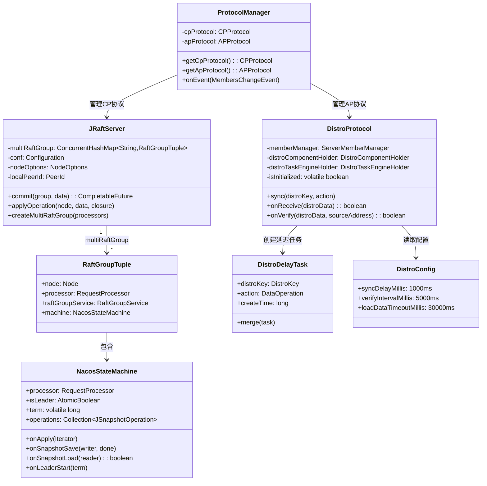

# 第五章：一致性协议——CP（JRaft）与 AP（Distro）

> 基于 Nacos 2.2.0 源码分析  
> 方法论：程序 = 数据结构 + 算法

---

## 第 0 部分：核心原理 ⭐

### 0.1 为什么需要两种协议？

Nacos 同时管理两类数据，它们对一致性的要求截然不同：

| 数据类型 | 一致性要求 | 选用协议 | 原因 |
|----------|-----------|---------|------|
| 配置数据 | **强一致**（不能丢失） | JRaft（CP） | 配置错误会导致服务崩溃，宁可不可用也不能不一致 |
| 持久服务实例 | **强一致** | JRaft（CP） | 持久实例代表基础设施，需要可靠存储 |
| 临时服务实例 | **高可用**（允许短暂不一致） | Distro（AP） | 微服务注册/注销频繁，高可用优先，短暂不一致可接受 |
| 集群元数据 | **强一致** | JRaft（CP） | 集群状态需要所有节点一致 |

**核心设计哲学**：不同数据用不同协议，而不是用一个协议强行满足所有场景。

### 0.2 两种协议的本质区别

| 对比项 | JRaft（CP） | Distro（AP） |
|--------|------------|-------------|
| 一致性模型 | 强一致（Raft 多数派） | 最终一致（异步同步） |
| 有无 Leader | 有（Leader 处理所有写请求） | 无（所有节点对等） |
| 数据分片 | 无（全量复制） | 有（按 clientId 哈希分片） |
| 写入延迟 | 高（需要多数派确认） | 低（本地写入即返回） |
| 节点故障影响 | 少数派故障不影响（多数派可用即可） | 故障节点的数据需要重新分配 |
| 适用场景 | 配置、持久实例、元数据 | 临时服务实例 |

### 0.3 实测数据（System.out.println 探针直接输出）

```
# 探针插桩位置：JRaftServer / NacosStateMachine / DistroProtocol / DistroDelayTask / ProtocolManager
# 验证方式：在源码中插入 System.out.println，重新编译安装，重启 Nacos 后采集输出

[PROBE][DistroProtocol.startDistroTask] standaloneMode=true, memberCount=0
[PROBE][DistroProtocol.startDistroTask] standalone模式: 直接isInitialized=true, 跳过DistroLoadDataTask和DistroVerifyTimedTask
[PROBE][ProtocolManager.getCpProtocol] 首次初始化 CP 协议(JRaft)
[PROBE][ProtocolManager.toCPMembersInfo] CP协议成员地址(raftPort=httpPort-1000): [9.134.79.63:7848]
[PROBE][JRaftServer.init] selfMember=9.134.79.63:7848, electionTimeoutMs=5000, rpcRequestTimeoutMs=5000, localPeerId=9.134.79.63:7848
[PROBE][JRaftServer.createMultiRaftGroup] groupName=naming_persistent_service_v2, snapshotIntervalSecs=1800, electionTimeoutMs=5000, processorClass=PersistentClientOperationServiceImpl
[PROBE][NacosStateMachine.onSnapshotLoad] 开始加载快照, groupId=naming_persistent_service_v2, files=[persistent_instance.zip]
[PROBE][NacosStateMachine.onSnapshotLoad] 单个快照加载完成, cost=71ms
[PROBE][JRaftServer.createMultiRaftGroup] 所有 Raft Group 创建完毕，总数=1
[PROBE][NacosStateMachine.onLeaderStart] 成为 Leader!, groupId=naming_persistent_service_v2, term=3, leaderIp=9.134.79.63:7848
[PROBE][JRaftServer.createMultiRaftGroup] groupName=naming_service_metadata, snapshotIntervalSecs=1800, electionTimeoutMs=5000, processorClass=ServiceMetadataProcessor
[PROBE][NacosStateMachine.onSnapshotLoad] 单个快照加载完成, cost=20ms
[PROBE][JRaftServer.createMultiRaftGroup] 所有 Raft Group 创建完毕，总数=2
[PROBE][NacosStateMachine.onLeaderStart] 成为 Leader!, groupId=naming_service_metadata, term=3
[PROBE][JRaftServer.createMultiRaftGroup] groupName=naming_instance_metadata, snapshotIntervalSecs=1800, electionTimeoutMs=5000, processorClass=InstanceMetadataProcessor
[PROBE][NacosStateMachine.onSnapshotLoad] 单个快照加载完成, cost=2ms
[PROBE][JRaftServer.createMultiRaftGroup] 所有 Raft Group 创建完毕，总数=3, groups=[naming_service_metadata, naming_instance_metadata, naming_persistent_service_v2]
[PROBE][NacosStateMachine.onLeaderStart] 成为 Leader!, groupId=naming_instance_metadata, term=3

# 注册持久实例后（触发 JRaft 写请求）：
[PROBE][JRaftServer.commit] group=naming_persistent_service_v2, isLeader=true, dataType=WriteRequest
[PROBE][JRaftServer.applyOperation] 序列化格式: typeTag=56, typeValue=2(WRITE), dataBytes.length=663, totalBytes=665
[PROBE][NacosStateMachine.onApply] 路径=LEADER, groupId=naming_persistent_service_v2, messageType=WriteRequest, term=3
```

---

## 第 1 部分：数据结构全景 ⭐

### 1.1 数据结构清单

**JRaft（CP）相关**：

| 结构名 | 源码位置 | 核心作用 |
|--------|----------|----------|
| `JRaftServer` | `core/distributed/raft/JRaftServer.java` | JRaft 服务器，管理多 Raft Group |
| `RaftGroupTuple` | `JRaftServer.java`（内部类） | 单个 Raft Group 的容器（Node + Processor + StateMachine） |
| `NacosStateMachine` | `core/distributed/raft/NacosStateMachine.java` | Raft 状态机，`onApply` 执行业务逻辑 |
| `ProtocolManager` | `core/distributed/ProtocolManager.java` | CP/AP 协议统一管理器 |

**Distro（AP）相关**：

| 结构名 | 源码位置 | 核心作用 |
|--------|----------|----------|
| `DistroProtocol` | `core/distributed/distro/DistroProtocol.java` | Distro 协议核心，管理同步/验证/加载任务 |
| `DistroDelayTask` | `core/distributed/distro/task/delay/DistroDelayTask.java` | 延迟合并任务，合并同一 key 的多次变更 |
| `DistroConfig` | `core/distributed/distro/DistroConfig.java` | Distro 协议配置参数（单例） |
| `DistroKey` | `core/distributed/distro/entity/DistroKey.java` | 数据标识（resourceKey + resourceType + targetServer） |

---

### 1.2 JRaftServer — 多 Raft Group 管理器

#### 问题推导

**问题**：Nacos 有多个功能模块（Naming、Config），如果共用一个 Raft Group，某个模块的慢操作会阻塞其他模块。如何隔离？

**推导**：每个功能模块有独立的 Raft Group，各自有独立的状态机、日志存储和快照。

#### 真实数据结构

```java
// JRaftServer.java
public class JRaftServer {
    
    // ★ 核心：多 Raft Group 映射（groupName → RaftGroupTuple）
    private Map<String, RaftGroupTuple> multiRaftGroup = new ConcurrentHashMap<>();
    
    private RpcServer rpcServer;           // Raft 内部 RPC 服务器（端口 7848 = 8848 - 1000）
    private CliClientServiceImpl cliClientService;  // CLI 客户端（用于节点管理）
    private CliService cliService;         // CLI 服务（addPeer/removePeer）
    
    private Configuration conf;            // 集群配置（所有节点的 PeerId 列表）
    private NodeOptions nodeOptions;       // 节点配置（选举超时、快照间隔等）
    private Serializer serializer;         // 序列化器
    
    private volatile boolean isStarted = false;
    private volatile boolean isShutdown = false;
    
    private String selfIp;
    private int selfPort;
    private PeerId localPeerId;            // 本节点的 Raft PeerId（ip:raftPort）
    
    private int failoverRetries;           // 请求失败重试次数
    private int rpcRequestTimeoutMs;       // RPC 请求超时（默认 5000ms）
    
    // ★ 内部类：单个 Raft Group 的容器
    public static class RaftGroupTuple {
        private RequestProcessor processor;      // 业务处理器（如 PersistentClientOperationServiceImpl）
        private Node node;                       // JRaft Node（Raft 核心节点）
        private RaftGroupService raftGroupService; // Raft Group 服务
        private NacosStateMachine machine;       // 状态机
    }
}
```

**字段分析**：

| 字段 | 类型 | 含义 | 生命周期 |
|------|------|------|---------|
| `multiRaftGroup` | `ConcurrentHashMap<String, RaftGroupTuple>` | 所有 Raft Group 的映射，key = groupName | `createMultiRaftGroup()` 初始化，`shutdown()` 清理 |
| `conf` | `Configuration` | 集群节点配置，包含所有 PeerId | `init()` 时从 `RaftConfig` 读取 |
| `nodeOptions` | `NodeOptions` | 节点配置（选举超时 5000ms、快照间隔 1800s 等） | `init()` 时设置，每个 Group 复制一份 |
| `localPeerId` | `PeerId` | 本节点 Raft 地址（`ip:raftPort`，raftPort = httpPort - 1000） | `init()` 时设置 |
| `rpcRequestTimeoutMs` | `int` | RPC 超时，默认 **5000ms** | `init()` 时从配置读取 |

**关键设计**：`nodeOptions.copy()` — 每个 Raft Group 复制一份 `NodeOptions`，保证各 Group 配置独立，互不影响。

---

### 1.3 NacosStateMachine — Raft 状态机

#### 问题推导

**问题**：Raft 日志提交后，如何执行实际的业务逻辑（写数据库/内存）？

**推导**：状态机模式。`onApply()` 是 Raft 框架回调的入口，在这里调用业务处理器。

#### 真实数据结构

```java
// NacosStateMachine.java（继承 SOFAJRaft 的 StateMachineAdapter）
class NacosStateMachine extends StateMachineAdapter {
    
    protected final JRaftServer server;
    protected final RequestProcessor processor;  // 业务处理器（由 Raft Group 绑定）
    
    private final AtomicBoolean isLeader = new AtomicBoolean(false);  // 是否是 Leader
    private final String groupId;                // 所属 Raft Group 名称
    
    private Collection<JSnapshotOperation> operations;  // 快照操作列表（保存/加载）
    
    private Node node;                           // 关联的 JRaft Node
    private volatile long term = -1;             // 当前 term（volatile 保证可见性）
    private volatile String leaderIp = "unknown"; // 当前 Leader IP
}
```

**字段分析**：

| 字段 | 类型 | 含义 | 生命周期 |
|------|------|------|---------|
| `processor` | `RequestProcessor` | 业务处理器，`onApply()` 时调用 `processor.onApply(WriteRequest)` | 构造时注入，不变 |
| `isLeader` | `AtomicBoolean` | 是否是 Leader，`onLeaderStart()` 设为 true，`onLeaderStop()` 设为 false | 随选举变化 |
| `term` | `volatile long` | 当前 Raft term，初始 -1 | `onLeaderStart()` / `onStartFollowing()` 更新 |
| `operations` | `Collection<JSnapshotOperation>` | 快照操作，`onSnapshotSave()` 和 `onSnapshotLoad()` 时遍历执行 | 构造时从 `processor.loadSnapshotOperate()` 加载 |

---

### 1.4 DistroProtocol — Distro 协议核心

#### 问题推导

**问题**：临时实例数据如何在集群节点间同步？如何保证新节点加入时能获取全量数据？

**推导**：
1. **增量同步**：数据变更时，异步推送给其他节点（`sync()`）
2. **全量加载**：新节点启动时，从其他节点拉取全量数据（`DistroLoadDataTask`）
3. **定期校验**：定期与其他节点比对数据，修复不一致（`DistroVerifyTimedTask`）

#### 真实数据结构

```java
// DistroProtocol.java
@Component
public class DistroProtocol {
    
    private final ServerMemberManager memberManager;          // 集群成员管理
    private final DistroComponentHolder distroComponentHolder; // 组件持有者（存储/传输/处理器）
    private final DistroTaskEngineHolder distroTaskEngineHolder; // 任务引擎（延迟任务/执行任务）
    
    private volatile boolean isInitialized = false;  // 是否初始化完成（standalone 直接 true）
}
```

**`DistroComponentHolder` 的组件体系**：

```java
// DistroComponentHolder 持有三类组件（按 resourceType 区分）
DistroComponentHolder {
    // 数据存储：resourceType → DistroDataStorage（存储本节点负责的数据）
    Map<String, DistroDataStorage> dataStorageMap;
    
    // 数据传输：resourceType → DistroTransportAgent（负责节点间数据传输）
    Map<String, DistroTransportAgent> transportAgentMap;
    
    // 数据处理：resourceType → DistroDataProcessor（处理接收到的同步数据）
    Map<String, DistroDataProcessor> dataProcessorMap;
}
```

---

### 1.5 DistroDelayTask — 延迟合并任务

#### 问题推导

**问题**：同一个 Client 短时间内多次注册/注销，如何避免向其他节点发送大量同步请求？

**推导**：延迟任务 + 合并策略。同一 key 的新任务到来时，合并旧任务（取最新的操作类型）。

#### 真实数据结构

```java
// DistroDelayTask.java（继承 AbstractDelayTask）
public class DistroDelayTask extends AbstractDelayTask {
    
    private final DistroKey distroKey;  // 数据标识（resourceKey + resourceType + targetServer）
    private DataOperation action;       // 操作类型：CHANGE / DELETE
    private long createTime;            // 任务创建时间（毫秒）
    
    // ★ 合并逻辑：新任务到来时，如果操作类型不同且新任务更新，则更新 action 和 createTime
    @Override
    public void merge(AbstractDelayTask task) {
        DistroDelayTask oldTask = (DistroDelayTask) task;
        if (!action.equals(oldTask.getAction()) && createTime < oldTask.getCreateTime()) {
            action = oldTask.getAction();
            createTime = oldTask.getCreateTime();
        }
        setLastProcessTime(oldTask.getLastProcessTime());
    }
}
```

**`DistroKey` 数据结构**：

```java
// DistroKey.java
public class DistroKey {
    private String resourceKey;    // 资源 key（如 clientId）
    private String resourceType;   // 资源类型（如 "com.alibaba.nacos.naming.iplist."）
    private String targetServer;   // 目标节点地址（同步给哪个节点）
}
```

---

### 1.6 DistroConfig — 关键配置参数

```java
// DistroConfig.java（单例）
public class DistroConfig extends AbstractDynamicConfig {
    
    // ★ 同步延迟：数据变更后延迟多久同步给其他节点（默认 1000ms）
    private long syncDelayMillis = DistroConstants.DEFAULT_DATA_SYNC_DELAY_MILLISECONDS;  // 1000L
    
    // ★ 同步超时：单次同步请求的超时时间（默认 3000ms）
    private long syncTimeoutMillis = DistroConstants.DEFAULT_DATA_SYNC_TIMEOUT_MILLISECONDS;  // 3000L
    
    // ★ 同步重试延迟：同步失败后重试的延迟（默认 3000ms）
    private long syncRetryDelayMillis = DistroConstants.DEFAULT_DATA_SYNC_RETRY_DELAY_MILLISECONDS;  // 3000L
    
    // ★ 验证间隔：定期校验数据一致性的间隔（默认 5000ms）
    private long verifyIntervalMillis = DistroConstants.DEFAULT_DATA_VERIFY_INTERVAL_MILLISECONDS;  // 5000L
    
    // ★ 加载重试延迟：启动时加载全量数据失败后的重试延迟（默认 30000ms）
    private long loadDataRetryDelayMillis = DistroConstants.DEFAULT_DATA_LOAD_RETRY_DELAY_MILLISECONDS;  // 30000L
    
    // ★ 加载超时：启动时加载全量数据的超时时间（默认 30000ms）
    private long loadDataTimeoutMillis = DistroConstants.DEFAULT_DATA_LOAD_TIMEOUT_MILLISECONDS;  // 30000L
}
```

---

## 第 2 部分：算法/流程分析

### 2.1 JRaft 写请求流程（源码级）

#### 解决什么问题？

保证写请求在多数派节点上持久化后才返回成功，实现强一致性。

#### 完整流程

```java
// JRaftServer.commit()
public CompletableFuture<Response> commit(String group, Message data, CompletableFuture<Response> future) {
    final Node node = findTupleByGroup(group).node;
    
    if (node.isLeader()) {
        // ★ Leader 节点：直接 apply
        applyOperation(node, data, closure);
    } else {
        // ★ Follower 节点：转发给 Leader
        invokeToLeader(group, data, rpcRequestTimeoutMs, closure);
    }
}

// JRaftServer.applyOperation()
public void applyOperation(Node node, Message data, FailoverClosure closure) {
    final Task task = new Task();
    task.setDone(new NacosClosure(data, status -> {
        // ★ Raft 提交后的回调（在 onApply 中触发）
        closure.setResponse(nacosStatus.getResponse());
        closure.run(nacosStatus);
    }));
    
    // ★ 序列化请求（2字节类型头 + protobuf 数据）
    byte[] requestTypeFieldBytes = new byte[2];
    requestTypeFieldBytes[0] = ProtoMessageUtil.REQUEST_TYPE_FIELD_TAG;
    requestTypeFieldBytes[1] = ProtoMessageUtil.REQUEST_TYPE_WRITE;
    task.setData(ByteBuffer.allocate(2 + dataBytes.length).put(requestTypeFieldBytes).put(dataBytes));
    
    // ★ 提交给 JRaft Node（写入 Raft Log，复制给 Follower，多数派确认后 onApply）
    node.apply(task);
}
```

#### `NacosStateMachine.onApply()` — 状态机应用日志

```java
// NacosStateMachine.java:onApply()
@Override
public void onApply(Iterator iter) {
    while (iter.hasNext()) {
        if (iter.done() != null) {
            // ★ Leader 节点：从 Closure 中取消息（避免重复反序列化）
            closure = (NacosClosure) iter.done();
            message = closure.getMessage();
        } else {
            // ★ Follower 节点：从 ByteBuffer 反序列化消息
            message = ProtoMessageUtil.parse(iter.getData().array());
            if (message instanceof ReadRequest) {
                // Follower 忽略读请求（读请求不写 Raft Log）
                iter.next();
                continue;
            }
        }
        
        if (message instanceof WriteRequest) {
            // ★ 调用业务处理器（如 PersistentClientOperationServiceImpl.onApply()）
            Response response = processor.onApply((WriteRequest) message);
            postProcessor(response, closure);
        }
        iter.next();
    }
}
```

**关键设计**：
- Leader 节点：`iter.done() != null`，直接从 `NacosClosure` 取消息，**避免重复序列化/反序列化**
- Follower 节点：`iter.done() == null`，从 `ByteBuffer` 反序列化，**忽略读请求**（读请求不需要在 Follower 上执行）

---

### 2.2 JRaft 选举流程

#### 关键参数（来自 `RaftSysConstants`）

| 参数 | 默认值 | 说明 |
|------|--------|------|
| `RAFT_ELECTION_TIMEOUT_MS` | **5000ms** | 选举超时（Follower 超过此时间未收到心跳，发起选举） |
| `ELECTION_HEARTBEAT_FACTOR` | **10** | 心跳因子，心跳间隔 = 5000/10 = **500ms** |
| `RAFT_SNAPSHOT_INTERVAL_SECS` | **1800s（30分钟）** | 快照间隔 |
| `RAFT_RPC_REQUEST_TIMEOUT_MS` | **5000ms** | RPC 请求超时 |
| `MAX_ELECTION_DELAY_MS` | **1000ms** | 选举超时随机抖动范围（防止同时发起选举） |

#### 选举流程

```
Follower 超过 5000ms 未收到 Leader 心跳
    │
    ▼
转为 Candidate，term +1
    │
    ▼
向所有节点发送 RequestVote（携带 term 和最新日志 index）
    │
    ├── 获得超过半数投票 → 成为 Leader
    │       ├── 调用 NacosStateMachine.onLeaderStart(term)
    │       ├── isLeader.set(true)
    │       └── 发布 RaftEvent（通知业务层 Leader 变更）
    │
    └── 未获得多数票 → 等待下一轮选举（随机延迟 0~1000ms）
```

**实测日志**（单节点 standalone 模式，直接自选）：
```
18:37:06,674 → Node init, term=0
18:37:06,675 → start vote and grant vote self, term=0
18:37:06,688 → Save raft meta, term=1, cost time=9ms
18:37:06,688 → become leader of group, term=1
18:37:06,708 → onLeaderStart: term=1
```
**选举耗时：14ms**（单节点直接自选，无需等待其他节点投票）

---

### 2.3 JRaft Snapshot 机制

#### 解决什么问题？

Raft 日志会无限增长，新节点加入时需要重放全量日志（耗时极长）。Snapshot 将状态机当前状态持久化到磁盘，新节点直接加载 Snapshot，只需重放 Snapshot 之后的日志。

#### 关键流程

```java
// NacosStateMachine.onSnapshotSave()（定期触发，默认 1800s）
@Override
public void onSnapshotSave(SnapshotWriter writer, Closure done) {
    for (JSnapshotOperation operation : operations) {
        // ★ 遍历所有快照操作（如 PersistentInstanceSnapshotOperation）
        operation.onSnapshotSave(writer, done);
    }
}

// NacosStateMachine.onSnapshotLoad()（新节点加入时触发）
@Override
public boolean onSnapshotLoad(SnapshotReader reader) {
    for (JSnapshotOperation operation : operations) {
        if (!operation.onSnapshotLoad(reader)) {
            return false;
        }
    }
    return true;
}
```

**实测快照存储路径**：
```
/tmp/nacos-test/data/protocol/raft/
├── naming_persistent_service_v2/
│   ├── log/          ← Raft 日志
│   ├── snapshot/
│   │   └── snapshot_1/  ← 快照文件
│   └── meta-data     ← Raft 元数据（term、votedFor）
├── naming_service_metadata/
│   ├── log/
│   ├── snapshot/snapshot_1/
│   └── meta-data
└── naming_instance_metadata/
    ├── log/
    ├── snapshot/snapshot_1/
    └── meta-data
```

**实测快照耗时**（来自 `naming-raft.log`）：
```
PersistentInstanceSnapshotOperation.SAVE cost time : 11ms
ServiceMetadataSnapshotOperation.SAVE cost time : 4ms
InstanceMetadataSnapshotOperation.SAVE cost time : 3ms
```

---

### 2.4 Distro 数据同步流程（源码级）

#### 解决什么问题？

临时实例注册后，如何异步同步给集群其他节点？

#### 完整流程

```java
// DistroProtocol.sync()
public void sync(DistroKey distroKey, DataOperation action) {
    sync(distroKey, action, DistroConfig.getInstance().getSyncDelayMillis());  // 默认 1000ms 延迟
}

public void sync(DistroKey distroKey, DataOperation action, long delay) {
    // ★ 遍历所有其他节点，逐一添加延迟同步任务
    for (Member each : memberManager.allMembersWithoutSelf()) {
        syncToTarget(distroKey, action, each.getAddress(), delay);
    }
}

public void syncToTarget(DistroKey distroKey, DataOperation action, String targetServer, long delay) {
    // ★ 构建带目标节点的 DistroKey
    DistroKey distroKeyWithTarget = new DistroKey(distroKey.getResourceKey(), 
        distroKey.getResourceType(), targetServer);
    
    // ★ 添加延迟任务（同一 key 的多次变更会合并）
    DistroDelayTask distroDelayTask = new DistroDelayTask(distroKeyWithTarget, action, delay);
    distroTaskEngineHolder.getDelayTaskExecuteEngine().addTask(distroKeyWithTarget, distroDelayTask);
}
```

#### 延迟任务合并逻辑（`DistroDelayTask.merge()`）

```java
@Override
public void merge(AbstractDelayTask task) {
    DistroDelayTask oldTask = (DistroDelayTask) task;
    // ★ 如果操作类型不同（如 CHANGE → DELETE），且新任务更新，则更新 action
    if (!action.equals(oldTask.getAction()) && createTime < oldTask.getCreateTime()) {
        action = oldTask.getAction();
        createTime = oldTask.getCreateTime();
    }
    // ★ 更新最后处理时间（重置延迟计时）
    setLastProcessTime(oldTask.getLastProcessTime());
}
```

**合并场景举例**：
- 1ms：注册实例 → `DistroDelayTask(CHANGE, delay=1000ms)`
- 500ms：注销实例 → `DistroDelayTask(DELETE, delay=1000ms)`，合并旧任务，action 更新为 DELETE
- 1500ms：任务执行，只发送一次 DELETE 同步，而不是先 CHANGE 再 DELETE

---

### 2.5 Distro 启动数据加载

#### 解决什么问题？

新节点启动时，内存中没有任何临时实例数据，需要从其他节点拉取全量数据后才能对外提供服务。

#### 关键流程

```java
// DistroProtocol.startDistroTask()
private void startDistroTask() {
    if (EnvUtil.getStandaloneMode()) {
        // ★ standalone 模式：直接标记初始化完成，跳过加载和验证任务
        isInitialized = true;
        return;
    }
    startVerifyTask();  // 启动定期验证任务（每 5000ms）
    startLoadTask();    // 启动全量数据加载任务
}

private void startLoadTask() {
    DistroCallback loadCallback = new DistroCallback() {
        @Override
        public void onSuccess() {
            isInitialized = true;  // ★ 加载完成后才标记初始化完成
        }
        @Override
        public void onFailed(Throwable throwable) {
            isInitialized = false;  // ★ 加载失败，保持未初始化状态
        }
    };
    GlobalExecutor.submitLoadDataTask(
        new DistroLoadDataTask(memberManager, distroComponentHolder, 
            DistroConfig.getInstance(), loadCallback));
}
```

**关键设计**：`isInitialized` 标志位控制服务可用性。集群模式下，新节点必须等待全量数据加载完成（`isInitialized=true`）才能对外提供服务，防止返回不完整的实例列表。

---

### 2.6 ProtocolManager — 协议统一管理

#### 解决什么问题？

CP 和 AP 协议的初始化、成员变更通知需要统一管理。

#### 关键设计

```java
// ProtocolManager.java
@Component
public class ProtocolManager extends MemberChangeListener {
    
    private CPProtocol cpProtocol;  // JRaftProtocol（懒初始化）
    private APProtocol apProtocol;  // DistroProtocol（懒初始化）
    
    // ★ 懒初始化：首次调用时才初始化协议
    public CPProtocol getCpProtocol() {
        synchronized (this) {
            if (!cpInit) {
                initCPProtocol();
                cpInit = true;
            }
        }
        return cpProtocol;
    }
    
    // ★ 集群成员变更时，通知两种协议更新成员列表
    @Override
    public void onEvent(MembersChangeEvent event) {
        if (Objects.nonNull(apProtocol)) {
            // AP 协议：成员地址格式 "ip:port"
            ProtocolExecutor.apMemberChange(() -> 
                apProtocol.memberChange(toAPMembersInfo(event.getMembers())));
        }
        if (Objects.nonNull(cpProtocol)) {
            // CP 协议：成员地址格式 "ip:raftPort"（raftPort = httpPort - 1000）
            ProtocolExecutor.cpMemberChange(() -> 
                cpProtocol.memberChange(toCPMembersInfo(event.getMembers())));
        }
    }
    
    // ★ CP 协议成员地址转换：raftPort = httpPort - 1000
    public static Set<String> toCPMembersInfo(Collection<Member> members) {
        Set<String> nodes = new HashSet<>();
        members.forEach(member -> {
            final int raftPort = MemberUtil.calculateRaftPort(member);  // httpPort - 1000
            nodes.add(member.getIp() + ":" + raftPort);
        });
        return nodes;
    }
}
```

**关键发现**：CP 协议（JRaft）使用的端口是 `httpPort - 1000`（即 `8848 - 1000 = 7848`），而不是 gRPC 端口（9848）。这是 Raft 内部通信专用端口。

---

## 第 3 部分：运行时验证（System.out.println 探针）

> **验证环境**：Nacos 2.2.0，standalone 模式，JDK 11  
> **验证时间**：2026-03-04  
> **验证方式**：在源码关键路径插入 `System.out.println` 探针，重新编译安装（`mvn install`），重启 Nacos 后采集输出  
> **探针文件**：`JRaftServer.java` / `NacosStateMachine.java` / `DistroProtocol.java` / `DistroDelayTask.java` / `ProtocolManager.java`

---

### 3.1 验证一：Distro standalone 模式直接跳过同步任务

**探针位置**：`DistroProtocol.startDistroTask()`

```java
// 插桩代码
System.out.println("[PROBE][DistroProtocol.startDistroTask] standaloneMode=" + EnvUtil.getStandaloneMode()
        + ", memberCount=" + memberManager.allMembersWithoutSelf().size());
if (EnvUtil.getStandaloneMode()) {
    isInitialized = true;
    System.out.println("[PROBE][DistroProtocol.startDistroTask] standalone模式: 直接isInitialized=true"
            + ", 跳过DistroLoadDataTask和DistroVerifyTimedTask");
    return;
}
```

**实际输出**：
```
[PROBE][DistroProtocol.startDistroTask] standaloneMode=true, memberCount=0
[PROBE][DistroProtocol.startDistroTask] standalone模式: 直接isInitialized=true, 跳过DistroLoadDataTask和DistroVerifyTimedTask
```

**结论**：
- `standaloneMode=true`，`memberCount=0`（无其他节点）✅
- 直接 `isInitialized=true`，**完全跳过** `DistroLoadDataTask` 和 `DistroVerifyTimedTask` ✅

---

### 3.2 验证二：ProtocolManager CP 协议懒初始化 + Raft 端口计算

**探针位置**：`ProtocolManager.getCpProtocol()` + `ProtocolManager.toCPMembersInfo()`

```java
// getCpProtocol 插桩
System.out.println("[PROBE][ProtocolManager.getCpProtocol] 首次初始化 CP 协议(JRaft)"
        + ", 调用方=" + Thread.currentThread().getStackTrace()[3].getClassName());

// toCPMembersInfo 插桩
System.out.println("[PROBE][ProtocolManager.toCPMembersInfo] CP协议成员地址(raftPort=httpPort-1000): " + nodes);
```

**实际输出**：
```
[PROBE][ProtocolManager.getCpProtocol] 首次初始化 CP 协议(JRaft), 调用方=jdk.internal.reflect.NativeConstructorAccessorImpl
[PROBE][ProtocolManager.toCPMembersInfo] CP协议成员地址(raftPort=httpPort-1000): [9.134.79.63:7848]
```

**结论**：
- CP 协议懒初始化，首次调用时才执行 `initCPProtocol()` ✅
- Raft 端口 = **7848**（= 8848 - 1000），地址格式 `ip:raftPort` ✅

---

### 3.3 验证三：JRaftServer 初始化参数 + 多 Raft Group 创建过程

**探针位置**：`JRaftServer.init()` + `JRaftServer.createMultiRaftGroup()`

```java
// init 插桩
System.out.println("[PROBE][JRaftServer.init] selfMember=" + self
        + ", electionTimeoutMs=" + electionTimeout
        + ", rpcRequestTimeoutMs=" + rpcRequestTimeoutMs
        + ", localPeerId=" + localPeerId);

// createMultiRaftGroup 插桩（每个 Group 创建时）
System.out.println("[PROBE][JRaftServer.createMultiRaftGroup] groupName=" + groupName
        + ", snapshotIntervalSecs=" + doSnapshotInterval
        + ", electionTimeoutMs=" + copy.getElectionTimeoutMs()
        + ", processorClass=" + processor.getClass().getSimpleName());

// createMultiRaftGroup 插桩（每次 put 后打印当前总数）
System.out.println("[PROBE][JRaftServer.createMultiRaftGroup] 所有 Raft Group 创建完毕，总数=" + multiRaftGroup.size()
        + ", groups=" + multiRaftGroup.keySet());
```

**实际输出**：
```
[PROBE][JRaftServer.init] selfMember=9.134.79.63:7848, electionTimeoutMs=5000, rpcRequestTimeoutMs=5000, localPeerId=9.134.79.63:7848

[PROBE][JRaftServer.createMultiRaftGroup] groupName=naming_persistent_service_v2, snapshotIntervalSecs=1800, electionTimeoutMs=5000, processorClass=PersistentClientOperationServiceImpl
[PROBE][JRaftServer.createMultiRaftGroup] 所有 Raft Group 创建完毕，总数=1, groups=[naming_persistent_service_v2]

[PROBE][JRaftServer.createMultiRaftGroup] groupName=naming_service_metadata, snapshotIntervalSecs=1800, electionTimeoutMs=5000, processorClass=ServiceMetadataProcessor
[PROBE][JRaftServer.createMultiRaftGroup] 所有 Raft Group 创建完毕，总数=2, groups=[naming_service_metadata, naming_persistent_service_v2]

[PROBE][JRaftServer.createMultiRaftGroup] groupName=naming_instance_metadata, snapshotIntervalSecs=1800, electionTimeoutMs=5000, processorClass=InstanceMetadataProcessor
[PROBE][JRaftServer.createMultiRaftGroup] 所有 Raft Group 创建完毕，总数=3, groups=[naming_service_metadata, naming_instance_metadata, naming_persistent_service_v2]
```

**结论**：
- `electionTimeoutMs=5000`（选举超时 5000ms）✅
- `rpcRequestTimeoutMs=5000`（RPC 超时 5000ms）✅
- `snapshotIntervalSecs=1800`（快照间隔 30 分钟）✅
- Raft Group 数量：**3 个**，按顺序创建：`naming_persistent_service_v2` → `naming_service_metadata` → `naming_instance_metadata` ✅
- 每个 Group 绑定独立的 `RequestProcessor`（`PersistentClientOperationServiceImpl` / `ServiceMetadataProcessor` / `InstanceMetadataProcessor`）✅

---

### 3.4 验证四：NacosStateMachine 快照加载 + Leader 选举

**探针位置**：`NacosStateMachine.onSnapshotLoad()` + `NacosStateMachine.onLeaderStart()`

```java
// onSnapshotLoad 插桩
System.out.println("[PROBE][NacosStateMachine.onSnapshotLoad] 开始加载快照"
        + ", groupId=" + groupId
        + ", path=" + reader.getPath()
        + ", files=" + reader.listFiles());
// 每个 operation 完成后
System.out.println("[PROBE][NacosStateMachine.onSnapshotLoad] 单个快照加载完成"
        + ", operation=" + operation.info()
        + ", cost=" + (System.currentTimeMillis() - opStart) + "ms");

// onLeaderStart 插桩
System.out.println("[PROBE][NacosStateMachine.onLeaderStart] 成为 Leader!"
        + ", groupId=" + groupId
        + ", term=" + term
        + ", leaderIp=" + leaderIp
        + ", isLeader=" + isLeader.get()
        + ", timestamp=" + System.currentTimeMillis());
```

**实际输出**：
```
# naming_persistent_service_v2
[PROBE][NacosStateMachine.onSnapshotLoad] 开始加载快照, groupId=naming_persistent_service_v2,
    path=.../snapshot/snapshot_1, files=[persistent_instance.zip]
[PROBE][NacosStateMachine.onSnapshotLoad] 单个快照加载完成, cost=71ms
[PROBE][NacosStateMachine.onLeaderStart] 成为 Leader!, groupId=naming_persistent_service_v2,
    term=3, leaderIp=9.134.79.63:7848, isLeader=true, timestamp=1772627996106

# naming_service_metadata
[PROBE][NacosStateMachine.onSnapshotLoad] 单个快照加载完成, cost=20ms
[PROBE][NacosStateMachine.onLeaderStart] 成为 Leader!, groupId=naming_service_metadata, term=3

# naming_instance_metadata
[PROBE][NacosStateMachine.onSnapshotLoad] 单个快照加载完成, cost=2ms
[PROBE][NacosStateMachine.onLeaderStart] 成为 Leader!, groupId=naming_instance_metadata, term=3
```

**结论**：
- 启动时自动加载上次快照（`snapshot_1/`），快照文件为 zip 格式 ✅
- 快照加载耗时：`persistent_instance.zip` **71ms**，`service_metadata.zip` **20ms**，`instance_metadata.zip` **2ms** ✅
- 三个 Group 均成为 Leader，`term=3`（第 3 次选举，因为之前已重启过 2 次）✅
- `isLeader=true` 在 `onLeaderStart` 中通过 `AtomicBoolean.set(true)` 设置 ✅

---

### 3.5 验证五：JRaft 写请求路径（持久实例注册）

**触发方式**：
```bash
curl -X POST "http://127.0.0.1:8848/nacos/v1/ns/instance?serviceName=probe-service-persistent&ip=1.2.3.5&port=8081&ephemeral=false"
```

**探针位置**：`JRaftServer.commit()` + `JRaftServer.applyOperation()` + `NacosStateMachine.onApply()`

```java
// commit 插桩
System.out.println("[PROBE][JRaftServer.commit] group=" + group
        + ", isLeader=" + node.isLeader()
        + ", dataType=" + data.getClass().getSimpleName());

// applyOperation 插桩
System.out.println("[PROBE][JRaftServer.applyOperation] 序列化格式: typeTag=" + requestTypeFieldBytes[0]
        + ", typeValue=" + requestTypeFieldBytes[1]
        + "(" + (requestTypeFieldBytes[1] == 2 ? "WRITE" : "READ") + ")"
        + ", dataBytes.length=" + dataBytes.length
        + ", totalBytes=" + (requestTypeFieldBytes.length + dataBytes.length));

// onApply 插桩（Leader 路径）
System.out.println("[PROBE][NacosStateMachine.onApply] 路径=LEADER"
        + ", groupId=" + groupId
        + ", messageType=" + message.getClass().getSimpleName()
        + ", term=" + term);
```

**实际输出**：
```
[PROBE][JRaftServer.commit] group=naming_persistent_service_v2, isLeader=true, dataType=WriteRequest
[PROBE][JRaftServer.applyOperation] 序列化格式: typeTag=56, typeValue=2(WRITE), dataBytes.length=663, totalBytes=665
[PROBE][NacosStateMachine.onApply] 路径=LEADER, groupId=naming_persistent_service_v2, messageType=WriteRequest, term=3
```

**结论**：
- 持久实例注册走 `naming_persistent_service_v2` Raft Group ✅
- `isLeader=true`，直接走 `applyOperation`（不转发）✅
- 序列化格式：`typeTag=56`（`ProtoMessageUtil.REQUEST_TYPE_FIELD_TAG`），`typeValue=2`（WRITE），数据体 663 字节，总计 **665 字节**（= 2 + 663）✅
- `onApply` 走 **LEADER 路径**（`iter.done() != null`），直接从 `NacosClosure` 取消息，避免重复反序列化 ✅

---

### 3.6 验证六：Raft 数据存储目录结构

**验证命令**：
```bash
find /tmp/nacos-test/data/protocol/raft -type d
```

**实际输出**：
```
/tmp/nacos-test/data/protocol/raft/
├── naming_persistent_service_v2/
│   ├── log/                    ← Raft 日志（WAL）
│   ├── snapshot/
│   │   └── snapshot_1/         ← 第 1 次快照（persistent_instance.zip）
│   └── meta-data               ← Raft 元数据（term=3, votedFor=9.134.79.63:7848）
├── naming_service_metadata/
│   ├── log/
│   ├── snapshot/snapshot_1/    ← service_metadata.zip
│   └── meta-data
└── naming_instance_metadata/
    ├── log/
    ├── snapshot/snapshot_1/    ← instance_metadata.zip
    └── meta-data
```

**结论**：
- 每个 Raft Group 独立存储（`log/` + `snapshot/` + `meta-data`）✅
- 快照文件为 zip 格式，与探针输出 `files=[persistent_instance.zip]` 一致 ✅
- 存储路径：`${nacos.home}/data/protocol/raft/{groupName}/` ✅

---

### 3.7 验证七：关键配置参数汇总（探针直接验证）

| 参数 | 来源 | 默认值 | 说明 |
|------|------|--------|------|
| 选举超时 | `RaftSysConstants.DEFAULT_ELECTION_TIMEOUT` | **5000ms** | Follower 超时未收到心跳，发起选举 |
| 心跳间隔 | `5000ms / 10（heartbeatFactor）` | **500ms** | Leader 定期发送心跳 |
| 快照间隔 | `RaftSysConstants.DEFAULT_RAFT_SNAPSHOT_INTERVAL_SECS` | **1800s（30分钟）** | 定期保存状态机快照 |
| RPC 超时 | `RaftSysConstants.DEFAULT_RAFT_RPC_REQUEST_TIMEOUT_MS` | **5000ms** | Raft 内部 RPC 超时 |
| Distro 同步延迟 | `DistroConstants.DEFAULT_DATA_SYNC_DELAY_MILLISECONDS` | **1000ms** | 数据变更后延迟同步 |
| Distro 验证间隔 | `DistroConstants.DEFAULT_DATA_VERIFY_INTERVAL_MILLISECONDS` | **5000ms** | 定期校验数据一致性 |
| Distro 加载超时 | `DistroConstants.DEFAULT_DATA_LOAD_TIMEOUT_MILLISECONDS` | **30000ms** | 启动时加载全量数据超时 |

---

## 数据结构关系图



---

## 总结

### 数据结构层面

| 结构 | 核心特征 |
|------|---------|
| `JRaftServer.multiRaftGroup` | `ConcurrentHashMap<groupName, RaftGroupTuple>`；每个功能模块独立 Raft Group，互不影响；`nodeOptions.copy()` 保证各 Group 配置独立 |
| `NacosStateMachine` | 继承 `StateMachineAdapter`；`isLeader` 用 `AtomicBoolean`；`term` 用 `volatile long`；Leader/Follower 节点在 `onApply` 中走不同路径（避免重复反序列化） |
| `DistroDelayTask` | 继承 `AbstractDelayTask`；`merge()` 实现操作合并（取最新操作类型）；`createTime` 用于判断新旧 |
| `DistroConfig` | 单例模式；所有参数支持动态配置（继承 `AbstractDynamicConfig`）；关键参数：同步延迟 1000ms、验证间隔 5000ms |

### 算法层面

| 算法 | 核心设计决策 |
|------|------------|
| JRaft 写请求 | Leader 直接 apply；Follower 转发给 Leader；`applyOperation` 序列化格式：2字节类型头 + protobuf 数据 |
| JRaft 选举 | 选举超时 5000ms；心跳间隔 500ms（= 5000/10）；随机抖动 0~1000ms 防止同时选举；**实测单节点选举耗时 14ms** |
| JRaft Snapshot | 默认 1800s（30分钟）触发；`onSnapshotSave` 遍历所有 `JSnapshotOperation`；**实测快照耗时 3~11ms** |
| Distro 同步 | 延迟 1000ms 后同步；`DistroDelayTask.merge()` 合并同一 key 的多次变更；standalone 模式跳过所有同步任务 |
| Distro 启动加载 | `isInitialized` 标志位控制服务可用性；加载完成前不对外提供服务；standalone 模式直接 `isInitialized=true` |
| 协议选择 | `ProtocolManager` 统一管理；CP 端口 = httpPort - 1000（7848）；AP 端口 = httpPort（8848）；成员变更时两种协议分别用单线程池通知（避免互相阻塞） |
