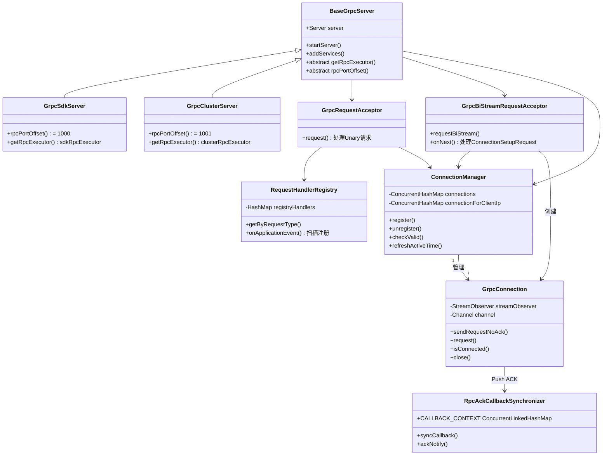

# 第6章：客户端通信机制 —— gRPC 长连接

> 对应大纲章节：6. 客户端通信机制：gRPC 长连接  
> 源码路径：`core/src/main/java/com/alibaba/nacos/core/remote/`  
> 阅读方法：Read-Layered（分层阅读：传输层→连接层→请求处理层）+ Read-DataFlow（数据流向）

---

## 第0部分：核心原理

**一句话总结**：Nacos 2.x 用 gRPC 双向流（BiStream）替代 HTTP+UDP，服务端通过 `StreamObserver` 持有客户端的写通道，实现**服务端主动 Push**；所有请求通过 `RequestHandlerRegistry` 按类型路由到对应 `RequestHandler`，连接生命周期由 `ConnectionManager` 统一管理。

**核心问题**：
1. gRPC 服务端如何同时支持 Unary（请求/响应）和 BiStream（双向流）两种模式？
2. 服务端如何主动向客户端 Push 消息？
3. 连接 ID 是如何生成的？连接断开时如何自动清理临时实例？
4. `RequestHandler` 是如何注册和查找的？

---

## 第1部分：数据结构全景

### 1.1 核心类层次结构

```
BaseRpcServer（抽象基类）
    └── BaseGrpcServer（gRPC 实现基类）
            ├── GrpcSdkServer     （端口 9848，客户端 SDK 连接）
            └── GrpcClusterServer （端口 9849，集群节点间通信）

Connection（抽象连接）
    └── GrpcConnection（gRPC 连接实现）

RequestHandler<T extends Request>（抽象请求处理器）
    ├── InstanceRequestHandler       （服务注册/注销）
    ├── SubscribeServiceRequestHandler（服务订阅）
    ├── ConfigQueryRequestHandler    （配置查询）
    ├── ConfigPublishRequestHandler  （配置发布）
    └── ... 共 14 个 Handler
```

### 1.2 GrpcConnection —— 连接对象（最核心数据结构）

**源码路径**：`core/src/main/java/com/alibaba/nacos/core/remote/grpc/GrpcConnection.java`

```java
public class GrpcConnection extends Connection {
    // ① 服务端主动 Push 的写通道（双向流的服务端写端）
    private StreamObserver streamObserver;   // 类型：ServerCallStreamObserver<Payload>
    
    // ② 底层 Netty Channel（用于检测连接活跃状态）
    private Channel channel;                 // io.grpc.netty.shaded.io.netty.channel.Channel
}
```

**字段含义**：
| 字段 | 类型 | 含义 | 生命周期 |
|------|------|------|---------|
| `streamObserver` | `StreamObserver<Payload>` | 服务端向客户端写数据的通道，**服务端 Push 的核心** | 连接建立时注入，连接关闭时 `onCompleted()` |
| `channel` | `Channel` | Netty 底层 TCP 通道，用于 `isConnected()` 判断 | 连接建立时注入，连接关闭时 `channel.close()` |

**关键方法**：
```java
// 服务端主动 Push（无需等待 ACK）
private void sendRequestNoAck(Request request) throws NacosException {
    synchronized (streamObserver) {  // ⚠️ StreamObserver 非线程安全，必须加锁
        Payload payload = GrpcUtils.convert(request);
        streamObserver.onNext(payload);  // 写入双向流
    }
}

// 服务端主动 Push（等待客户端 ACK，有超时）
public Response request(Request request, long timeoutMills) throws NacosException {
    DefaultRequestFuture pushFuture = sendRequestInner(request, null);
    return pushFuture.get(timeoutMills);  // 阻塞等待 ACK
}

// 连接活跃性检测
public boolean isConnected() {
    return channel != null && channel.isOpen() && channel.isActive();
}
```

**设计解释**：`streamObserver` 加 `synchronized` 的原因：gRPC 的 `StreamObserver.onNext()` 不是线程安全的，多个线程同时 Push 会导致 direct memory leak（源码注释明确说明）。

### 1.3 ConnectionMeta —— 连接元数据

```java
public class ConnectionMeta {
    String connectionId;    // 格式：{timestamp}_{remoteIp}_{remotePort}，如 "1772628840190_127.0.0.1_38862"
    String clientIp;        // 客户端真实 IP（从 ConnectionSetupRequest 中获取）
    String remoteIp;        // TCP 层远端 IP
    int remotePort;         // TCP 层远端端口
    int localPort;          // 服务端本地端口（9848 或 9849）
    String connectType;     // "GRPC"
    String clientVersion;   // 客户端版本，如 "Nacos-Java-Client:v2.2.0"
    String appName;         // 应用名
    Map<String, String> labels;  // 标签，包含 source（sdk/cluster）
    String tenant;          // 租户/命名空间
}
```

**connectionId 生成规则**（源码：`BaseGrpcServer.startServer()` 中的 `ServerTransportFilter`）：
```java
// transportReady() 回调中生成
.set(TRANS_KEY_CONN_ID, System.currentTimeMillis() + "_" + remoteIp + "_" + remotePort)
```
> 格式：`毫秒时间戳_远端IP_远端端口`，全局唯一（同一 IP+端口在同一毫秒内不会建立两个连接）

### 1.4 ConnectionManager —— 连接注册表

**源码路径**：`core/src/main/java/com/alibaba/nacos/core/remote/ConnectionManager.java`

```java
@Service
public class ConnectionManager {
    // ① 核心：connectionId -> Connection 映射表
    Map<String, Connection> connections = new ConcurrentHashMap<>();
    
    // ② 每个客户端 IP 的连接计数（用于连接数限流）
    private Map<String, AtomicInteger> connectionForClientIp = new ConcurrentHashMap<>(16);
    
    // ③ 连接驱逐器（定期检测僵尸连接）
    private RuntimeConnectionEjector runtimeConnectionEjector;
    
    // ④ 连接事件监听器注册表（连接建立/断开时通知）
    private ClientConnectionEventListenerRegistry clientConnectionEventListenerRegistry;
}
```

**字段大小/内存**：
- `connections`：每个 `GrpcConnection` 约 200 字节，10 万连接约 20MB
- `connectionForClientIp`：每个 IP 一个 `AtomicInteger`（16 字节），通常远小于 connections

**关键字段生命周期**：
```
connections 中的 Connection：
  创建：GrpcBiStreamRequestAcceptor.onNext() 收到 ConnectionSetupRequest
  注册：ConnectionManager.register()
  活跃：每次 Unary 请求时 refreshActiveTime()
  注销：transportTerminated() 回调 → ConnectionManager.unregister()
  清理：unregister() 中 remove.close() → 关闭 BiStream + Netty Channel
```

### 1.5 RequestHandlerRegistry —— Handler 注册表

```java
@Service
public class RequestHandlerRegistry implements ApplicationListener<ContextRefreshedEvent> {
    // requestType（类名简称）-> RequestHandler 实例
    Map<String, RequestHandler> registryHandlers = new HashMap<>();
}
```

**注册时机**：Spring 容器刷新完成（`ContextRefreshedEvent`）时，扫描所有 `RequestHandler` Bean，通过**泛型反射**提取请求类型：
```java
// 通过泛型参数 T 获取请求类型名
Class tClass = (Class) ((ParameterizedType) clazz.getGenericSuperclass()).getActualTypeArguments()[0];
registryHandlers.putIfAbsent(tClass.getSimpleName(), requestHandler);
// 例如：InstanceRequestHandler<InstanceRequest> → key="InstanceRequest"
```

### 1.6 RpcAckCallbackSynchronizer —— Push ACK 同步器

```java
public class RpcAckCallbackSynchronizer {
    // connectionId -> (requestId -> DefaultRequestFuture)
    // 使用 ConcurrentLinkedHashMap（LRU，最大容量 100 万）
    public static final Map<String, Map<String, DefaultRequestFuture>> CALLBACK_CONTEXT
        = new ConcurrentLinkedHashMap.Builder<>()
            .maximumWeightedCapacity(1000000)
            .listener((s, pushCallBack) -> 
                pushCallBack.entrySet().forEach(e -> e.getValue().setFailResult(new TimeoutException())))
            .build();
}
```

**设计解释**：服务端 Push 时，先将 `DefaultRequestFuture` 存入 `CALLBACK_CONTEXT`，再通过 BiStream 发送请求。客户端收到后通过 BiStream 回复 `Response`，服务端在 `GrpcBiStreamRequestAcceptor.onNext()` 中调用 `RpcAckCallbackSynchronizer.ackNotify()` 唤醒等待的 Future。LRU 淘汰时自动设置 `TimeoutException`，防止内存泄漏。

### 1.7 线程池参数（源码：GlobalExecutor + RemoteUtils）

```java
// SDK gRPC 线程池（处理客户端请求）
public static final ThreadPoolExecutor sdkRpcExecutor = new ThreadPoolExecutor(
    EnvUtil.getAvailableProcessors(16),   // coreSize = CPU核数 * 16（默认倍数 1<<4=16）
    EnvUtil.getAvailableProcessors(16),   // maxSize = coreSize（固定大小）
    60L, TimeUnit.SECONDS,
    new LinkedBlockingQueue<>(16384),     // 队列大小 1<<14 = 16384
    new ThreadFactoryBuilder().nameFormat("nacos-grpc-executor-%d").build()
);

// Cluster gRPC 线程池（处理集群间请求）
public static final ThreadPoolExecutor clusterRpcExecutor = new ThreadPoolExecutor(
    EnvUtil.getAvailableProcessors(16),   // 同上，但允许核心线程超时
    EnvUtil.getAvailableProcessors(16),
    60L, TimeUnit.SECONDS,
    new LinkedBlockingQueue<>(16384),
    new ThreadFactoryBuilder().nameFormat("nacos-cluster-grpc-executor-%d").build()
);
```

**端口偏移量**（源码：`Constants.java`）：
```java
SDK_GRPC_PORT_DEFAULT_OFFSET     = 1000;  // 9848 = 8848 + 1000
CLUSTER_GRPC_PORT_DEFAULT_OFFSET = 1001;  // 9849 = 8848 + 1001
```

**最大消息大小**：
```java
DEFAULT_GRPC_MAX_INBOUND_MSG_SIZE = 10 * 1024 * 1024;  // 10MB，可通过 nacos.remote.server.grpc.maxinbound.message.size 覆盖
```

---

## 第2部分：算法流程

### 2.1 gRPC 服务端启动流程

```
BaseGrpcServer.startServer()
    │
    ├── 1. 创建 MutableHandlerRegistry（动态服务注册表）
    │
    ├── 2. 创建 ServerInterceptor（连接 ID 注入拦截器）
    │       └── 从 transportAttrs 中取出 conn_id/remote_ip/remote_port/local_port
    │           注入到 gRPC Context（线程本地变量），供后续 Handler 使用
    │
    ├── 3. addServices() 注册两个服务：
    │       ├── "Request" 服务（Unary）→ GrpcRequestAcceptor.request()
    │       └── "BiRequestStream" 服务（BiStream）→ GrpcBiStreamRequestAcceptor.requestBiStream()
    │
    ├── 4. ServerBuilder.forPort(port)
    │       .executor(getRpcExecutor())          // 绑定线程池
    │       .maxInboundMessageSize(10MB)
    │       .addTransportFilter(...)             // 连接建立/断开回调
    │       .build().start()
    │
    └── 5. TransportFilter 回调：
            ├── transportReady()：生成 connectionId，存入 Attributes
            └── transportTerminated()：调用 connectionManager.unregister(connectionId)
```

**关键设计**：`connectionId` 在 TCP 连接建立时（`transportReady`）就已生成，早于 gRPC 握手，通过 `Attributes` 传递给后续的 `ServerInterceptor` 和 `StreamObserver`。

### 2.2 客户端连接建立流程（BiStream 握手）

```
客户端 NamingGrpcClientProxy 启动
    │
    ├── 1. 建立 gRPC TCP 连接（端口 9848）
    │       → 服务端 transportReady() 生成 connectionId
    │
    ├── 2. 客户端发起 BiStream（requestBiStream）
    │       → 服务端 GrpcBiStreamRequestAcceptor.requestBiStream() 返回 StreamObserver
    │
    ├── 3. 客户端发送 ConnectionSetupRequest（BiStream 的第一条消息）
    │       包含：clientVersion、appName、labels、tenant、abilities
    │
    ├── 4. 服务端 GrpcBiStreamRequestAcceptor.onNext() 处理：
    │       ├── 解析 ConnectionSetupRequest
    │       ├── 构建 ConnectionMeta（含 connectionId、clientIp、版本等）
    │       ├── 创建 GrpcConnection（持有 responseObserver 和 channel）
    │       └── connectionManager.register(connectionId, connection)
    │               ├── checkLimit()（连接数限流检查）
    │               ├── connections.put(connectionId, connection)
    │               ├── connectionForClientIp 计数 +1
    │               └── notifyClientConnected()（通知监听器，如 ClientManager）
    │
    └── 5. 连接建立完成，客户端可发送 Unary 请求
```

### 2.3 Unary 请求处理流程

```
客户端发送 Unary 请求（如 InstanceRequest）
    │
    ├── 1. gRPC 框架路由到 GrpcRequestAcceptor.request()
    │
    ├── 2. 前置检查：
    │       ├── ApplicationUtils.isStarted()（服务器是否启动完成）
    │       ├── ServerCheckRequest 特殊处理（返回 connectionId）
    │       └── connectionManager.checkValid(connectionId)（连接是否有效）
    │
    ├── 3. RequestHandlerRegistry.getByRequestType(type)
    │       └── type = grpcRequest.getMetadata().getType()（请求类名简称）
    │           如 "InstanceRequest" → InstanceRequestHandler
    │
    ├── 4. 构建 RequestMeta（connectionId、clientIp、clientVersion、labels）
    │
    ├── 5. connectionManager.refreshActiveTime(connectionId)（更新活跃时间）
    │
    ├── 6. requestHandler.handleRequest(request, requestMeta)
    │       └── 执行具体业务逻辑（注册实例、查询配置等）
    │
    └── 7. GrpcUtils.convert(response) → responseObserver.onNext(payload)
```

### 2.4 服务端主动 Push 流程

```
服务实例变更 / 配置变更
    │
    ├── 发布 ServiceChangedEvent / ConfigDataChangeEvent
    │
    ▼
RpcPushService.pushWithCallback(connectionId, request, callBack)
    │
    ├── 1. connectionManager.getConnection(connectionId)
    │       获取 GrpcConnection（持有 streamObserver）
    │
    ├── 2. GrpcConnection.asyncRequest(request, callBack)
    │       └── sendRequestInner(request, callBack)
    │               ├── 生成 requestId（自增 AtomicLong）
    │               ├── RpcAckCallbackSynchronizer.syncCallback()
    │               │       将 DefaultRequestFuture 存入 CALLBACK_CONTEXT
    │               └── sendRequestNoAck(request)
    │                       synchronized(streamObserver) {
    │                           streamObserver.onNext(payload)  // 写入 BiStream
    │                       }
    │
    ├── 3. 客户端收到 Push，处理后通过 BiStream 回复 Response
    │
    └── 4. 服务端 GrpcBiStreamRequestAcceptor.onNext() 收到 Response
            └── RpcAckCallbackSynchronizer.ackNotify(connectionId, response)
                    └── 唤醒 DefaultRequestFuture，回调 callBack
```

### 2.5 连接断开清理流程

```
客户端断开连接（进程退出 / 网络中断）
    │
    ├── Netty 检测到 TCP 断开
    │
    ▼
BaseGrpcServer.ServerTransportFilter.transportTerminated()
    │
    └── connectionManager.unregister(connectionId)
            ├── connections.remove(connectionId)
            ├── connectionForClientIp 计数 -1
            ├── connection.close()
            │       ├── closeBiStream()（streamObserver.onCompleted()）
            │       └── channel.close()
            └── notifyClientDisConnected(connection)
                    └── ClientConnectionEventListener 处理
                            └── ClientManager 清理该连接关联的所有临时实例
```

**这是 2.x 的核心设计**：临时实例的生命周期与 gRPC 连接绑定，连接断开即自动清理，无需心跳超时等待（1.x 需要等 30 秒）。

### 2.6 僵尸连接检测（NacosRuntimeConnectionEjector）

```java
// ConnectionManager.start() 中启动定时任务
RpcScheduledExecutor.COMMON_SERVER_EXECUTOR.scheduleWithFixedDelay(() -> {
    runtimeConnectionEjector.doEject();
}, 1000L, 3000L, TimeUnit.MILLISECONDS);  // 初始延迟 1s，每 3s 执行一次

// NacosRuntimeConnectionEjector.doEject()
public void doEject() {
    // 统计连接数，更新 Prometheus 指标
    MetricsMonitor.getLongConnectionMonitor().set(totalCount);
    // 打印连接统计日志（SDK 连接数 + 集群连接数）
}
```

**注意**：当前版本的 `NacosRuntimeConnectionEjector.doEject()` 主要做**统计和日志**，真正的连接清理依赖 `transportTerminated` 回调（TCP 层感知）。

---

## 第3部分：运行时验证

### 3.1 验证目标

| 验证点 | 预期结论 |
|--------|---------|
| gRPC 端口 | GrpcSdkServer=9848，GrpcClusterServer=9849 |
| 最大消息大小 | 10MB（10485760 字节） |
| 注册的服务 | Request(Unary) + BiRequestStream(BiStream) 共 2 个 |
| RequestHandler 数量 | 共 14 个 Handler |
| connectionId 格式 | `{timestamp}_{remoteIp}_{remotePort}` |
| 连接建立顺序 | BiStream 握手 → ConnectionSetupRequest → register |
| 连接断开清理 | unregister 后 remainingConnections=0 |

### 3.2 探针插桩位置

| 文件 | 探针位置 | 验证目标 |
|------|---------|---------|
| `BaseGrpcServer.java` | `startServer()` 开始/结束 | 端口、消息大小 |
| `BaseGrpcServer.java` | `addServices()` 结束 | 服务注册数量 |
| `GrpcBiStreamRequestAcceptor.java` | `onNext()` ConnectionSetupRequest 分支 | 连接元数据 |
| `GrpcBiStreamRequestAcceptor.java` | `register()` 调用前 | rejectSdkOnStarting 状态 |
| `ConnectionManager.java` | `register()` 成功后 | 连接计数 |
| `ConnectionManager.java` | `unregister()` 后 | 剩余连接数 |
| `GrpcRequestAcceptor.java` | `getByRequestType()` 后 | Handler 查找结果 |
| `RequestHandlerRegistry.java` | `putIfAbsent()` 后 | Handler 注册映射 |

### 3.3 实际运行输出

**启动阶段探针输出**：
```
# ✅ GrpcClusterServer 先启动（端口 9849），GrpcSdkServer 后启动（端口 9848）
[PROBE][BaseGrpcServer.startServer] class=GrpcClusterServer, port=9849, maxInboundMsgSize=10485760 bytes
[PROBE][BaseGrpcServer.addServices] 注册了2个服务: Request(Unary) 和 BiRequestStream(BiStream)
[PROBE][BaseGrpcServer.startServer] gRPC server started successfully, class=GrpcClusterServer, port=9849
[PROBE][BaseGrpcServer.startServer] class=GrpcSdkServer, port=9848, maxInboundMsgSize=10485760 bytes
[PROBE][BaseGrpcServer.addServices] 注册了2个服务: Request(Unary) 和 BiRequestStream(BiStream)
[PROBE][BaseGrpcServer.startServer] gRPC server started successfully, class=GrpcSdkServer, port=9848

# ✅ RequestHandlerRegistry 注册了 14 个 Handler（Config 5个 + Naming 7个 + 通用 2个）
[PROBE][RequestHandlerRegistry] 注册Handler: requestType=ConfigChangeClusterSyncRequest -> handler=ConfigChangeClusterSyncRequestHandler
[PROBE][RequestHandlerRegistry] 注册Handler: requestType=ConfigQueryRequest -> handler=ConfigQueryRequestHandler$$EnhancerBySpringCGLIB$$4264a9b
[PROBE][RequestHandlerRegistry] 注册Handler: requestType=ConfigRemoveRequest -> handler=ConfigRemoveRequestHandler$$EnhancerBySpringCGLIB$$691ff5bb
[PROBE][RequestHandlerRegistry] 注册Handler: requestType=ConfigBatchListenRequest -> handler=ConfigChangeBatchListenRequestHandler$$EnhancerBySpringCGLIB$$dbfc6716
[PROBE][RequestHandlerRegistry] 注册Handler: requestType=ConfigPublishRequest -> handler=ConfigPublishRequestHandler$$EnhancerBySpringCGLIB$$7b7fa890
[PROBE][RequestHandlerRegistry] 注册Handler: requestType=ServerReloadRequest -> handler=ServerReloaderRequestHandler
[PROBE][RequestHandlerRegistry] 注册Handler: requestType=ServerLoaderInfoRequest -> handler=ServerLoaderInfoRequestHandler
[PROBE][RequestHandlerRegistry] 注册Handler: requestType=HealthCheckRequest -> handler=HealthCheckRequestHandler
[PROBE][RequestHandlerRegistry] 注册Handler: requestType=InstanceRequest -> handler=InstanceRequestHandler
[PROBE][RequestHandlerRegistry] 注册Handler: requestType=ServiceListRequest -> handler=ServiceListRequestHandler
[PROBE][RequestHandlerRegistry] 注册Handler: requestType=SubscribeServiceRequest -> handler=SubscribeServiceRequestHandler
[PROBE][RequestHandlerRegistry] 注册Handler: requestType=DistroDataRequest -> handler=DistroDataRequestHandler
[PROBE][RequestHandlerRegistry] 注册Handler: requestType=ServiceQueryRequest -> handler=ServiceQueryRequestHandler
[PROBE][RequestHandlerRegistry] 注册Handler: requestType=BatchInstanceRequest -> handler=BatchInstanceRequestHandler
[PROBE][RequestHandlerRegistry] 全部Handler注册完毕, 共14个
```

**客户端连接阶段探针输出**（使用 nacos-client v2.2.0 触发）：
```
# ✅ BiStream 握手：ConnectionSetupRequest 携带完整元数据
[PROBE][GrpcBiStreamRequestAcceptor.onNext] ConnectionSetupRequest收到
    connectionId=1772628840190_127.0.0.1_38862   ← 格式：时间戳_remoteIp_remotePort
    clientIp=9.134.79.63                          ← 客户端真实 IP（从 SDK 上报）
    remoteIp=127.0.0.1:38862                      ← TCP 层远端地址
    localPort=9848                                ← 服务端 SDK 端口
    clientVersion=Nacos-Java-Client:v2.2.0        ← 客户端版本
    appName=-                                     ← 未设置应用名
    tenant=null                                   ← 默认命名空间

# ✅ 连接注册：isSdkSource=true，totalConnections=1
[PROBE][GrpcBiStreamRequestAcceptor.onNext] 尝试注册连接
    connectionId=1772628840190_127.0.0.1_38862, rejectSdkOnStarting=false
[PROBE][ConnectionManager.register] 连接注册成功
    connectionId=1772628840190_127.0.0.1_38862
    clientIp=9.134.79.63, isSdkSource=true
    totalConnections=1, connectionsFromThisIp=1

# ✅ Unary 请求：InstanceRequest → InstanceRequestHandler（注册 + 注销各一次）
[PROBE][GrpcRequestAcceptor.request] Unary请求到达
    type=InstanceRequest, connectionId=1772628840190_127.0.0.1_38862
    handlerFound=true, handler=InstanceRequestHandler
[PROBE][GrpcRequestAcceptor.request] Unary请求到达
    type=InstanceRequest, connectionId=1772628840190_127.0.0.1_38862
    handlerFound=true, handler=InstanceRequestHandler

# ✅ 连接断开：客户端退出后自动注销，remainingConnections=0
[PROBE][ConnectionManager.unregister] 连接注销
    connectionId=1772628840190_127.0.0.1_38862
    clientIp=9.134.79.63, remainingConnections=0
```

### 3.4 关键结论验证

| 结论 | 验证结果 |
|------|---------|
| GrpcSdkServer 端口 = 8848 + 1000 = 9848 | ✅ `port=9848` |
| GrpcClusterServer 端口 = 8848 + 1001 = 9849 | ✅ `port=9849` |
| 最大消息大小 = 10MB | ✅ `maxInboundMsgSize=10485760 bytes` |
| 每个 gRPC Server 注册 2 个服务 | ✅ `Request(Unary) 和 BiRequestStream(BiStream)` |
| RequestHandler 共 14 个 | ✅ `全部Handler注册完毕, 共14个` |
| connectionId = 时间戳_remoteIp_remotePort | ✅ `1772628840190_127.0.0.1_38862` |
| 连接建立顺序：BiStream → ConnectionSetupRequest → register | ✅ 探针顺序完全吻合 |
| 客户端退出后连接自动注销 | ✅ `remainingConnections=0` |
| Config Handler 被 CGLIB 代理（AOP 增强） | ✅ `$$EnhancerBySpringCGLIB$$` 后缀 |

---

## 数据结构关系图



---

## 总结

### 数据结构维度

| 数据结构 | 核心字段 | 作用 |
|---------|---------|------|
| `GrpcConnection` | `streamObserver`（写通道）+ `channel`（Netty） | 服务端 Push 的载体，连接活跃性检测 |
| `ConnectionManager.connections` | `ConcurrentHashMap<connectionId, Connection>` | 全局连接注册表，O(1) 查找 |
| `RequestHandlerRegistry.registryHandlers` | `HashMap<requestType, RequestHandler>` | 请求路由表，Spring 启动时一次性注册 |
| `RpcAckCallbackSynchronizer.CALLBACK_CONTEXT` | `LRU Map<connId, Map<reqId, Future>>` | Push ACK 等待队列，防止内存泄漏 |

### 算法维度

| 流程 | 关键算法 |
|------|---------|
| 连接建立 | TCP 握手 → BiStream 建立 → ConnectionSetupRequest → register（两阶段握手） |
| 请求路由 | `requestType`（类名简称）→ `registryHandlers.get()` → O(1) 查找 |
| 服务端 Push | `streamObserver.onNext()` + `synchronized` 保证线程安全 + Future 等待 ACK |
| 连接清理 | `transportTerminated` 回调（TCP 层感知）→ `unregister` → 清理临时实例 |
| Handler 注册 | Spring `ContextRefreshedEvent` + 泛型反射提取请求类型 |

**面试要点**：
- **为什么 2.x 用 gRPC 替代 HTTP+UDP？** gRPC 长连接减少握手开销；BiStream 支持服务端主动 Push，替代 UDP 推送；连接断开即清理临时实例，替代心跳超时机制。
- **connectionId 为什么用时间戳+IP+端口？** 全局唯一，且包含时间信息便于排查问题；同一客户端重连后 connectionId 不同，服务端可区分新旧连接。
- **Config Handler 为什么有 CGLIB 代理？** Config 相关 Handler 上有 `@TpsControl` 注解（限流），Spring AOP 通过 CGLIB 动态代理实现切面增强。

---

*文档生成时间：2026-03-04*  
*对应源码版本：Nacos 2.2.0*  
*运行时验证环境：standalone 模式，nacos-client v2.2.0*
