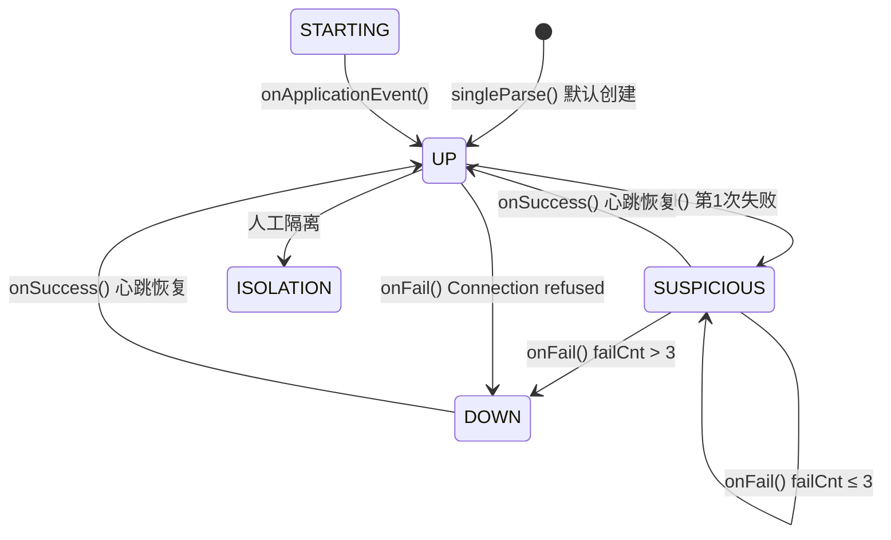
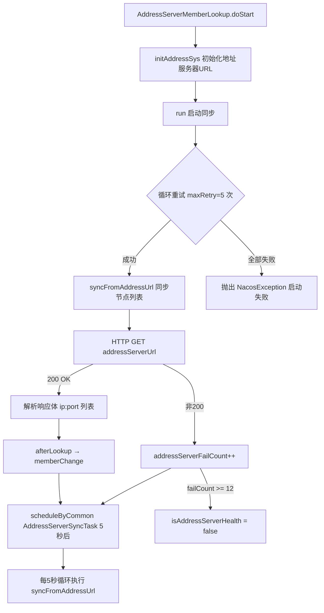
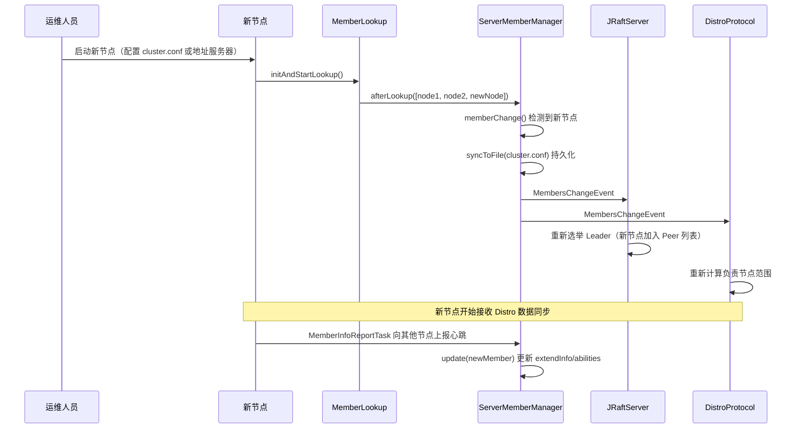
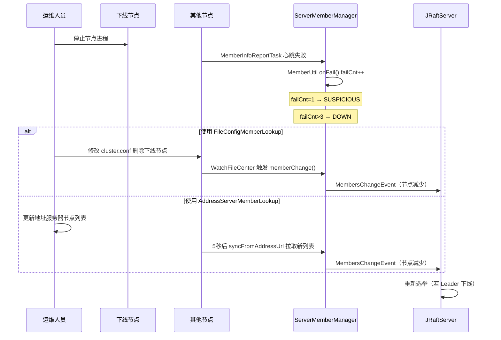
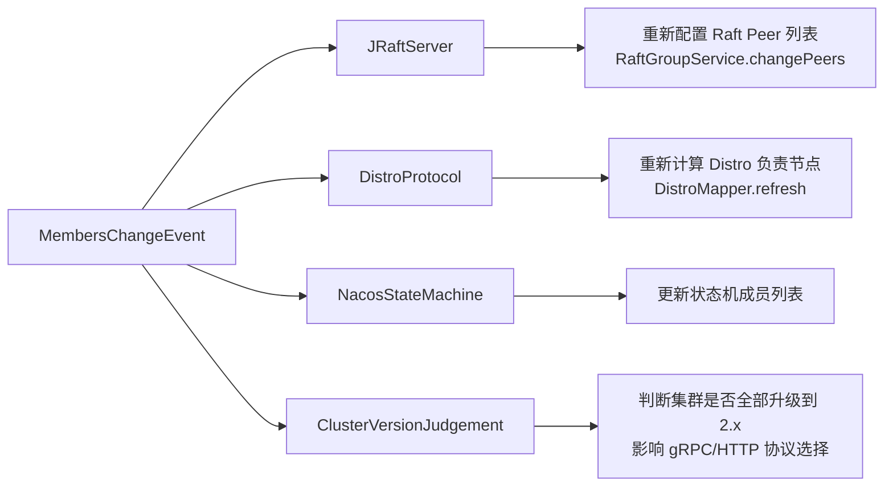
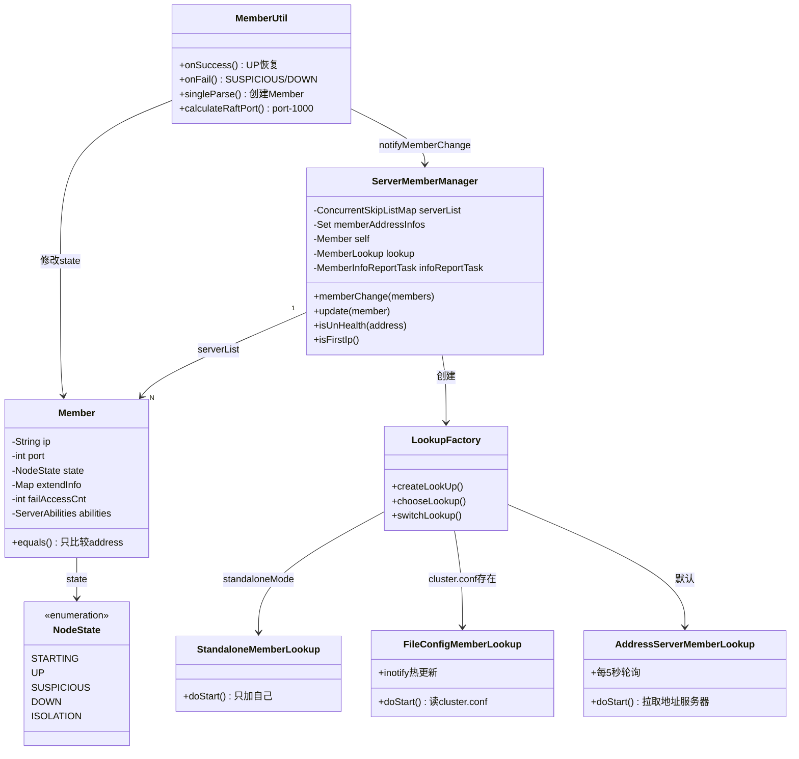

# 第7章：集群管理与节点发现

> 版本：Nacos 2.2.0  
> 核心类：`ServerMemberManager` / `LookupFactory` / `MemberUtil` / `NodeState`  
> 模块路径：`core/src/main/java/com/alibaba/nacos/core/cluster/`

---

## 第0部分：核心原理（先问题后结构）

### 问题驱动

**Q1：Nacos 集群节点如何互相发现？**  
→ 通过 `LookupFactory` 选择三种寻址策略之一（单机/文件/地址服务器），将节点列表注入 `ServerMemberManager`。

**Q2：节点健康状态如何维护？**  
→ `MemberInfoReportTask` 每 2 秒向其他节点发送 HTTP `/cluster/report`，失败时通过 `MemberUtil.onFail()` 将状态从 `UP → SUSPICIOUS → DOWN`（连续失败 > 3 次）。

**Q3：节点变更如何通知 Raft/Distro 等组件？**  
→ `memberChange()` 发布 `MembersChangeEvent`，Raft/Distro 订阅该事件，动态调整 Peer 列表。

**Q4：单机模式和集群模式的核心差异？**  
→ 单机模式：`StandaloneMemberLookup`，成员列表只有自己，不启动 `MemberInfoReportTask`。  
→ 集群模式：`FileConfigMemberLookup` 或 `AddressServerMemberLookup`，启动心跳上报任务。

---

## 第1部分：数据结构全景

### 1.1 Member（集群节点）

```java
// core/src/main/java/com/alibaba/nacos/core/cluster/Member.java
public class Member implements Comparable<Member>, Cloneable, Serializable {
    private String ip;                          // 节点 IP
    private int port = -1;                      // HTTP 端口（默认 8848）
    private volatile NodeState state = NodeState.UP;  // 节点状态（初始 UP）
    private Map<String, Object> extendInfo;     // 扩展元数据（TreeMap，线程安全）
    private String address = "";                // ip:port 缓存字符串
    private transient int failAccessCnt = 0;   // 连续访问失败次数（不序列化）
    private ServerAbilities abilities;          // 节点能力（是否支持 gRPC 长连接等）
}
```

**字段详解**：

| 字段 | 类型 | 含义 | 值域 |
|------|------|------|------|
| `ip` | String | 节点 IP | IPv4/IPv6 |
| `port` | int | HTTP 端口 | 默认 8848 |
| `state` | NodeState | 节点状态 | 见 1.2 |
| `extendInfo` | TreeMap | 扩展元数据 | 见下表 |
| `failAccessCnt` | int | 连续失败次数 | 0~N，`transient` 不序列化 |
| `abilities` | ServerAbilities | 能力标记 | 含 `supportRemoteConnection` |

**extendInfo 关键字段**（`MemberMetaDataConstants`）：

| Key | 含义 | 示例值 |
|-----|------|--------|
| `raftPort` | Raft 端口 = httpPort - 1000 | `"7848"` |
| `version` | Nacos 版本号 | `"2.2.0"` |
| `readyToUpgrade` | 是否支持 gRPC 升级 | `true` |
| `site` | 机房标识 | `"unknow"` |
| `weight` | 节点权重 | `"1"` |
| `lastRefreshTime` | 最后刷新时间戳 | `1709558544280` |

> ⚠️ **重要**：`Member.equals()` 只比较 `address`（ip:port），不比较 `state`、`extendInfo`。  
> 这意味着同一节点的状态变化**不会**导致 Set 中出现重复元素。

**内存大小估算**：
- 单个 Member 对象：约 500~800 bytes（含 extendInfo TreeMap）
- 3 节点集群：`serverList`（ConcurrentSkipListMap）约 3KB

**创建位置**：`MemberUtil.singleParse(String ipPort)` → `Member.builder().build()`

**关键字段生命周期**：
```
singleParse() 创建
    → state = UP（默认）
    → extendInfo = {raftPort, readyToUpgrade}
    
onApplicationEvent() 触发
    → state = UP（WebServer 启动后确认）
    
MemberInfoReportTask 心跳失败
    → failAccessCnt++
    → state: UP → SUSPICIOUS（第1次失败）
    → state: SUSPICIOUS → DOWN（failAccessCnt > 3）
    
MemberInfoReportTask 心跳成功
    → failAccessCnt = 0
    → state: DOWN/SUSPICIOUS → UP
```

---

### 1.2 NodeState（节点状态枚举）

```java
// core/src/main/java/com/alibaba/nacos/core/cluster/NodeState.java
public enum NodeState {
    STARTING,    // 节点正在启动，不对外提供服务
    UP,          // 正常，可处理请求
    SUSPICIOUS,  // 可疑（心跳失败但未超过阈值）
    DOWN,        // 下线（连续失败 > maxFailAccessCnt 或连接被拒绝）
    ISOLATION,   // 被隔离（人工干预）
}
```

> ✅ **大纲验证**：大纲第7章已标注"源码实际有5种状态"，与源码一致。

**状态转换图**：



---

### 1.3 ServerMemberManager（集群成员管理器）

```java
// core/src/main/java/com/alibaba/nacos/core/cluster/ServerMemberManager.java
@Component(value = "serverMemberManager")
public class ServerMemberManager implements ApplicationListener<WebServerInitializedEvent> {
    
    // 集群节点字典：address(ip:port) -> Member
    // ConcurrentSkipListMap 保证按地址字典序排列（isFirstIp() 依赖此特性）
    private volatile ConcurrentSkipListMap<String, Member> serverList;
    
    // 健康节点地址集合（UP 状态节点的 address 集合）
    // 用于快速判断节点是否健康，避免遍历 serverList
    private volatile Set<String> memberAddressInfos = new ConcurrentHashSet<>();
    
    private volatile Member self;           // 本节点 Member 对象
    private String localAddress;            // 本节点 ip:port
    private int port;                       // HTTP 端口
    private MemberLookup lookup;            // 当前寻址策略实例
    
    // 心跳上报任务（集群模式下每 2 秒执行一次）
    private final MemberInfoReportTask infoReportTask = new MemberInfoReportTask();
    
    // 常量
    private static final long DEFAULT_TASK_DELAY_TIME = 5_000L;  // 首次延迟 5 秒
    // MemberInfoReportTask.after() 中调度间隔为 2_000L
}
```

**关键设计**：`ConcurrentSkipListMap` 而非 `ConcurrentHashMap`
- 保证节点按 `address` 字典序排列
- `isFirstIp()` 方法通过 `serverList.firstKey()` 判断本节点是否为第一个节点
- 第一个节点承担特殊职责（如 Distro 数据加载时的优先同步源）

---

### 1.4 LookupFactory（寻址策略工厂）

```java
// 三种寻址策略的选择逻辑（chooseLookup）
private static LookupType chooseLookup(String lookupType) {
    // 1. 优先使用显式配置（nacos.core.member.lookup.type）
    if (StringUtils.isNotBlank(lookupType)) { ... }
    
    // 2. cluster.conf 文件存在 → FILE_CONFIG
    File file = new File(EnvUtil.getClusterConfFilePath());
    if (file.exists() || StringUtils.isNotBlank(EnvUtil.getMemberList())) {
        return LookupType.FILE_CONFIG;
    }
    
    // 3. 默认 → ADDRESS_SERVER（地址服务器）
    return LookupType.ADDRESS_SERVER;
}
```

| 策略 | 类 | 触发条件 | 特点 |
|------|-----|---------|------|
| 单机 | `StandaloneMemberLookup` | `standaloneMode=true` | 成员列表只有自己 |
| 文件 | `FileConfigMemberLookup` | `cluster.conf` 存在 | inotify 监听文件变化，热更新 |
| 地址服务器 | `AddressServerMemberLookup` | 默认（无 cluster.conf） | 每 5 秒轮询地址服务器 HTTP 接口 |

---

## 第2部分：算法流程

### 2.1 启动初始化流程

```
ServerMemberManager 构造函数
    │
    ▼
init()
    ├── 解析 localAddress = selfIP:port
    ├── MemberUtil.singleParse(localAddress) → self（state=UP, extendInfo含raftPort）
    ├── serverList.put(self.address, self)   ← 先把自己加入列表
    ├── registerClusterEvent()               ← 注册 MembersChangeEvent 发布者
    │                                           注册 IPChangeEvent 订阅者（IP 变更时更新 self）
    └── initAndStartLookup()
            └── LookupFactory.createLookUp()
                    ├── standaloneMode=true  → StandaloneMemberLookup.doStart()
                    │       └── afterLookup([localAddress])  → memberChange()
                    └── standaloneMode=false → FileConfigMemberLookup / AddressServerMemberLookup
    
onApplicationEvent(WebServerInitializedEvent)  ← Spring Web 容器启动完成后触发
    ├── self.setState(NodeState.UP)           ← 确认节点就绪
    ├── 集群模式: scheduleByCommon(infoReportTask, 5000ms)
    └── 单机模式: 跳过 MemberInfoReportTask
```

---

### 2.2 心跳上报与状态转换（集群模式）

```java
// MemberInfoReportTask.executeBody()
// 每次执行：轮询选择一个目标节点（cursor 递增取模）
this.cursor = (this.cursor + 1) % members.size();
Member target = members.get(cursor);

// POST /nacos/core/cluster/report，携带本节点 Member 信息
asyncRestTemplate.post(url, header, Query.EMPTY, getSelf(), ...);

// 成功回调 → MemberUtil.onSuccess()
//   state → UP, failAccessCnt = 0

// 失败回调 → MemberUtil.onFail()
//   failAccessCnt++
//   state → SUSPICIOUS（failCnt ≤ 3）
//   state → DOWN（failCnt > 3 或 Connection refused）

// after() 中重新调度，间隔 2000ms
```

**关键设计：轮询而非广播**
- 每次只向一个节点发送心跳（`cursor` 轮询），而非同时向所有节点广播
- 优点：减少网络开销，N 个节点每 2 秒只产生 1 个 HTTP 请求
- 代价：节点状态感知有延迟（最坏情况：(N-1) × 2 秒才能检测到某节点下线）

---

### 2.3 成员变更处理（memberChange）

```java
synchronized boolean memberChange(Collection<Member> members) {
    // 1. 检查自己是否在新列表中（防止被误删）
    boolean isContainSelfIp = members.stream()
        .anyMatch(m -> Objects.equals(localAddress, m.getAddress()));
    if (!isContainSelfIp) {
        members.add(this.self);  // 强制把自己加回去
    }
    
    // 2. 对比新旧列表，判断是否有变化
    boolean hasChange = members.size() != serverList.size();
    // 遍历新列表：新节点 → hasChange=true；已有节点 → 保留旧对象（保留动态上报的 extendInfo）
    
    // 3. 原子替换 serverList 和 memberAddressInfos
    serverList = tmpMap;
    memberAddressInfos = tmpAddressInfo;
    
    // 4. 有变化时：持久化到 cluster.conf + 发布 MembersChangeEvent
    if (hasChange) {
        MemberUtil.syncToFile(finalMembers);
        NotifyCenter.publishEvent(MembersChangeEvent.builder().members(finalMembers).build());
    }
}
```

**关键设计：保留旧对象**
```java
Member existMember = serverList.get(address);
if (existMember == null) {
    tmpMap.put(address, member);      // 新节点：使用新对象
} else {
    tmpMap.put(address, existMember); // 已有节点：保留旧对象（含动态上报的 extendInfo/abilities）
}
```
这样避免了 `FileConfigMemberLookup` 重新读取文件时，覆盖掉通过 `/cluster/report` 动态更新的节点元数据。

---

### 2.4 FileConfigMemberLookup 热更新

```java
// 使用 inotify 机制监听 cluster.conf 文件变化
WatchFileCenter.registerWatcher(EnvUtil.getConfPath(), watcher);

// 文件变化时自动触发
watcher.onChange(event) → readClusterConfFromDisk() → afterLookup() → memberChange()
```

**效果**：修改 `cluster.conf` 后，无需重启 Nacos，集群成员列表自动更新。

---

### 2.5 AddressServerMemberLookup 详细流程

`AddressServerMemberLookup` 是生产环境中最常用的寻址策略（无 `cluster.conf` 时默认使用），通过轮询外部地址服务器 HTTP 接口获取集群节点列表。

#### 关键字段

```java
public class AddressServerMemberLookup extends AbstractMemberLookup {
    public String domainName;           // 地址服务器域名（默认 jmenv.tbsite.net）
    public String addressPort;          // 地址服务器端口（默认 8080）
    public String addressUrl;           // 地址服务器路径（默认 /nacos/serverlist）
    public String addressServerUrl;     // 完整 URL = http://domainName:port/path
    
    private volatile boolean isAddressServerHealth = true;  // 地址服务器是否健康
    private int addressServerFailCount = 0;                 // 连续失败次数
    private int maxFailCount = 12;                          // 最大失败次数（超过则标记不健康）
    
    private static final int DEFAULT_SERVER_RETRY_TIME = 5;         // 启动时重试次数
    private static final long DEFAULT_SYNC_TASK_DELAY_MS = 5_000L;  // 轮询间隔 5 秒
}
```

#### 配置优先级（三级覆盖）

| 优先级 | 来源 | 示例 |
|--------|------|------|
| 1（最高） | 环境变量 | `address_server_domain=my-addr-server.com` |
| 2 | `application.properties` | `address.server.domain=my-addr-server.com` |
| 3（默认） | 硬编码默认值 | `jmenv.tbsite.net:8080` |

#### 启动流程



#### 地址服务器响应格式

地址服务器返回纯文本，每行一个 `ip:port`：

```
192.168.1.1:8848
192.168.1.2:8848
192.168.1.3:8848
```

`MemberUtil.readServerConf(EnvUtil.analyzeClusterConf(reader))` 负责解析，支持注释行（`#` 开头）和空行过滤。

#### 健康状态监控

```java
// 可通过 REST API 查询地址服务器健康状态
GET /nacos/v1/core/cluster/lookup/info
// 返回：
{
  "addressServerHealth": true,
  "addressServerUrl": "http://jmenv.tbsite.net:8080/nacos/serverlist",
  "addressServerFailCount": 0
}
```

---

### 2.6 集群扩缩容完整时序

#### 扩容（新增节点）



#### 缩容（节点下线）



#### 关键设计：`memberLeave` vs `memberChange`

```java
// memberLeave：只能通过 REST API 手动触发，不会自动触发
public boolean memberLeave(Collection<Member> members) {
    members.forEach(m -> {
        serverList.remove(m.getAddress());
        memberAddressInfos.remove(m.getAddress());
    });
    return memberChange(allMembers());
}

// memberChange：Lookup 自动触发（文件变化/地址服务器轮询）
// 区别：memberLeave 是主动剔除，memberChange 是被动同步
```

> ⚠️ **重要**：节点 DOWN 状态**不会**自动从 `serverList` 中删除！  
> DOWN 状态只影响 `memberAddressInfos`（健康节点集合），`serverList` 中仍保留该节点。  
> 真正从列表中删除节点，需要通过 `memberLeave()` 或 Lookup 重新同步（新列表中不含该节点）。

---

### 2.7 MembersChangeEvent 下游响应链

`memberChange()` 发布 `MembersChangeEvent` 后，多个组件会响应：



| 订阅者 | 响应动作 | 影响 |
|--------|---------|------|
| `JRaftServer` | 重新配置 Raft Peer 列表 | Raft 选举和日志复制范围变化 |
| `DistroProtocol` | 刷新 `DistroMapper` 负责节点 | 临时实例的负责节点重新分配 |
| `ClusterVersionJudgement` | 判断集群版本一致性 | 影响是否启用 gRPC 长连接 |

---

## 第3部分：运行时验证

### 验证目标

| 编号 | 验证目标 | 验证方法 |
|------|---------|---------|
| V1 | 单机模式选择 StandaloneMemberLookup | 探针输出 |
| V2 | self 初始状态为 UP，extendInfo 含 raftPort | 探针输出 |
| V3 | raftPort = httpPort - 1000 | 探针输出 |
| V4 | memberChange 在 Lookup 初始化时触发 | 探针输出 |
| V5 | onApplicationEvent 时节点状态确认 UP | 探针输出 |
| V6 | 单机模式跳过 MemberInfoReportTask | 探针输出 |

### 探针插桩位置

| 文件 | 方法 | 探针内容 |
|------|------|---------|
| `LookupFactory.java` | `createLookUp()` | standaloneMode 判断、Lookup 类型选择 |
| `LookupFactory.java` | `chooseLookup()` | cluster.conf 文件是否存在、最终选择 |
| `StandaloneMemberLookup.java` | `doStart()` | localAddress、成员列表设置 |
| `ServerMemberManager.java` | `init()` | localAddress、selfState、extendInfo |
| `ServerMemberManager.java` | `onApplicationEvent()` | 状态变更、是否启动心跳任务 |
| `ServerMemberManager.java` | `memberChange()` | hasChange、成员数、地址列表 |
| `MemberUtil.java` | `onSuccess()` | 状态恢复路径 |
| `MemberUtil.java` | `onFail()` | 状态降级路径、failCnt/maxFailCnt |

### 实际探针输出（Nacos 2.2.0 standalone 模式）

```
# ✅ V2：self 初始状态 UP，extendInfo 含 raftPort=7848
[PROBE][ServerMemberManager.init] localAddress=9.134.79.63:8848, selfState=UP, version=2.2.0
[PROBE][ServerMemberManager.init] self.extendInfo={raftPort=7848, readyToUpgrade=true, version=2.2.0}
[PROBE][ServerMemberManager.init] serverList初始化完成, 共1个节点

# ✅ V1：单机模式直接使用 StandaloneMemberLookup
[PROBE][LookupFactory.createLookUp] standaloneMode=true
[PROBE][LookupFactory.createLookUp] 单机模式: 直接使用StandaloneMemberLookup

# ✅ V3：raftPort = 8848 - 1000 = 7848
# （由 MemberUtil.singleParse → calculateRaftPort 计算，已在 extendInfo 中验证）

# ✅ V4：memberChange 在 Lookup 初始化时触发（hasChange=false，因为 self 已在列表中）
[PROBE][StandaloneMemberLookup.doStart] 单机模式成员列表初始化, localAddress=9.134.79.63:8848
[PROBE][ServerMemberManager.memberChange] hasChange=false, 成员数=1, 地址列表=[9.134.79.63:8848]
[PROBE][StandaloneMemberLookup.doStart] 成员列表已设置, 共1个节点: 9.134.79.63:8848

# ✅ V5：onApplicationEvent 时节点状态 UP -> UP（singleParse 默认就是 UP）
[PROBE][ServerMemberManager.onApplicationEvent] 节点状态变更: UP -> UP, 地址=9.134.79.63:8848, 端口=8848

# ✅ V6：单机模式跳过 MemberInfoReportTask
[PROBE][ServerMemberManager.onApplicationEvent] 单机模式: 跳过MemberInfoReportTask
```

### 关键发现

**发现1：self 初始状态就是 UP，不经过 STARTING**

```
selfState=UP（singleParse 创建时默认 UP）
onApplicationEvent: UP -> UP（状态未变，不触发 MembersChangeEvent）
```

`STARTING` 状态在源码中定义但**从未被赋值**，`singleParse()` 直接创建 UP 状态的节点。这意味着 Nacos 节点没有"启动中"的对外可见状态，而是依靠 Spring 容器的 `WebServerInitializedEvent` 来控制心跳任务的启动时机。

**发现2：memberChange 在 StandaloneMemberLookup 初始化时 hasChange=false**

```
init() 时：serverList.put(self.address, self)  ← 先加入自己
doStart() 时：afterLookup([localAddress])       ← 再次设置，成员数相同
→ hasChange=false，不发布 MembersChangeEvent
```

这是一个精心设计：避免启动时发布无意义的变更事件，减少 Raft/Distro 的无效初始化。

**发现3：raftPort 在 Member 创建时就写入 extendInfo**

```
extendInfo={raftPort=7848, readyToUpgrade=true, version=2.2.0}
```

`raftPort = httpPort - 1000 = 8848 - 1000 = 7848`，与第5章 JRaft 验证结果完全一致。

---

## 数据结构关系图



---

## 总结

### 数据结构维度

| 数据结构 | 作用 | 关键设计 |
|---------|------|---------|
| `ConcurrentSkipListMap<String, Member>` | 集群节点字典 | 字典序排列，支持 `firstKey()` |
| `ConcurrentHashSet<String>` | 健康节点地址集合 | 快速健康判断，O(1) |
| `Member.extendInfo`（TreeMap） | 节点元数据 | 含 raftPort/version/weight |
| `NodeState`（5种枚举） | 节点状态机 | STARTING 定义但未使用 |

### 算法维度

| 算法 | 实现 | 关键参数 |
|------|------|---------|
| 寻址策略选择 | `LookupFactory.chooseLookup()` | cluster.conf 存在 → FILE_CONFIG |
| 心跳轮询 | `MemberInfoReportTask`（cursor 取模） | 间隔 2s，首次延迟 5s |
| 状态降级 | `MemberUtil.onFail()` | failCnt > 3 → DOWN |
| 成员变更 | `memberChange()`（synchronized） | 保留旧对象，防止覆盖动态元数据 |
| 文件热更新 | `WatchFileCenter`（inotify） | cluster.conf 变化自动触发 |
