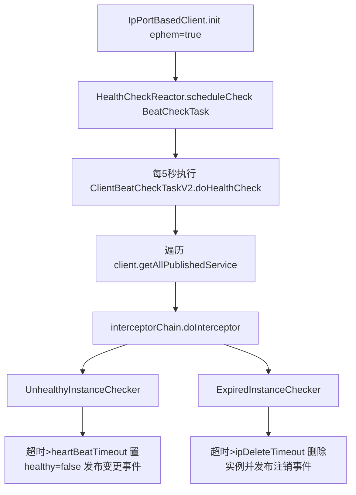
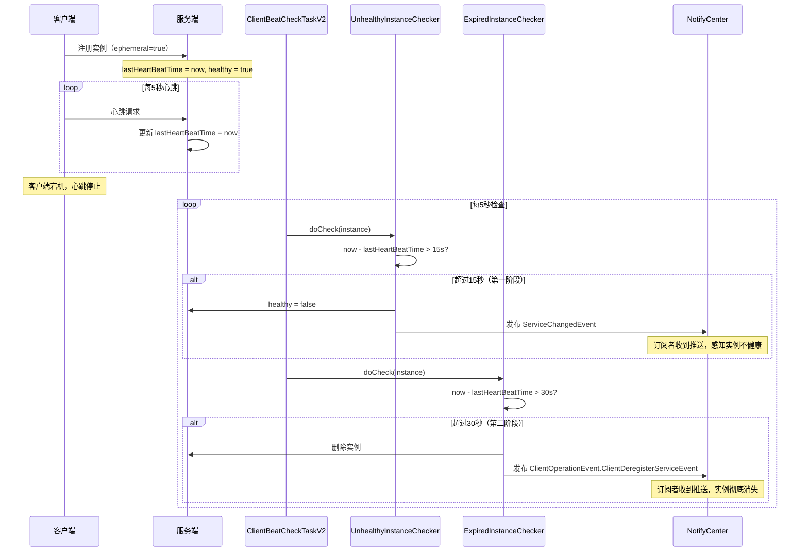
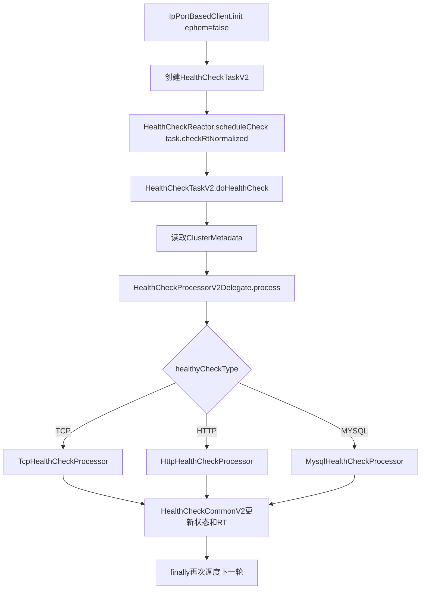
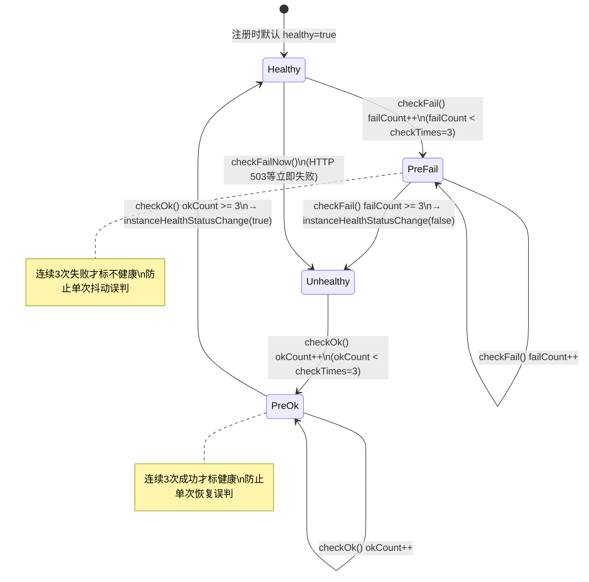
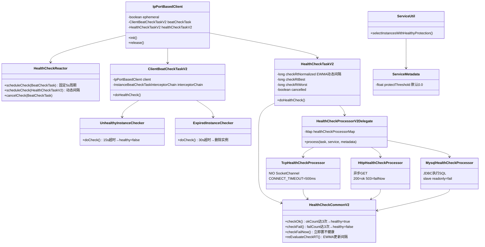

# 第8章：健康检查机制

> 版本：Nacos 2.2.0  
> 核心类：`ClientBeatCheckTaskV2` / `UnhealthyInstanceChecker` / `ExpiredInstanceChecker` / `HealthCheckTaskV2` / `HealthCheckProcessorV2Delegate` / `ServiceUtil`  
> 模块路径：`naming/src/main/java/com/alibaba/nacos/naming/healthcheck/`

---

## 第0部分：核心原理（先问题后结构）

### 问题驱动

**Q1：临时实例（ephemeral=true）如何判定健康？**  
→ 不是服务端主动探测，而是基于客户端心跳超时：`ClientBeatCheckTaskV2` 周期扫描实例，`UnhealthyInstanceChecker` 在超时后置 `healthy=false`，`ExpiredInstanceChecker` 在更长超时后删除实例。

**Q2：持久实例（ephemeral=false）如何判定健康？**  
→ 服务端主动探测：`HealthCheckTaskV2` 调度 `HealthCheckProcessorV2Delegate`，按 `ClusterMetadata.healthyCheckType` 分发到 TCP/HTTP/MySQL 处理器执行探测。

**Q3：保护模式阈值到底是谁生效？**  
→ 服务实例返回阶段生效的是 `ServiceMetadata.protectThreshold`，核心逻辑在 `ServiceUtil.selectInstancesWithHealthyProtection(...)`。当健康比例不高于阈值时，返回“全部实例并强制标健康”。

**Q4：`distroThreshold=0.7` 是不是保护模式阈值？**  
→ 不是。`distroThreshold` 在 `SwitchDomain`/`SwitchManager` 里用于 Distro 相关开关与阈值，不是服务返回保护阈值。

---

## 第1部分：数据结构全景

### 1.1 临时实例检查任务：`ClientBeatCheckTaskV2`

```java
public class ClientBeatCheckTaskV2 extends AbstractExecuteTask implements BeatCheckTask, NacosHealthCheckTask {
    private final IpPortBasedClient client;
    private final String taskId;
    private final InstanceBeatCheckTaskInterceptorChain interceptorChain;
}
```

- **字段含义**：
  - `client`：当前连接维度客户端，持有该客户端发布的所有服务实例。
  - `taskId`：负责人标签（来自 client responsibleId），用于任务标识。
  - `interceptorChain`：心跳检查拦截器链，执行真实 checker。
- **创建位置**：`IpPortBasedClient.init()` 中，当 `ephemeral=true` 时创建并调度。
- **关键生命周期**：
  - 注册实例后初始化任务。
  - 客户端释放时 `HealthCheckReactor.cancelCheck(beatCheckTask)` 取消任务。
- **值域/行为**：
  - 每次 run 都会遍历 `client.getAllPublishedService()`。

### 1.2 临时实例健康信息：`HealthCheckInstancePublishInfo`

该结构在临时实例与持久实例都使用，心跳链路关注以下字段：

- `ip`/`port`：实例地址。
- `cluster`：集群名。
- `healthy`：健康标记。
- `lastHeartBeatTime`：最后心跳时间戳（毫秒）。
- `extendDatum`：可覆盖阈值参数（如 `heartBeatTimeout`、`ipDeleteTimeout`）。

**关键字段生命周期**：
- 注册时由 `InstancePublishInfo` 转换而来。
- 心跳上报会更新 `lastHeartBeatTime`。
- 超时检查会修改 `healthy`，或触发删除。

### 1.3 持久实例检查任务：`HealthCheckTaskV2`

```java
public class HealthCheckTaskV2 extends AbstractExecuteTask implements NacosHealthCheckTask {
    private long checkRtNormalized = -1;
    private long checkRtBest = -1;
    private long checkRtWorst = -1;
    private long checkRtLast = -1;
    private long checkRtLastLast = -1;
    private volatile boolean cancelled = false;
}
```

- **字段含义**：
  - `checkRtNormalized`：当前调度间隔（动态调整）。
  - `checkRtBest/Worst/Last`：探测 RT 统计，用于下一轮间隔评估。
  - `cancelled`：任务取消标志。
- **创建位置**：`IpPortBasedClient.init()` 中，当 `ephemeral=false` 时创建并调度。
- **关键生命周期**：
  - `doHealthCheck()` 完成后 `finally` 中再次 `scheduleCheck(this)`。
  - 客户端释放时 `healthCheckTaskV2.setCancelled(true)` 停止继续调度。

### 1.4 健康检查调度器：`HealthCheckReactor`

```java
public static void scheduleCheck(BeatCheckTask task) {
    futureMap.computeIfAbsent(task.taskKey(),
        k -> GlobalExecutor.scheduleNamingHealth(wrapperTask, 5000, 5000, TimeUnit.MILLISECONDS));
}

public static void scheduleCheck(HealthCheckTaskV2 task) {
    GlobalExecutor.scheduleNamingHealth(wrapperTask, task.getCheckRtNormalized(), TimeUnit.MILLISECONDS);
}
```

- **临时实例**：固定 5 秒延迟 + 5 秒周期。
- **持久实例**：按 `checkRtNormalized` 动态延迟单次调度。

### 1.5 保护模式元数据：`ServiceMetadata.protectThreshold`

```java
private float protectThreshold = 0.0F;
```

- 默认值 `0.0F`，表示默认不开启保护阈值保护。
- 生效位置不是健康检查任务，而是服务查询/推送前的实例筛选逻辑。

### 1.6 持久实例健康状态公共处理器：`HealthCheckCommonV2`

```java
@Component
public class HealthCheckCommonV2 {
    @Autowired private DistroMapper distroMapper;       // 判断本节点是否负责该实例
    @Autowired private SwitchDomain switchDomain;       // 全局开关（checkTimes、healthCheckEnabled）
    @Autowired private PersistentHealthStatusSynchronizer healthStatusSynchronizer; // 状态同步
    
    // 三个核心方法：
    // checkOk()      → 探测成功，okCount++，达到 checkTimes 后置 healthy=true
    // checkFail()    → 探测失败，failCount++，达到 checkTimes 后置 healthy=false
    // checkFailNow() → 立即置 healthy=false（不需要计数，如 HTTP 503）
    // reEvaluateCheckRT() → 更新 checkRtNormalized（指数加权移动平均）
}
```

**`checkTimes` 的作用**：避免单次探测抖动导致状态频繁翻转。默认值为 `SwitchDomain.DEFAULT_CHECK_TIMES = 3`，即连续 3 次成功才置健康，连续 3 次失败才置不健康。

**`distroMapper.responsible()` 的作用**：只有负责该实例的节点才执行状态变更，避免集群中多个节点重复修改同一实例状态。

### 1.7 RT 自适应调度算法（`reEvaluateCheckRT`）

```java
// 指数加权移动平均（EWMA）算法
public void reEvaluateCheckRT(long checkRT, HealthCheckTaskV2 task, SwitchDomain.HealthParams params) {
    task.setCheckRtLast(checkRT);
    
    // 更新最优/最差 RT 统计
    if (checkRT > task.getCheckRtWorst()) task.setCheckRtWorst(checkRT);
    if (checkRT < task.getCheckRtBest())  task.setCheckRtBest(checkRT);
    
    // EWMA：新值 = factor * 旧值 + (1-factor) * 本次RT
    // factor 默认 0.1（SwitchDomain.TcpHealthParams.factor）
    checkRT = (long) ((params.getFactor() * task.getCheckRtNormalized()) + (1 - params.getFactor()) * checkRT);
    
    // 限制在 [min, max] 范围内
    if (checkRT > params.getMax()) checkRT = params.getMax();
    if (checkRT < params.getMin()) checkRT = params.getMin();
    
    task.setCheckRtNormalized(checkRT);  // 更新下次调度间隔
}
```

**TCP 探测的 HealthParams 默认值**（`SwitchDomain.TcpHealthParams`）：

| 参数 | 默认值 | 含义 |
|------|--------|------|
| `min` | 500ms | 最小调度间隔 |
| `max` | 5000ms | 最大调度间隔 |
| `factor` | 0.1 | EWMA 平滑因子（越小越敏感） |

**效果**：当实例响应快时，探测间隔缩短（最小 500ms）；响应慢时，间隔拉长（最大 5000ms），自动适应实例负载。

---

## 第2部分：算法流程

### 2.1 临时实例心跳检查流程（5秒周期）



核心代码锚点：

```java
// ClientBeatCheckTaskV2
for (Service each : services) {
    HealthCheckInstancePublishInfo instance = (HealthCheckInstancePublishInfo) client.getInstancePublishInfo(each);
    interceptorChain.doInterceptor(new InstanceBeatCheckTask(client, each, instance));
}
```

```java
// UnhealthyInstanceChecker
return timeout.map(ConvertUtils::toLong).orElse(Constants.DEFAULT_HEART_BEAT_TIMEOUT);
```

```java
// ExpiredInstanceChecker
return timeout.map(ConvertUtils::toLong).orElse(Constants.DEFAULT_IP_DELETE_TIMEOUT);
```

阈值优先级：
1. `InstanceMetadata.extendData`（元数据覆盖）
2. `instance.extendDatum`（注册时扩展参数）
3. 默认常量（`Constants`）

默认值（源码常量）：
- `DEFAULT_HEART_BEAT_INTERVAL = 5s`
- `DEFAULT_HEART_BEAT_TIMEOUT = 15s`
- `DEFAULT_IP_DELETE_TIMEOUT = 30s`

---

### 2.1.1 临时实例两阶段淘汰详细时序



**两阶段设计的意义**：
- **第一阶段（15s → 不健康）**：快速感知实例异常，让消费者停止路由到该实例
- **第二阶段（30s → 删除）**：给实例恢复的时间窗口（网络抖动、GC 停顿等），避免误删

---

### 2.2 持久实例主动探测流程（动态周期）



分发核心代码：

```java
String type = metadata.getHealthyCheckType();
HealthCheckProcessorV2 processor = healthCheckProcessorMap.get(type);
if (processor == null) {
    processor = healthCheckProcessorMap.get(NoneHealthCheckProcessor.TYPE);
}
processor.process(task, service, metadata);
```

处理器关键差异：

- **TCP**：NIO `Selector` + `SocketChannel`，`CONNECT_TIMEOUT_MS=500`，支持异步后处理与超时任务。
- **HTTP**：异步 GET，`200` 判成功；`503/302` 记为 fail（稍后再验证）；其余状态可立即 failNow。
- **MySQL**：JDBC 执行配置 SQL（如 `show global variables ...`），可识别 slave readonly 并判失败。

---

### 2.2.1 持久实例探测状态机（checkOk/checkFail 计数器）



**关键设计**：`okCount` 和 `failCount` 在 `finally` 块中互相重置：
```java
// checkOk() 的 finally 块
instance.resetFailCount();  // 成功时重置失败计数
instance.finishCheck();     // 释放并发检查锁

// checkFail() 的 finally 块
instance.resetOkCount();    // 失败时重置成功计数
instance.finishCheck();
```

---

### 2.3 2.x gRPC 连接保活机制（临时实例的另一条路径）

Nacos 2.x 中，通过 gRPC 长连接注册的临时实例有**两套健康检查机制**并行工作：

```mermaid
flowchart LR
    subgraph 机制一：心跳超时检查（兼容1.x）
        A1[ClientBeatCheckTaskV2\n每5秒扫描] --> B1[UnhealthyInstanceChecker\n15s超时→不健康]
        B1 --> C1[ExpiredInstanceChecker\n30s超时→删除]
    end
    
    subgraph 机制二：gRPC连接断开检查（2.x新增）
        A2[ConnectionManager\n检测连接断开] --> B2[ClientDisconnectEvent]
        B2 --> C2[ClientManager.clientDisconnected\n立即删除该连接的所有实例]
    end
    
    D[临时实例注册] --> 机制一
    D --> 机制二
```

**两种机制的触发条件**：

| 机制 | 触发条件 | 响应速度 | 适用场景 |
|------|---------|---------|---------|
| 心跳超时 | 心跳停止 > 15s/30s | 慢（最多 30s） | 网络抖动、客户端假死 |
| gRPC 断开 | TCP 连接断开 | 快（秒级） | 客户端进程崩溃、网络中断 |

> ✅ **实际效果**：gRPC 客户端正常关闭时，连接断开事件会立即触发实例注销，无需等待 30 秒超时。

---

```java
float threshold = serviceMetadata.getProtectThreshold();
if (threshold < 0) {
    threshold = 0F;
}
if ((float) newHealthyCount / allInstances.size() <= threshold) {
    Loggers.SRV_LOG.warn("protect threshold reached, return all ips, service: {}", filteredResult.getName());
    filteredResult.setReachProtectionThreshold(true);
    // 不健康实例深拷贝并置 healthy=true 后返回
}
```

结论：
- 保护模式发生在 `ServiceUtil.selectInstancesWithHealthyProtection(...)`。
- 阈值字段是 `ServiceMetadata.protectThreshold`。
- 行为是“返回全部实例并将返回结果中的实例标为健康”，用于防止误摘导致雪崩。

---

## 第3部分：运行时验证（必须有真实数据）

### 3.1 验证目标

| 编号 | 目标 | 方法 |
|---|---|---|
| V1 | 临时实例心跳链会触发 `IP-DISABLED` 与 `AUTO-DELETE-IP` | 单测 `ClientBeatCheckTaskV2Test` |
| V2 | 持久实例主动探测链可正常执行 | 单测 `HealthCheckTaskV2Test` |
| V3 | HTTP 探测并发保护生效 | 单测 `HttpHealthCheckProcessorTest` |
| V4 | 扩展处理器注入/分发链可用 | 单测 `HealthCheckProcessorExtendV2Test` |
| V5 | 保护模式逻辑可执行且测试通过 | 单测 `ServiceUtilTest` |

### 3.2 执行命令

```bash
mvn -pl naming -Dtest=ClientBeatCheckTaskV2Test,HealthCheckTaskV2Test,HttpHealthCheckProcessorTest,HealthCheckProcessorExtendV2Test test -DfailIfNoTests=false -Dcheckstyle.skip=true
mvn -pl naming -Dtest=ServiceUtilTest test -DfailIfNoTests=false -Dcheckstyle.skip=true
```

### 3.3 实际输出数据（节选）

#### V1：临时实例超时置不健康 + 自动删除

```text
[INFO] Running com.alibaba.nacos.naming.healthcheck.heartbeat.ClientBeatCheckTaskV2Test
... {POS} {IP-DISABLED} valid: 1.1.1.1:10000@DEFAULT@service ... msg: client last beat: 0
... [AUTO-DELETE-IP] service: Service{namespace='namespace', group='group', name='service', ephemeral=true, revision=0}, ip: {"ip":"1.1.1.1","port":10000,...}
[INFO] Tests run: 8, Failures: 0, Errors: 0, Skipped: 0
```

解释：
- `IP-DISABLED` 对应 `UnhealthyInstanceChecker.changeHealthyStatus(...)`。
- `AUTO-DELETE-IP` 对应 `ExpiredInstanceChecker.deleteIp(...)`。
- 说明“先置不健康，再到删除”的两阶段策略生效。

#### V2/V3/V4：主动探测链与扩展链

```text
[INFO] Running com.alibaba.nacos.naming.healthcheck.v2.HealthCheckTaskV2Test
[INFO] Tests run: 4, Failures: 0, Errors: 0, Skipped: 0

[INFO] Running com.alibaba.nacos.naming.healthcheck.v2.processor.HttpHealthCheckProcessorTest
... http check started before last one finished, service: null : null : null:0
[INFO] Tests run: 7, Failures: 0, Errors: 0, Skipped: 0

[INFO] Running com.alibaba.nacos.naming.healthcheck.extend.HealthCheckProcessorExtendV2Test
... Setting field 'processors' ... value [[mysqlProcessor]]
[INFO] Tests run: 1, Failures: 0, Errors: 0, Skipped: 0

[INFO] Results:
[INFO] Tests run: 20, Failures: 0, Errors: 0, Skipped: 0
[INFO] BUILD SUCCESS
```

解释：
- HTTP 测试日志中出现“上一次检查未完成”，与 `instance.tryStartCheck()` 的并发保护逻辑一致。
- 扩展测试显示可注入 `mysqlProcessor`，说明 `HealthCheckProcessorV2Delegate` 的可扩展分发能力正常。

#### V5：保护模式路径测试

```text
[INFO] Running com.alibaba.nacos.naming.utils.ServiceUtilTest
[INFO] Tests run: 1, Failures: 0, Errors: 0, Skipped: 0
[INFO] BUILD SUCCESS
```

解释：
- 保护模式核心方法 `ServiceUtil.selectInstancesWithHealthyProtection(...)` 的单测通过。
- 与源码日志 `protect threshold reached, return all ips` 一起，支撑“阈值由 `protectThreshold` 生效”的结论。

---

## 数据结构关系图



---

## 总结

### 数据结构维度

| 数据结构 | 作用 | 关键字段 |
|---------|------|---------|
| `ClientBeatCheckTaskV2` | 临时实例心跳检查任务 | `interceptorChain`（拦截器链） |
| `HealthCheckInstancePublishInfo` | 实例健康信息 | `lastHeartBeatTime`、`healthy`、`okCount`、`failCount` |
| `HealthCheckTaskV2` | 持久实例探测任务 | `checkRtNormalized`（EWMA 动态间隔） |
| `HealthCheckCommonV2` | 探测结果公共处理 | `checkTimes=3`（防抖计数器） |
| `ServiceMetadata` | 服务元数据 | `protectThreshold`（保护模式阈值） |

### 算法维度

| 算法 | 实现 | 关键参数 |
|------|------|---------|
| 临时实例两阶段淘汰 | `UnhealthyInstanceChecker` + `ExpiredInstanceChecker` | 15s 不健康，30s 删除 |
| 持久实例探测防抖 | `checkOk/checkFail` 计数器 | 连续 3 次才变更状态 |
| RT 自适应调度 | EWMA 算法（`reEvaluateCheckRT`） | factor=0.1，范围 [500ms, 5000ms] |
| 保护模式 | `ServiceUtil.selectInstancesWithHealthyProtection` | `protectThreshold`（默认 0.0 不开启） |
| gRPC 连接保活 | `ConnectionManager` 连接断开事件 | 秒级感知，优先于心跳超时 |

### 关键纠偏

- `distroThreshold=0.7` 是 Distro 相关阈值，**不是**服务保护模式阈值。
- 服务保护模式阈值应看 `protectThreshold`（`ServiceMetadata` + `ServiceUtil` 生效链路）。
- 2.x gRPC 客户端正常关闭时，**不需要等待 30 秒**，连接断开事件会立即触发实例注销。
- 持久实例探测状态变更需要**连续 3 次**成功/失败，单次抖动不会改变健康状态。
