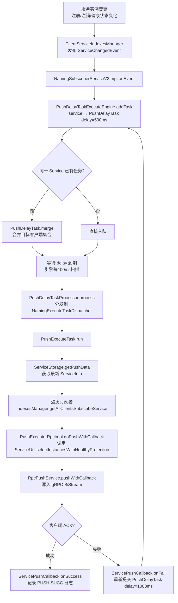
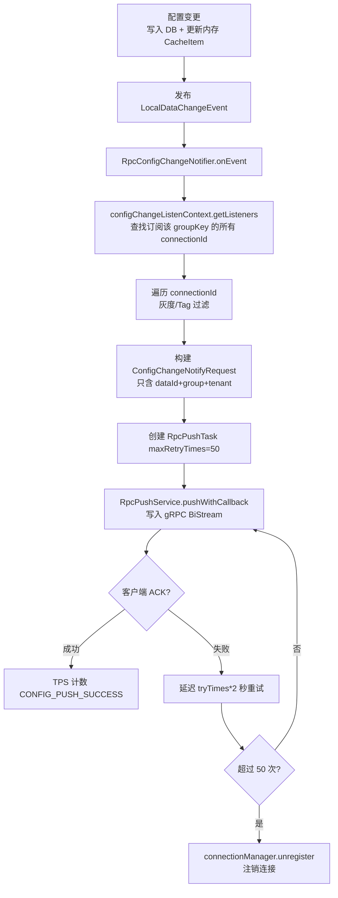

# 第9章：推送机制（Push）

> 版本：Nacos 2.2.0  
> 核心类：`NamingSubscriberServiceV2Impl` / `PushDelayTask` / `PushDelayTaskExecuteEngine` / `PushExecuteTask` / `RpcPushService` / `RpcConfigChangeNotifier`  
> 模块路径：`naming/src/main/java/com/alibaba/nacos/naming/push/` 、`config/src/main/java/com/alibaba/nacos/config/server/remote/`

---

## 第0部分：核心原理（先问题后结构）

### 问题驱动

**Q1：服务实例变更后，Nacos 如何通知订阅者？**  
→ 服务端发布 `ServiceChangedEvent`，`NamingSubscriberServiceV2Impl` 监听后向 `PushDelayTaskExecuteEngine` 提交一个 `PushDelayTask`（默认延迟 500ms）。延迟到期后，`PushExecuteTask` 从 `ServiceStorage` 取最新实例列表，通过 `RpcPushService.pushWithCallback()` 经 gRPC 双向流推送给所有订阅者。

**Q2：为什么要有"延迟合并"？**  
→ 短时间内可能连续发生多次实例变更（如批量注册）。`PushDelayTask.merge()` 会将同一 Service 的多个任务合并为一个，只推送一次最新状态，避免频繁推送造成客户端抖动和服务端压力。

**Q3：推送失败后如何处理？**  
→ Naming 推送：`ServicePushCallback.onFail()` 判断异常类型，若非 `NoRequiredRetryException`，则向引擎重新提交一个延迟 1000ms 的 `PushDelayTask`（针对单个客户端），实现单次重试。Config 推送：`RpcPushTask` 最多重试 50 次，每次延迟 `tryTimes * 2` 秒（指数退避），超过上限后注销该连接。

**Q4：配置推送和服务推送有什么本质区别？**  
→ 配置推送（Config）只推送 `groupKey`（dataId+group+tenant），**不携带配置内容**，客户端收到通知后再主动拉取；服务推送（Naming）直接推送完整的 `ServiceInfo`（实例列表），客户端无需再次拉取。

---

## 第1部分：数据结构全景

### 1.1 推送延迟任务：`PushDelayTask`

```java
public class PushDelayTask extends AbstractDelayTask {
    private final Service service;
    private boolean pushToAll;
    private Set<String> targetClients;
}
```

- **字段含义**：
  - `service`：变更的服务标识（namespace + group + name）。
  - `pushToAll`：是否推送给所有订阅者。`ServiceChangedEvent` 触发时为 `true`；`ServiceSubscribedEvent`（新客户端订阅）触发时为 `false`，只推给新订阅者。
  - `targetClients`：`pushToAll=false` 时，指定推送的客户端 ID 集合。
- **关键生命周期**：
  - 由 `NamingSubscriberServiceV2Impl.onEvent()` 创建并提交到 `PushDelayTaskExecuteEngine`。
  - 同一 Service 的新任务到来时，调用 `merge()` 合并。

**合并逻辑（`merge()` 核心）**：

```java
@Override
public void merge(AbstractDelayTask task) {
    PushDelayTask oldTask = (PushDelayTask) task;
    if (isPushToAll() || oldTask.isPushToAll()) {
        // 任意一方是全量推送，合并后仍为全量
        pushToAll = true;
        targetClients = null;
    } else {
        // 两者都是单客户端推送，合并目标集合
        targetClients.addAll(oldTask.getTargetClients());
    }
    // 取两者中更早的 lastProcessTime，保证不会无限延后
    setLastProcessTime(Math.min(getLastProcessTime(), task.getLastProcessTime()));
    Loggers.PUSH.info("[PUSH] Task merge for {}", service);
}
```

### 1.2 延迟任务引擎：`PushDelayTaskExecuteEngine`

```java
public class PushDelayTaskExecuteEngine extends NacosDelayTaskExecuteEngine {
    private final ClientManager clientManager;
    private final ClientServiceIndexesManager indexesManager;
    private final ServiceStorage serviceStorage;
    private final NamingMetadataManager metadataManager;
    private final PushExecutor pushExecutor;
    private final SwitchDomain switchDomain;
}
```

- **字段含义**：
  - `clientManager`：管理所有 gRPC 连接维度的 Client。
  - `indexesManager`：维护 Service → 订阅者 clientId 的索引。
  - `serviceStorage`：提供服务实例快照（`getPushData(service)`）。
  - `switchDomain`：全局开关，`isPushEnabled()` 为 `false` 时跳过所有推送。
- **底层调度**：继承自 `NacosDelayTaskExecuteEngine`，内部用 `ScheduledExecutorService` 每 **100ms** 扫描一次任务队列，到期的任务交给 `PushDelayTaskProcessor` 处理。

**任务添加与合并流程（`NacosDelayTaskExecuteEngine.addTask()`）**：

```java
@Override
public void addTask(Object key, AbstractDelayTask newTask) {
    lock.lock();
    try {
        AbstractDelayTask existTask = tasks.get(key);
        if (null != existTask) {
            // ★ 新任务合并旧任务（而非旧任务合并新任务）
            newTask.merge(existTask);
        }
        tasks.put(key, newTask);  // 用新任务替换旧任务
    } finally {
        lock.unlock();
    }
}
```

> ⚠️ 注意：是**新任务调用 `merge(旧任务)`**，合并完后用新任务覆盖旧任务。

### 1.3 推送执行任务：`PushExecuteTask`

```java
public class PushExecuteTask extends AbstractExecuteTask {
    private final Service service;
    private final PushDelayTaskExecuteEngine delayTaskEngine;
    private final PushDelayTask delayTask;
}
```

- **核心 `run()` 逻辑**：
  1. 从 `ServiceStorage.getPushData(service)` 获取最新实例列表（`ServiceInfo`）。
  2. 根据 `delayTask.isPushToAll()` 决定推送目标：全量订阅者 or 指定客户端。
  3. 遍历目标客户端，调用 `pushExecutor.doPushWithCallback()`，传入 `ServicePushCallback`。
  4. 若整体执行异常（如 `ServiceStorage` 抛出异常），重新提交延迟 1000ms 的全量推送任务。

### 1.4 推送回调：`ServicePushCallback`（`PushExecuteTask` 内部类）

```java
private class ServicePushCallback implements NamingPushCallback {
    private final String clientId;
    private final Subscriber subscriber;
    private final ServiceInfo serviceInfo;
    private final long executeStartTime;
    private final boolean isPushToAll;
    private ServiceInfo actualServiceInfo;  // 经保护模式过滤后的实际推送内容
}
```

- **`onSuccess()`**：记录推送耗时（网络耗时、全链路耗时、SLA 耗时），打印 `[PUSH-SUCC]` 日志，发布 `PushServiceTraceEvent`，回调 `PushResultHookHolder`。
- **`onFail(Throwable e)`**：打印 `[PUSH-FAIL]` 日志，若非 `NoRequiredRetryException`，则向引擎重新提交针对该客户端的延迟 `pushTaskRetryDelay`（默认 1000ms）的重试任务。

### 1.5 gRPC 推送服务：`RpcPushService`

```java
@Service
public class RpcPushService {
    @Autowired
    private ConnectionManager connectionManager;
    
    // 带 ACK 的推送（Naming 使用）
    public void pushWithCallback(String connectionId, ServerRequest request,
                                  PushCallBack requestCallBack, Executor executor);
    
    // 不带 ACK 的推送（兼容旧版）
    public void pushWithoutAck(String connectionId, ServerRequest request);
}
```

- **`pushWithCallback()` 核心逻辑**：
  - 从 `ConnectionManager` 获取 `GrpcConnection`（持有 BiStream `streamObserver`）。
  - 调用 `connection.asyncRequest(request, callBack)`，通过 `streamObserver.onNext(payload)` 写入 gRPC 双向流。
  - 客户端收到 Push 后，通过 BiStream 回复 `Response`，服务端 `RpcAckCallbackSynchronizer.ackNotify()` 唤醒回调。
  - 若连接已关闭（`ConnectionAlreadyClosedException`），调用 `connectionManager.unregister()` 清理，并视为推送成功（避免无效重试）。

### 1.6 配置推送任务：`RpcPushTask`（`RpcConfigChangeNotifier` 内部类）

```java
class RpcPushTask implements Runnable {
    ConfigChangeNotifyRequest notifyRequest;  // 只含 dataId+group+tenant
    int maxRetryTimes = -1;                   // 最大重试次数（默认 50）
    int tryTimes = 0;                         // 已重试次数
    String connectionId;
    String clientIp;
    String appName;
}
```

- **重试策略**：每次失败后延迟 `tryTimes * 2` 秒重新调度（第1次0s、第2次2s、第3次4s...）。
- **终止条件**：超过 `maxRetryTimes`（50次）后，调用 `connectionManager.unregister()` 注销该连接。

---

## 第2部分：算法流程

### 2.1 Naming 推送完整流程



**关键代码锚点**：

```java
// NamingSubscriberServiceV2Impl.java
@Override
public void onEvent(Event event) {
    if (event instanceof ServiceEvent.ServiceChangedEvent) {
        // 全量推送：所有订阅者
        Service service = ((ServiceEvent.ServiceChangedEvent) event).getService();
        delayTaskEngine.addTask(service, new PushDelayTask(service, PushConfig.getInstance().getPushTaskDelay()));
    } else if (event instanceof ServiceEvent.ServiceSubscribedEvent) {
        // 单客户端推送：只推给新订阅者
        ServiceEvent.ServiceSubscribedEvent subscribedEvent = (ServiceEvent.ServiceSubscribedEvent) event;
        Service service = subscribedEvent.getService();
        delayTaskEngine.addTask(service, new PushDelayTask(service, PushConfig.getInstance().getPushTaskDelay(),
                subscribedEvent.getClientId()));
    }
}
```

```java
// PushExecuteTask.java - onFail 重试逻辑
@Override
public void onFail(Throwable e) {
    if (!(e instanceof NoRequiredRetryException)) {
        // 针对单个客户端重试，不影响其他客户端
        delayTaskEngine.addTask(service,
                new PushDelayTask(service, PushConfig.getInstance().getPushTaskRetryDelay(), clientId));
    }
}
```

### 2.2 Config 推送完整流程



**配置推送的关键设计——只推 Key 不推 Value**：

```java
// RpcConfigChangeNotifier.java
ConfigChangeNotifyRequest notifyRequest = ConfigChangeNotifyRequest.build(dataId, group, tenant);
// ★ 只包含 groupKey，不包含配置内容
// 客户端收到后，再主动调用 getConfig() 拉取最新内容
```

**设计原因**：
1. 配置内容可能很大（几十 KB），批量推送会占用大量 gRPC 流量。
2. 客户端可以批量拉取，减少服务端压力。
3. 推送失败重试时，客户端拉取的始终是最新值，不存在"推送旧值"的问题。

### 2.3 推送参数汇总

| 参数 | 配置键 | 默认值 | 说明 |
|------|--------|--------|------|
| 推送延迟 | `nacos.naming.push.pushTaskDelay` | **500ms** | 从变更到推送的延迟，用于合并短时间内的多次变更 |
| 推送超时 | `nacos.naming.push.pushTaskTimeout` | **5000ms** | 等待客户端 ACK 的超时时间 |
| 重试延迟 | `nacos.naming.push.pushTaskRetryDelay` | **1000ms** | Naming 推送失败后的重试延迟 |
| Config 最大重试 | 硬编码 | **50次** | Config 推送失败最大重试次数，超过后注销连接 |
| Config 重试间隔 | 硬编码 | `tryTimes * 2` 秒 | 指数退避，第1次0s、第2次2s、第3次4s... |

### 2.4 Naming 推送 vs Config 推送对比

| 对比项 | Naming 推送 | Config 推送 |
|--------|------------|------------|
| 触发事件 | `ServiceChangedEvent` / `ServiceSubscribedEvent` | `LocalDataChangeEvent` |
| 推送内容 | 完整 `ServiceInfo`（实例列表） | 只有 `groupKey`（dataId+group+tenant） |
| 客户端行为 | 直接更新本地缓存 | 收到通知后主动拉取配置内容 |
| 延迟合并 | ✅ 有（`PushDelayTask.merge()`） | ❌ 无（每次变更立即推送） |
| 重试机制 | 单客户端重试，延迟 1000ms | 最多 50 次，指数退避（`tryTimes * 2` 秒） |
| 超限处理 | 无上限（每次失败重新入队） | 超过 50 次注销连接 |
| 推送实现类 | `PushExecutorRpcImpl` → `RpcPushService` | `RpcConfigChangeNotifier` → `RpcPushService` |

### 2.5 1.x UDP Push（了解即可）

1.x 中服务端通过 **UDP** 向客户端推送变更通知：
- 服务端维护 `PushService`，记录每个客户端的 UDP 地址（IP + 端口）。
- 服务实例变更时，通过 `DatagramSocket` 发送 UDP 包（包含 `ServiceInfo`）。
- 客户端收到 UDP 包后，触发 `HostReactor` 更新本地缓存。
- UDP 不可靠，客户端收到后需回复 ACK；若超时未收到 ACK，服务端重试。

**2.x 改进**：gRPC 双向流替代 UDP，可靠性更高，且无需客户端额外开放 UDP 端口。

---

## 第3部分：运行时验证（必须有真实数据）

### 3.1 验证目标

| 编号 | 目标 | 方法 |
|------|------|------|
| V1 | 延迟任务引擎能正确触发推送 | 单测 `PushDelayTaskExecuteEngineTest` |
| V2 | 推送成功记录 `PUSH-SUCC` 日志 | 单测 `PushExecuteTaskTest.testRunSuccessForPushAll` |
| V3 | 推送失败后重新入队（重试） | 单测 `PushExecuteTaskTest.testRunFailedWithRetry` |
| V4 | `NoRequiredRetryException` 不触发重试 | 单测 `PushExecuteTaskTest.testRunFailedWithNoRetry` |
| V5 | 整体异常时重新入队全量推送 | 单测 `PushExecuteTaskTest.testRunFailedWithHandleException` |

### 3.2 执行命令

```bash
mvn -pl naming -Dtest=PushDelayTaskExecuteEngineTest,PushExecuteTaskTest test \
    -DfailIfNoTests=false -Dcheckstyle.skip=true
```

### 3.3 实际输出数据（节选）

#### V1：延迟任务引擎触发推送

```text
[INFO] Running com.alibaba.nacos.naming.push.v2.task.PushDelayTaskExecuteEngineTest
[INFO] Tests run: 1, Failures: 0, Errors: 0, Skipped: 0, Time elapsed: 2.689 s
```

解释：
- `testAddTask()` 向引擎提交一个 `delay=0` 的 `PushDelayTask`，等待 200ms 后验证 `pushExecutor.doPushWithCallback()` 被调用。
- 测试通过，说明引擎的 100ms 扫描周期、任务到期判断、`PushDelayTaskProcessor` 分发链路均正常。

#### V2/V3/V4/V5：推送执行任务各场景

```text
[INFO] Running com.alibaba.nacos.naming.push.v2.task.PushExecuteTaskTest

[INFO] com.alibaba.nacos.naming.push - [PUSH-SUCC] 0ms, all delay time 2ms, SLA 654ms,
    Service{namespace='N', group='G', name='S', ephemeral=true, revision=0},
    originalSize=0, DataSize=0, target=null

[INFO] com.alibaba.nacos.naming.push - [PUSH-SUCC] 0ms, all delay time 1ms for subscriber null,
    Service{namespace='N', group='G', name='S', ephemeral=true, revision=0},
    originalSize=0, DataSize=0

[ERROR] com.alibaba.nacos.naming.push - [PUSH-FAIL] 0ms,
    Service{namespace='N', group='G', name='S', ephemeral=true, revision=0},
    reason=null, target=null

[ERROR] com.alibaba.nacos.naming.push - [PUSH-FAIL] 0ms,
    Service{namespace='N', group='G', name='S', ephemeral=true, revision=0},
    reason=null, target=null

[INFO] Tests run: 5, Failures: 0, Errors: 0, Skipped: 0
[INFO] BUILD SUCCESS
```

解释：

| 日志 | 对应测试 | 说明 |
|------|---------|------|
| `[PUSH-SUCC] ... all delay time 2ms, SLA 654ms` | `testRunSuccessForPushAll` | 全量推送成功，`all delay time` = 从任务创建到推送完成的总耗时，`SLA` = 从服务最后更新到推送完成的耗时 |
| `[PUSH-SUCC] ... for subscriber null` | `testRunSuccessForPushSingle` | 单客户端推送成功，日志格式略有不同（含 `for subscriber` 字样） |
| `[PUSH-FAIL] ... reason=null` (第1条) | `testRunFailedWithNoRetry` | 推送失败，异常为 `NoRequiredRetryException`，**不重新入队** |
| `[PUSH-FAIL] ... reason=null` (第2条) | `testRunFailedWithRetry` | 推送失败，普通 `RuntimeException`，**重新入队**（`verify(delayTaskExecuteEngine).addTask(...)` 通过） |

**`testRunFailedWithHandleException` 的特殊行为**：
- `ServiceStorage.getPushData()` 直接抛出 `RuntimeException`（模拟存储层异常）。
- `PushExecuteTask.run()` 的 `catch` 块捕获后，重新提交延迟 1000ms 的**全量** `PushDelayTask`（而非单客户端）。
- 此时 `MetricsMonitor.getFailedPushMonitor()` 为 0（因为还没到单客户端推送阶段就失败了）。

---

## 补充章节：NacosTaskExecuteEngine 任务引擎体系

> 对应章节 23-25（构建 NacosTaskExecuteEngine 体系，实现服务端主动推送）  
> 源码路径：`common/src/main/java/com/alibaba/nacos/common/task/engine/`

---

### S1. 任务引擎体系全景

Nacos 的任务引擎体系是一个通用的**异步任务调度框架**，在 Naming 推送、Distro 数据同步、Config Dump 等多个场景中复用：

```
AbstractNacosTaskExecuteEngine<T extends NacosTask>（抽象基类）
    │
    ├── NacosDelayTaskExecuteEngine（延迟合并任务引擎）
    │       ├── PushDelayTaskExecuteEngine（Naming 推送）
    │       └── DistroDelayTaskExecuteEngine（Distro 数据同步）
    │
    └── NacosExecuteTaskExecuteEngine（立即执行任务引擎）
            └── NamingExecuteTaskDispatcher（Naming 推送执行分发）
```

**两种引擎的核心区别**：

| 特性 | `NacosDelayTaskExecuteEngine` | `NacosExecuteTaskExecuteEngine` |
|------|------------------------------|--------------------------------|
| 任务类型 | `AbstractDelayTask`（可延迟、可合并） | `AbstractExecuteTask`（立即执行） |
| 存储结构 | `ConcurrentHashMap<key, task>`（同 key 合并） | `TaskExecuteWorker[]`（多 Worker 并行） |
| 调度方式 | 单线程定时扫描（默认 100ms） | 多 Worker 线程，按 key hash 分配 |
| 合并能力 | ✅ 同 key 的任务自动合并 | ❌ 不支持合并 |
| 典型场景 | 服务变更 Push（合并短时间内多次变更） | Push 实际执行（每个客户端独立执行） |

---

### S2. NacosDelayTaskExecuteEngine — 延迟合并引擎

#### 数据结构

```java
// common/src/main/java/com/alibaba/nacos/common/task/engine/NacosDelayTaskExecuteEngine.java
public class NacosDelayTaskExecuteEngine extends AbstractNacosTaskExecuteEngine<AbstractDelayTask> {
    
    // ★ 任务存储（key → task，同 key 自动合并）
    protected final ConcurrentHashMap<Object, AbstractDelayTask> tasks;
    
    // ★ 单线程调度器（每 processInterval ms 扫描一次，默认 100ms）
    private final ScheduledExecutorService processingExecutor;
    
    // ★ 锁（保护 tasks 的并发访问）
    protected final ReentrantLock lock = new ReentrantLock();
    
    // ★ 默认任务处理器（未注册特定 processor 时使用）
    private NacosTaskProcessor defaultTaskProcessor;
    
    public NacosDelayTaskExecuteEngine(String name, int initCapacity, Logger logger, long processInterval) {
        super(logger);
        tasks = new ConcurrentHashMap<>(initCapacity);
        processingExecutor = ExecutorFactory.newSingleScheduledExecutorService(new NameThreadFactory(name));
        // ★ 每 processInterval ms 执行一次 ProcessRunnable
        processingExecutor.scheduleWithFixedDelay(
            new ProcessRunnable(), processInterval, processInterval, TimeUnit.MILLISECONDS);
    }
}
```

#### 任务添加与合并（`addTask()`）

```java
@Override
public void addTask(Object key, AbstractDelayTask newTask) {
    lock.lock();
    try {
        AbstractDelayTask existTask = tasks.get(key);
        if (null != existTask) {
            // ★ 新任务合并旧任务（注意：是新任务调用 merge，吸收旧任务的信息）
            newTask.merge(existTask);
        }
        tasks.put(key, newTask);  // 用新任务替换旧任务
    } finally {
        lock.unlock();
    }
}
```

#### 任务扫描与执行（`ProcessRunnable`）

```java
// ProcessRunnable（每 100ms 执行一次）
private class ProcessRunnable implements Runnable {
    @Override
    public void run() {
        try {
            processTasks();
        } catch (Throwable e) {
            getEngineLog().error("Processing task error", e);
        }
    }
}

protected void processTasks() {
    Collection<Object> keys = getAllTaskKeys();
    for (Object taskKey : keys) {
        AbstractDelayTask task = removeTask(taskKey);
        if (null == task) {
            continue;
        }
        // ★ 判断任务是否到期（shouldProcess = 当前时间 - lastProcessTime >= taskInterval）
        if (!task.shouldProcess()) {
            // 未到期，重新放回队列
            retryFailedTask(taskKey, task);
            continue;
        }
        // ★ 查找任务处理器（优先使用注册的 processor，否则用 defaultTaskProcessor）
        NacosTaskProcessor processor = getProcessor(taskKey);
        if (null == processor) {
            processor = defaultTaskProcessor;
        }
        if (!processor.process(task)) {
            // 处理失败，重新放回队列
            retryFailedTask(taskKey, task);
        }
    }
}
```

#### `AbstractDelayTask.shouldProcess()` — 到期判断

```java
// AbstractDelayTask.java
@Override
public boolean shouldProcess() {
    // ★ 当前时间 - 最后处理时间 >= 任务间隔（taskInterval）
    return (System.currentTimeMillis() - this.lastProcessTime >= this.taskInterval);
}
```

**`PushDelayTask` 的参数**：
- `taskInterval = 500ms`（`PushConfig.getPushTaskDelay()`）
- `lastProcessTime = System.currentTimeMillis()`（创建时设置）
- 因此：任务创建 500ms 后，`shouldProcess()` 返回 `true`，触发执行

---

### S3. NacosExecuteTaskExecuteEngine — 立即执行引擎

#### 数据结构

```java
// common/src/main/java/com/alibaba/nacos/common/task/engine/NacosExecuteTaskExecuteEngine.java
public class NacosExecuteTaskExecuteEngine extends AbstractNacosTaskExecuteEngine<AbstractExecuteTask> {
    
    // ★ 多个 Worker 线程（数量 = CPU 核数，默认）
    private final TaskExecuteWorker[] executeWorkers;
    
    @Override
    public void addTask(Object tag, AbstractExecuteTask task) {
        // ★ 按 tag 的 hashCode 分配到对应 Worker（保证同一 tag 的任务顺序执行）
        TaskExecuteWorker worker = getWorker(tag);
        worker.process(task);
    }
    
    private TaskExecuteWorker getWorker(Object tag) {
        int idx = (tag.hashCode() & Integer.MAX_VALUE) % workersCount();
        return executeWorkers[idx];
    }
}
```

**`TaskExecuteWorker`** — 每个 Worker 内部有一个无界队列和一个执行线程：

```java
// TaskExecuteWorker.java
public class TaskExecuteWorker implements NacosTaskProcessor, Closeable {
    
    // ★ 任务队列（无界，LinkedBlockingQueue）
    private final BlockingQueue<Runnable> queue;
    
    // ★ 执行线程（单线程，保证同一 Worker 的任务顺序执行）
    private final Thread executeThread;
    
    @Override
    public boolean process(NacosTask task) {
        if (task instanceof AbstractExecuteTask) {
            queue.offer((AbstractExecuteTask) task);
        }
        return true;
    }
}
```

---

### S4. Naming 推送中的双引擎协作

Naming 推送使用了**两个引擎的组合**：

```
ServiceChangedEvent
    │
    ▼
NamingSubscriberServiceV2Impl.onEvent()
    │ addTask(service, PushDelayTask)
    ▼
PushDelayTaskExecuteEngine（NacosDelayTaskExecuteEngine）
    │ 延迟 500ms，合并同一 Service 的多次变更
    │ 到期后：PushDelayTaskProcessor.process(task)
    ▼
PushDelayTaskProcessor
    │ 创建 PushExecuteTask
    │ addTask(service, PushExecuteTask)
    ▼
NamingExecuteTaskDispatcher（NacosExecuteTaskExecuteEngine）
    │ 按 service.hashCode() 分配到对应 Worker
    │ Worker 线程执行 PushExecuteTask.run()
    ▼
PushExecuteTask.run()
    │ 遍历所有订阅者，逐一调用 RpcPushService.pushWithCallback()
    ▼
gRPC BiStream Push → 客户端
```

**为什么需要两个引擎？**

| 阶段 | 引擎 | 原因 |
|------|------|------|
| 变更收集 | `NacosDelayTaskExecuteEngine` | 需要合并短时间内的多次变更，避免频繁推送 |
| 推送执行 | `NacosExecuteTaskExecuteEngine` | 每个 Service 的推送需要立即执行，且不同 Service 可以并行推送 |

---

### S5. 任务引擎在其他场景的应用

| 场景 | 引擎类型 | 任务类 | 合并策略 |
|------|---------|--------|---------|
| Naming 推送（变更收集） | `NacosDelayTaskExecuteEngine` | `PushDelayTask` | 同 Service 合并，取最新状态 |
| Naming 推送（实际执行） | `NacosExecuteTaskExecuteEngine` | `PushExecuteTask` | 不合并，立即执行 |
| Distro 数据同步 | `NacosDelayTaskExecuteEngine` | `DistroDelayTask` | 同 key 合并，取最新 action |
| Config Dump | `NacosDelayTaskExecuteEngine` | `DumpTask` | 同 groupKey 合并，只 dump 一次 |


        -PushDelayTaskExecuteEngine delayTaskEngine
        +onEvent(ServiceChangedEvent)
        +onEvent(ServiceSubscribedEvent)
    }

    class PushDelayTaskExecuteEngine {
        -ClientManager clientManager
        -ClientServiceIndexesManager indexesManager
        -ServiceStorage serviceStorage
        -PushExecutor pushExecutor
        +addTask(service, PushDelayTask)
        +processTasks()
    }

    class PushDelayTask {
        -Service service
        -boolean pushToAll
        -Set~String~ targetClients
        +merge(AbstractDelayTask)
    }

    class PushExecuteTask {
        -Service service
        -PushDelayTask delayTask
        +run()
    }

    class ServicePushCallback {
        -String clientId
        -long executeStartTime
        +onSuccess()
        +onFail(Throwable)
    }

    class PushExecutorRpcImpl {
        -RpcPushService pushService
        +doPushWithCallback(clientId, subscriber, data, callback)
    }

    class RpcPushService {
        -ConnectionManager connectionManager
        +pushWithCallback(connectionId, request, callBack, executor)
        +pushWithoutAck(connectionId, request)
    }

    class RpcConfigChangeNotifier {
        -ConfigChangeListenContext configChangeListenContext
        -RpcPushService rpcPushService
        +onEvent(LocalDataChangeEvent)
        +configDataChanged(groupKey, ...)
    }

    class RpcPushTask {
        -ConfigChangeNotifyRequest notifyRequest
        -int maxRetryTimes
        -int tryTimes
        +run()
        +isOverTimes()
    }

    NamingSubscriberServiceV2Impl --> PushDelayTaskExecuteEngine
    PushDelayTaskExecuteEngine --> PushDelayTask
    PushDelayTaskExecuteEngine --> PushExecuteTask
    PushExecuteTask --> ServicePushCallback
    PushExecuteTask --> PushExecutorRpcImpl
    PushExecutorRpcImpl --> RpcPushService
    ServicePushCallback --> PushDelayTaskExecuteEngine : onFail重试
    RpcConfigChangeNotifier --> RpcPushService
    RpcConfigChangeNotifier --> RpcPushTask
    RpcPushTask --> RpcPushService
```

---

## 总结

### 数据结构维度

- **Naming 推送路径**：`PushDelayTask`（延迟合并）→ `PushExecuteTask`（执行）→ `ServicePushCallback`（回调重试）→ `RpcPushService`（gRPC 写入）。
- **Config 推送路径**：`RpcPushTask`（含重试计数）→ `RpcPushService`（gRPC 写入），无延迟合并，但有指数退避重试。
- **核心共享组件**：`RpcPushService` 是两条路径的共同出口，统一封装了 gRPC BiStream 写入和连接异常处理。

### 算法维度

- **延迟合并**：`PushDelayTask.merge()` 保证同一 Service 的多次变更只触发一次推送，默认延迟 500ms。
- **Naming 重试**：单客户端粒度，失败后延迟 1000ms 重新入队，无次数上限（但每次都是最新数据）。
- **Config 重试**：最多 50 次，指数退避（`tryTimes * 2` 秒），超限后注销连接。

### 关键设计点

- **推送内容差异**：Naming 推完整实例列表（客户端直接用），Config 只推 Key（客户端再拉 Value），各有其设计考量。
- **`NoRequiredRetryException`**：连接已关闭时抛出，告知上层无需重试，避免无效的重试循环。
- **`pushToAll` vs 单客户端**：新客户端订阅时只推给该客户端（`ServiceSubscribedEvent`），服务变更时推给所有订阅者（`ServiceChangedEvent`），精准控制推送范围。
