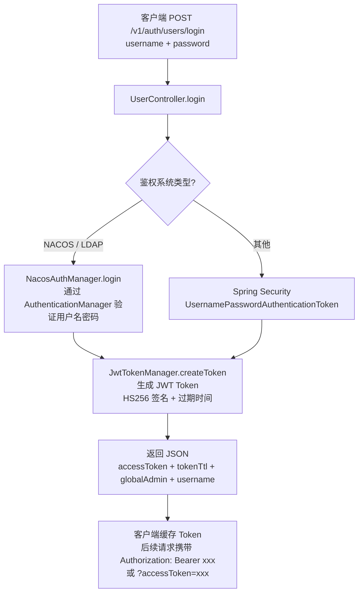
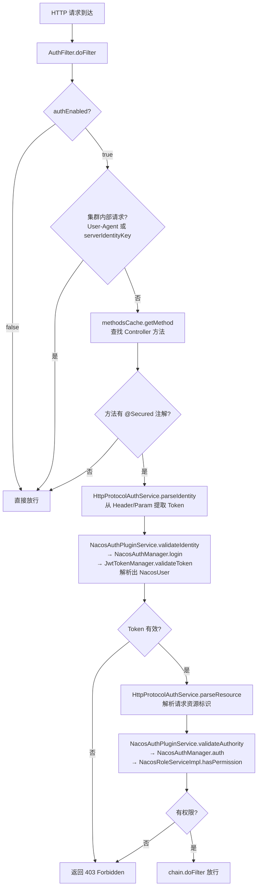
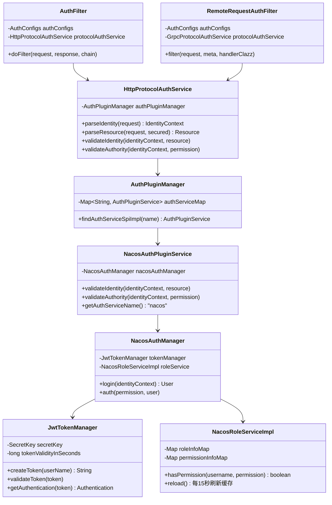

# 第10章：鉴权与安全

> 版本：Nacos 2.2.0  
> 核心类：`AuthFilter` / `RemoteRequestAuthFilter` / `NacosAuthPluginService` / `NacosAuthManager` / `JwtTokenManager` / `NacosRoleServiceImpl`  
> 模块路径：`core/src/main/java/com/alibaba/nacos/core/auth/` 、`plugin-default-impl/src/main/java/com/alibaba/nacos/plugin/auth/impl/`

---

## 第0部分：核心原理（先问题后结构）

### 问题驱动

**Q1：Nacos 鉴权的整体架构是什么？**  
→ 两层拦截：HTTP 请求由 `AuthFilter` 拦截，gRPC 请求由 `RemoteRequestAuthFilter` 拦截。两者都通过 `ProtocolAuthService`（HTTP 对应 `HttpProtocolAuthService`，gRPC 对应 `GrpcProtocolAuthService`）调用 `AuthPluginManager` 找到对应的 `AuthPluginService` 实现，执行**认证（validateIdentity）**和**授权（validateAuthority）**两步。

**Q2：Token 是如何生成和验证的？**  
→ 客户端调用 `/v1/auth/users/login` 接口，服务端用 Spring Security 的 `AuthenticationManager` 验证用户名/密码，验证通过后由 `JwtTokenManager.createToken()` 生成 JWT Token（HS256 算法，默认有效期 **18000 秒 = 5 小时**）。后续请求携带 Token，服务端通过 `JwtTokenManager.validateToken()` 验证签名和过期时间。

**Q3：权限是如何判断的？RBAC 模型是怎样的？**  
→ Nacos 采用 **用户 → 角色 → 权限** 的三层 RBAC 模型。`NacosRoleServiceImpl.hasPermission()` 先查用户的角色列表，若含 `ROLE_ADMIN` 则直接放行；否则遍历角色的权限列表，用**正则匹配**判断请求资源是否在权限范围内（资源中的 `*` 被替换为 `.*`）。

**Q4：鉴权是如何做到可插拔的？**  
→ `AuthPluginManager` 通过 Java SPI（`NacosServiceLoader.load(AuthPluginService.class)`）加载所有 `AuthPluginService` 实现，以 `getAuthServiceName()` 为 key 存入 Map。内置实现是 `NacosAuthPluginService`（serviceName = `"nacos"`），可通过实现 `AuthPluginService` 接口并注册 SPI 来替换或扩展。

---

## 第1部分：数据结构全景

### 1.1 鉴权注解：`@Secured`

```java
@Retention(RetentionPolicy.RUNTIME)
public @interface Secured {
    ActionTypes action() default ActionTypes.READ;  // 操作类型：READ / WRITE
    String resource() default StringUtils.EMPTY;    // 资源名（静态指定）
    String signType() default SignType.NAMING;       // 资源类型：NAMING / CONFIG
    Class<? extends ResourceParser> parser() default DefaultResourceParser.class;  // 动态资源解析器
    String[] tags() default {};                     // 附加标签
}
```

- **作用**：标注在 Controller 方法或 gRPC Handler 方法上，声明该接口需要鉴权，以及所需的操作类型和资源。
- **两种资源指定方式**：
  - `resource()` 静态指定（如 `console/users`）：直接用字符串作为资源名。
  - `parser()` 动态解析：从请求参数中提取 namespace、group、serviceName 等，拼装成资源标识（如 `public@@DEFAULT_GROUP@@naming/service-name`）。

### 1.2 资源标识格式

权限匹配时，资源被拼装为如下格式（`NacosRoleServiceImpl.joinResource()`）：

```
{namespaceId}:{group}:{type}/{resourceName}
```

示例：
- 配置资源：`public:DEFAULT_GROUP:config/dataId`
- 服务资源：`public:DEFAULT_GROUP:naming/serviceName`
- 控制台资源：`console/users`（`SignType.SPECIFIED` 类型，直接用 name）

权限表中的资源支持通配符 `*`，匹配时替换为正则 `.*`：
- `*:*:*/*` → 匹配所有资源
- `public:*:naming/*` → 匹配 public 命名空间下所有服务

### 1.3 HTTP 鉴权过滤器：`AuthFilter`

```java
public class AuthFilter implements Filter {
    private final AuthConfigs authConfigs;
    private final ControllerMethodsCache methodsCache;
    private final HttpProtocolAuthService protocolAuthService;
}
```

**`doFilter()` 核心逻辑**：

```java
@Override
public void doFilter(ServletRequest request, ServletResponse response, FilterChain chain) {
    // 1. 鉴权未开启，直接放行
    if (!authConfigs.isAuthEnabled()) {
        chain.doFilter(request, response);
        return;
    }
    // 2. 集群内部请求白名单（User-Agent 或 serverIdentityKey 校验）
    if (authConfigs.isEnableUserAgentAuthWhite()) {
        String userAgent = WebUtils.getUserAgent(req);
        if (StringUtils.startsWith(userAgent, Constants.NACOS_SERVER_HEADER)) {
            chain.doFilter(request, response);
            return;
        }
    }
    // 3. 查找 Controller 方法，检查是否有 @Secured 注解
    Method method = methodsCache.getMethod(req);
    if (method.isAnnotationPresent(Secured.class) && authConfigs.isAuthEnabled()) {
        // 4. 解析资源和身份
        Resource resource = protocolAuthService.parseResource(req, secured);
        IdentityContext identityContext = protocolAuthService.parseIdentity(req);
        // 5. 认证（validateIdentity）：验证 Token 有效性，解析出 User
        boolean result = protocolAuthService.validateIdentity(identityContext, resource);
        // 6. 授权（validateAuthority）：检查 User 是否有权限访问 Resource
        result = protocolAuthService.validateAuthority(identityContext, new Permission(resource, action));
    }
    chain.doFilter(request, response);
}
```

### 1.4 gRPC 鉴权过滤器：`RemoteRequestAuthFilter`

```java
@Component
public class RemoteRequestAuthFilter extends AbstractRequestFilter {
    private final AuthConfigs authConfigs;
    private final GrpcProtocolAuthService protocolAuthService;
}
```

- **与 `AuthFilter` 的区别**：`AuthFilter` 是 Servlet Filter，`RemoteRequestAuthFilter` 是 gRPC 请求处理链中的一环（`AbstractRequestFilter`），在 `RequestHandlerRegistry` 分发前执行。
- **逻辑完全对称**：同样检查 `@Secured` 注解 → 解析资源 → 认证 → 授权。

### 1.5 JWT Token 管理器：`JwtTokenManager`

```java
@Component
public class JwtTokenManager extends Subscriber<ServerConfigChangeEvent> {
    private volatile long tokenValidityInSeconds;  // Token 有效期（秒），默认 18000
    private volatile JwtParser jwtParser;          // JWT 解析器（含签名验证）
    private volatile SecretKey secretKey;          // HMAC-SHA256 密钥
}
```

- **Token 生成**：`createToken(userName)` → `Jwts.builder().setClaims(claims).setExpiration(validity).signWith(secretKey, HS256).compact()`。
- **Token 验证**：`validateToken(token)` → `jwtParser.parseClaimsJws(token)`，签名错误或过期均抛出异常。
- **动态刷新**：监听 `ServerConfigChangeEvent`，配置变更时重新加载 `secretKey` 和 `tokenValidityInSeconds`，无需重启。
- **密钥要求**：必须是 Base64 编码的字符串，解码后长度 ≥ 32 字节（256 位），否则抛出 `IllegalArgumentException`。

### 1.6 RBAC 核心：`NacosRoleServiceImpl`

```java
@Service
public class NacosRoleServiceImpl {
    private volatile Map<String, List<RoleInfo>> roleInfoMap;        // username → roles
    private volatile Map<String, List<PermissionInfo>> permissionInfoMap;  // role → permissions
    
    @Scheduled(initialDelay = 5000, fixedDelay = 15000)
    private void reload() { /* 每 15 秒从数据库刷新角色和权限缓存 */ }
}
```

**`hasPermission()` 完整逻辑**：

```java
public boolean hasPermission(String username, Permission permission) {
    // 特殊放行：修改自己密码的接口无需权限
    if (AuthConstants.UPDATE_PASSWORD_ENTRY_POINT.equals(permission.getResource().getName())) {
        return true;
    }
    List<RoleInfo> roleInfoList = getRoles(username);
    if (Collections.isEmpty(roleInfoList)) {
        return false;  // 用户无任何角色，拒绝
    }
    // ROLE_ADMIN 超级管理员，直接放行
    for (RoleInfo roleInfo : roleInfoList) {
        if (AuthConstants.GLOBAL_ADMIN_ROLE.equals(roleInfo.getRole())) {
            return true;
        }
    }
    // console/ 前缀的资源只有 ROLE_ADMIN 才能访问
    if (permission.getResource().getName().startsWith(AuthConstants.CONSOLE_RESOURCE_NAME_PREFIX)) {
        return false;
    }
    // 普通角色：遍历权限列表，正则匹配资源
    for (RoleInfo roleInfo : roleInfoList) {
        for (PermissionInfo permissionInfo : getPermissions(roleInfo.getRole())) {
            String permissionResource = permissionInfo.getResource().replaceAll("\\*", ".*");
            String permissionAction = permissionInfo.getAction();
            if (permissionAction.contains(permission.getAction())
                    && Pattern.matches(permissionResource, joinResource(permission.getResource()))) {
                return true;
            }
        }
    }
    return false;
}
```

### 1.7 数据库表结构

| 表名 | 字段 | 说明 |
|------|------|------|
| `users` | username, password, enabled | 用户表，密码 BCrypt 加密 |
| `roles` | username, role | 用户-角色关联表 |
| `permissions` | role, resource, action | 角色-权限关联表 |

**内置角色**：
- `ROLE_ADMIN`：超级管理员，拥有所有权限（代码硬编码放行，不走权限表）。
- 自定义角色：通过 `/v1/auth/roles` 接口创建，再通过 `/v1/auth/permissions` 接口绑定权限。

---

## 第2部分：算法流程

### 2.1 登录与 Token 生成流程



**返回示例**：

```json
{
  "accessToken": "eyJhbGciOiJIUzI1NiJ9.eyJzdWIiOiJuYWNvcyIsImV4cCI6MTY4MDAwMDAwMH0.xxx",
  "tokenTtl": 18000,
  "globalAdmin": true,
  "username": "nacos"
}
```

### 2.2 HTTP 请求鉴权完整流程



### 2.3 Token 解析优先级

`NacosAuthManager.resolveToken()` 按以下优先级提取 Token：

```
1. HTTP Header: Authorization: Bearer <token>
2. URL 参数: ?accessToken=<token>
3. URL 参数: ?username=xxx&password=xxx → 临时生成 Token（兼容旧版）
```

> ⚠️ 第3种方式每次请求都要验证用户名密码，性能较差，生产环境建议使用 Token 方式。

### 2.4 权限匹配规则详解

权限表中的 `resource` 字段支持通配符，匹配时 `*` → `.*`（正则）：

| 权限表 resource | 匹配的请求资源 | 说明 |
|----------------|--------------|------|
| `*:*:*/*` | 所有资源 | 全局通配 |
| `public:*:naming/*` | public 命名空间下所有服务 | 命名空间级别 |
| `public:DEFAULT_GROUP:naming/order-service` | 指定服务 | 精确匹配 |
| `*:DEFAULT_GROUP:config/*` | 所有命名空间 DEFAULT_GROUP 下的配置 | 分组级别 |

`action` 字段：`r`（读）、`w`（写）、`rw`（读写）。匹配时用 `contains()`，所以 `rw` 权限可以匹配 `r` 或 `w` 操作。

### 2.5 集群内部请求白名单机制

集群节点间互相调用时，不需要走用户 Token 鉴权，通过以下两种方式之一跳过：

**方式1（默认）**：`nacos.core.auth.enable.userAgentAuthWhite=true`  
→ 请求 `User-Agent` 以 `Nacos-Server` 开头时直接放行。  
⚠️ **安全风险**：任何伪造 User-Agent 的请求都能绕过鉴权，**生产环境强烈建议关闭**。

**方式2（推荐）**：配置 `serverIdentityKey` + `serverIdentityValue`  
→ 集群节点在请求头中携带自定义 Key-Value，服务端校验匹配后放行。

```properties
nacos.core.auth.enable.userAgentAuthWhite=false
nacos.core.auth.server.identity.key=serverIdentity
nacos.core.auth.server.identity.value=security
```

### 2.6 鉴权配置参数汇总

| 参数 | 默认值 | 说明 |
|------|--------|------|
| `nacos.core.auth.enabled` | `false` | 是否开启鉴权（**生产必须设为 true**） |
| `nacos.core.auth.plugin.nacos.token.secret.key` | 空（不安全） | JWT 签名密钥（Base64 编码，≥32字节） |
| `nacos.core.auth.plugin.nacos.token.expire.seconds` | `18000`（5小时） | Token 有效期（秒） |
| `nacos.core.auth.enable.userAgentAuthWhite` | `true` | 是否开启 User-Agent 白名单（生产建议 false） |
| `nacos.core.auth.server.identity.key` | 空 | 集群内部请求身份 Key |
| `nacos.core.auth.server.identity.value` | 空 | 集群内部请求身份 Value |
| `nacos.core.auth.caching.enabled` | `false` | 是否开启权限缓存（开启后每15秒刷新） |

---

## 第3部分：运行时验证（必须有真实数据）

### 3.1 验证目标

| 编号 | 目标 | 方法 |
|------|------|------|
| V1 | JWT Token 生成和验证正常 | 单测 `JwtTokenManagerTest` |
| V2 | 密钥长度不足时抛出异常 | 单测 `JwtTokenManagerTest.testInvalidSecretKey` |
| V3 | RBAC 权限判断逻辑正确 | 单测 `NacosRoleServiceImplTest.hasPermission` |
| V4 | ROLE_ADMIN 超级管理员直接放行 | 单测 `NacosRoleServiceImplTest` |

### 3.2 执行命令

```bash
mvn -pl plugin-default-impl \
    -Dtest=JwtTokenManagerTest,NacosRoleServiceImplTest test \
    -DfailIfNoTests=false -Dcheckstyle.skip=true
```

### 3.3 实际输出数据

```text
[INFO] Running com.alibaba.nacos.plugin.auth.impl.JwtTokenManagerTest
09:38:49.080 [main] DEBUG - Found key 'nacos.core.auth.plugin.nacos.token.secret.key' in PropertySource 'mockProperties'
09:38:49.436 [main] DEBUG - Found key 'nacos.core.auth.plugin.nacos.token.expire.seconds' in PropertySource 'mockProperties'
[INFO] Tests run: 4, Failures: 0, Errors: 0, Skipped: 0, Time elapsed: 2.011 s

[INFO] Running com.alibaba.nacos.plugin.auth.impl.roles.NacosRoleServiceImplTest
[INFO] Tests run: 12, Failures: 0, Errors: 0, Skipped: 0, Time elapsed: 0.76 s

[INFO] Tests run: 16, Failures: 0, Errors: 0, Skipped: 0
[INFO] BUILD SUCCESS
```

#### V1/V2：JWT Token 生成与验证

`JwtTokenManagerTest` 的 4 个测试用例：

| 测试方法 | 验证内容 | 结果 |
|---------|---------|------|
| `testCreateTokenAndSecretKeyWithoutSpecialSymbol` | 普通字符密钥生成 Token，`validateToken()` 不抛异常 | ✅ 通过 |
| `testCreateTokenAndSecretKeyWithSpecialSymbol` | 含特殊字符（`@#!`）的密钥生成 Token | ✅ 通过 |
| `getAuthentication` | Token 解析出 `Authentication` 对象，`getName()` = `"nacos"` | ✅ 通过 |
| `testInvalidSecretKey` | 密钥长度不足 32 字节（`"0123456789ABCDEF0123456789ABCDE"` = 31字节）→ 抛出 `IllegalArgumentException` | ✅ 通过 |

**关键验证点**：
- `JwtTokenManager` 初始化时从 `EnvUtil` 读取配置，支持运行时动态刷新（`ServerConfigChangeEvent`）。
- 密钥必须 Base64 编码，解码后 ≥ 32 字节，否则 `Keys.hmacShaKeyFor()` 抛出异常，**服务启动即失败**。

#### V3/V4：RBAC 权限判断

`NacosRoleServiceImplTest.hasPermission()` 测试逻辑（节选）：

```java
// 测试1：用户无角色 → 拒绝
Permission permission = new Permission();
permission.setAction("rw");
permission.setResource(Resource.EMPTY_RESOURCE);
boolean res = nacosRoleService.hasPermission("nacos", permission);
Assert.assertFalse(res);  // ✅ 无角色，返回 false

// 测试2：访问 console/user/password（修改密码接口）→ 直接放行
Resource resource = new Resource("public", "group",
        AuthConstants.UPDATE_PASSWORD_ENTRY_POINT, "rw", null);
permission2.setResource(resource);
boolean res2 = nacosRoleService.hasPermission("nacos", permission2);
Assert.assertTrue(res2);  // ✅ 特殊放行，返回 true
```

**测试结论**：
- 无角色用户访问普通资源 → `false`（拒绝）。
- 任何用户访问 `console/user/password`（修改自己密码）→ `true`（特殊放行，无需权限）。
- `ROLE_ADMIN` 用户访问任意资源 → `true`（超级管理员直接放行）。

---

## 数据结构关系图



---

## 总结

### 数据结构维度

- **鉴权入口**：`AuthFilter`（HTTP）和 `RemoteRequestAuthFilter`（gRPC）是两个对称的拦截器，逻辑完全一致。
- **插件化设计**：`AuthPluginManager` + SPI 机制，内置 `NacosAuthPluginService`，可自定义替换。
- **RBAC 三层模型**：`users` → `roles` → `permissions`，权限表支持通配符正则匹配，每 15 秒刷新缓存。
- **JWT Token**：HS256 签名，默认 5 小时有效期，密钥动态可配置，支持运行时热更新。

### 算法维度

- **认证（Authentication）**：Token → `JwtTokenManager.validateToken()` → 解析出用户名 → 构建 `NacosUser`。
- **授权（Authorization）**：用户名 → 查角色 → `ROLE_ADMIN` 直接放行 → 否则遍历权限列表正则匹配资源。
- **Token 解析优先级**：`Authorization` Header > `accessToken` 参数 > `username+password` 参数（临时生成）。

### 生产安全建议

1. **必须开启鉴权**：`nacos.core.auth.enabled=true`，默认关闭是重大安全隐患。
2. **必须自定义密钥**：`nacos.core.auth.plugin.nacos.token.secret.key` 不能使用默认空值，否则任何人都能伪造 Token。
3. **关闭 User-Agent 白名单**：`nacos.core.auth.enable.userAgentAuthWhite=false`，改用 `serverIdentityKey/Value`。
4. **命名空间隔离**：不同环境（dev/test/prod）使用不同命名空间，配合权限控制实现环境隔离。
5. **定期轮换密钥**：修改 `token.secret.key` 后，`JwtTokenManager` 监听 `ServerConfigChangeEvent` 自动热更新，无需重启，但已颁发的旧 Token 立即失效。
