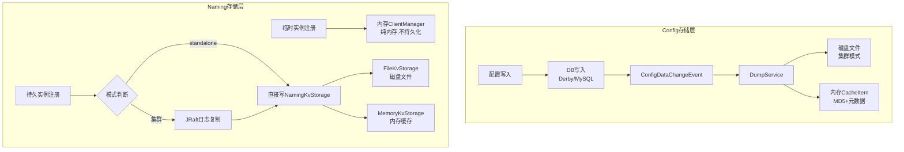

# 第11章：存储层设计

> **源码版本**：Nacos 2.x  
> **核心模块**：`config/service/datasource/`、`core/storage/kv/`、`naming/consistency/persistent/`

---

## 核心问题

1. **Nacos 有几套存储？各自存什么数据？**
2. **配置数据为什么同时有 DB、磁盘文件、内存三层存储？**
3. **服务实例的持久化是怎么实现的？KvStorage 是什么？**
4. **standalone 模式和集群模式的存储有什么本质区别？**

---

## 第 1 部分：存储层全景

### 1.1 三套存储体系

Nacos 的存储层并不是一个统一的存储，而是**三套独立的存储体系**，分别服务于不同的数据类型：

```
┌─────────────────────────────────────────────────────────────┐
│                    Nacos 存储层全景                           │
├──────────────────┬──────────────────┬───────────────────────┤
│  配置存储         │  服务实例存储      │  集群元数据存储         │
│  (Config)        │  (Naming)         │  (Core)               │
├──────────────────┼──────────────────┼───────────────────────┤
│ ① 关系型数据库    │ ① 内存（临时实例） │ ① JRaft Log + RocksDB │
│   Derby / MySQL  │ ② KvStorage      │   （Raft 状态机）       │
│ ② 磁盘文件缓存    │   （持久实例）     │                       │
│ ③ 内存 CacheItem │                  │                       │
└──────────────────┴──────────────────┴───────────────────────┘
```

### 1.2 数据结构清单

| 存储层 | 核心类 | 源码位置 | 存储内容 |
|--------|--------|----------|---------|
| 配置 DB（Derby） | `LocalDataSourceServiceImpl` | `config/service/datasource/` | 配置内容（嵌入式） |
| 配置 DB（MySQL） | `ExternalDataSourceServiceImpl` | `config/service/datasource/` | 配置内容（外部） |
| 配置磁盘缓存 | `DiskUtil` | `config/utils/` | 配置文件（集群模式） |
| 配置内存缓存 | `ConfigCacheService.CACHE` | `config/service/` | `groupKey → CacheItem`（MD5） |
| 服务实例内存 | `ClientManager` | `naming/core/v2/client/` | 临时实例（纯内存） |
| 服务实例 KV | `NamingKvStorage` | `naming/consistency/persistent/` | 持久实例（文件） |
| KV 接口 | `KvStorage` | `core/storage/kv/` | 通用 KV 抽象 |

---

## 第 2 部分：配置存储层

### 2.1 数据源抽象：DataSourceService

**问题推导**：Nacos 需要同时支持嵌入式 Derby（开发/测试）和外部 MySQL（生产），如何统一抽象？

**推导**：定义 `DataSourceService` 接口，两种实现分别封装不同的数据源，上层代码无感知切换。

```java
// config/src/main/java/com/alibaba/nacos/config/server/service/datasource/DataSourceService.java
public interface DataSourceService {
    void init() throws Exception;
    void reload() throws IOException;
    boolean checkMasterWritable();
    JdbcTemplate getJdbcTemplate();
    TransactionTemplate getTransactionTemplate();
    String getCurrentDbUrl();
    String getHealth();
    String getDataSourceType();
}
```

**两种实现对比**：

| 对比项 | `LocalDataSourceServiceImpl` | `ExternalDataSourceServiceImpl` |
|--------|------------------------------|----------------------------------|
| 数据库 | Apache Derby（嵌入式） | MySQL（外部） |
| 适用场景 | standalone 模式、开发测试 | 生产集群（推荐） |
| 驱动 | `org.apache.derby.jdbc.EmbeddedDriver` | MySQL JDBC Driver |
| 连接池 | HikariCP | HikariCP |
| 主从切换 | 不支持（单节点） | 支持（`SelectMasterTask` 定期检测） |
| 健康检查 | 始终返回 `UP` | `CheckDbHealthTask` 每 10 秒检测 |
| Schema 初始化 | 启动时执行 `derby-schema.sql` | 需手动初始化 `mysql-schema.sql` |

### 2.2 LocalDataSourceServiceImpl — 嵌入式 Derby

**核心源码**（`LocalDataSourceServiceImpl.java`）：

```java
public class LocalDataSourceServiceImpl implements DataSourceService {
    
    // Derby 驱动
    private final String jdbcDriverName = "org.apache.derby.jdbc.EmbeddedDriver";
    
    // Derby 数据目录：${nacos.home}/data/derby-data/
    private final String derbyBaseDir = "data" + File.separator + Constants.DERBY_BASE_DIR;
    
    @Override
    public synchronized void init() throws Exception {
        if (PropertyUtil.isUseExternalDB()) {
            return;  // 配置了外部 DB，跳过 Derby 初始化
        }
        // JDBC URL：jdbc:derby:${nacos.home}/data/derby-data;create=true
        final String jdbcUrl = "jdbc:derby:" + Paths.get(EnvUtil.getNacosHome(), derbyBaseDir) + ";create=true";
        initialize(jdbcUrl);
    }
    
    @Override
    public synchronized void reload() {
        // 执行 derby-schema.sql，创建表结构（幂等，表已存在时忽略错误）
        execute(ds.getConnection(), "META-INF/derby-schema.sql");
    }
}
```

**关键设计**：
- Derby 数据目录：`${nacos.home}/data/derby-data/`
- 启动时自动执行 `derby-schema.sql` 建表（幂等操作）
- `cleanAndReopenDerby()`：集群模式下从 Leader 同步数据时，先清空本地 Derby 再重建

### 2.3 ExternalDataSourceServiceImpl — 外部 MySQL

**核心源码**（`ExternalDataSourceServiceImpl.java`）：

```java
public class ExternalDataSourceServiceImpl implements DataSourceService {
    
    // 支持多数据源（主从）
    private List<HikariDataSource> dataSourceList = new ArrayList<>();
    
    // 当前主库索引
    private volatile int masterIndex;
    
    @Override
    public void init() {
        if (PropertyUtil.isUseExternalDB()) {
            reload();  // 加载数据源配置
        }
        // 多数据源时，启动主库选举任务（每 10 秒）
        if (this.dataSourceList.size() > DB_MASTER_SELECT_THRESHOLD) {
            ConfigExecutor.scheduleConfigTask(new SelectMasterTask(), 10, 10, TimeUnit.SECONDS);
        }
        // 启动健康检查任务（每 10 秒）
        ConfigExecutor.scheduleConfigTask(new CheckDbHealthTask(), 10, 10, TimeUnit.SECONDS);
    }
}
```

**主库选举机制**（`SelectMasterTask`）：

```java
class SelectMasterTask implements Runnable {
    @Override
    public void run() {
        // 遍历所有数据源，尝试执行写操作
        for (HikariDataSource ds : dataSourceList) {
            try {
                // 用一条 DELETE 语句测试是否可写（主库）
                testMasterJT.update("DELETE FROM config_info WHERE data_id='com.alibaba.nacos.testMasterDB'");
                jt.setDataSource(ds);  // 切换到可写的主库
                masterIndex = index;
                break;
            } catch (DataAccessException e) {
                // read only → 从库，跳过
            }
        }
    }
}
```

**健康检查机制**（`CheckDbHealthTask`）：

```java
class CheckDbHealthTask implements Runnable {
    @Override
    public void run() {
        // 对每个数据源执行查询，检测是否可用
        String sql = "SELECT * FROM config_info_beta WHERE id = 1";
        for (int i = 0; i < testJtList.size(); i++) {
            try {
                jdbcTemplate.query(sql, CONFIG_INFO4BETA_ROW_MAPPER);
                isHealthList.set(i, Boolean.TRUE);
            } catch (DataAccessException e) {
                isHealthList.set(i, Boolean.FALSE);
                // 主库不可用 → DOWN，从库不可用 → WARN
            }
        }
    }
}
```

### 2.4 配置三层存储的协作关系

**问题推导**：为什么配置需要 DB + 磁盘 + 内存三层？

| 层次 | 存储内容 | 作用 | 何时使用 |
|------|---------|------|---------|
| **DB**（Derby/MySQL） | 配置完整内容 | 持久化，数据不丢失 | 写入时、全量 dump 时 |
| **磁盘文件** | 配置完整内容 | 集群模式下供 HTTP 长轮询读取 | 集群 + MySQL 模式 |
| **内存 CacheItem** | 仅 MD5 + 元数据 | O(1) 判断配置是否变更 | 每次长轮询比对 |

**⭐ 重要发现：standalone 模式不写磁盘**

```java
// ConfigCacheService.java
public static boolean dump(...) {
    // ...
    } else if (!PropertyUtil.isDirectRead()) {
        DiskUtil.saveToDisk(dataId, group, tenant, content);  // 集群模式才写磁盘
    }
}

// PropertyUtil.java
public static boolean isDirectRead() {
    // standalone + Derby → true → 跳过写磁盘，直接读 Derby
    // 集群 + MySQL → false → 写磁盘（供 HTTP 长轮询读取）
    return EnvUtil.getStandaloneMode() && isEmbeddedStorage();
}
```

**结论**：
- **standalone + Derby**：配置变更 → 写 Derby → 更新内存 MD5，**不写磁盘**
- **集群 + MySQL**：配置变更 → 写 MySQL → 写磁盘文件 → 更新内存 MD5

### 2.5 关键数据库表

```sql
-- 配置主表
config_info (
    id, data_id, group_id, tenant_id,
    content,          -- 配置内容
    md5,              -- 内容 MD5（冗余存储，加速查询）
    gmt_create, gmt_modified,
    src_user, src_ip,
    app_name, type,   -- 配置类型（yaml/json/text 等）
    encrypted_data_key  -- 加密密钥（企业版）
)

-- 灰度配置表（Beta 发布）
config_info_beta (
    id, data_id, group_id, tenant_id,
    beta_ips,         -- 灰度 IP 列表（逗号分隔）
    content, md5, ...
)

-- 配置历史表（变更记录）
his_config_info (
    id, nid,          -- nid 自增，id 为原始配置 id
    data_id, group_id, tenant_id,
    content, md5,
    op_type,          -- 操作类型：I(insert)/U(update)/D(delete)
    gmt_create, gmt_modified
)

-- 标签配置表
config_info_tag (
    id, data_id, group_id, tenant_id, tag_id,
    content, md5, ...
)
```

---

## 第 3 部分：KV 存储层

### 3.1 KvStorage 接口设计

**问题推导**：服务实例的持久化需要一个轻量级的 KV 存储，不需要 SQL，只需要 get/put/delete，如何设计？

**推导**：定义通用 `KvStorage` 接口，支持多种实现（内存、文件、RocksDB），通过工厂模式创建。

```java
// core/src/main/java/com/alibaba/nacos/core/storage/kv/KvStorage.java
public interface KvStorage {
    
    // 存储类型枚举
    enum KvType {
        File,    // 文件系统存储
        Memory,  // 内存存储
        RocksDB, // RocksDB（接口预留，当前未实现）
    }
    
    // 基本 CRUD
    byte[] get(byte[] key) throws KvStorageException;
    void put(byte[] key, byte[] value) throws KvStorageException;
    void delete(byte[] key) throws KvStorageException;
    
    // 批量操作
    Map<byte[], byte[]> batchGet(List<byte[]> keys) throws KvStorageException;
    void batchPut(List<byte[]> keys, List<byte[]> values) throws KvStorageException;
    void batchDelete(List<byte[]> keys) throws KvStorageException;
    
    // 快照（用于 Raft Snapshot）
    void doSnapshot(String backupPath) throws KvStorageException;
    void snapshotLoad(String path) throws KvStorageException;
    
    // 遍历
    List<byte[]> allKeys() throws KvStorageException;
    
    void shutdown();
}
```

**注意**：`KvType.RocksDB` 在接口中预留，但 `StorageFactory` 当前**未实现**，传入 RocksDB 类型会抛出 `IllegalArgumentException`。

### 3.2 两种 KvStorage 实现

#### MemoryKvStorage — 内存 KV

```java
// core/src/main/java/com/alibaba/nacos/core/storage/kv/MemoryKvStorage.java
public class MemoryKvStorage implements KvStorage {
    
    // 底层数据结构：ConcurrentHashMap
    private final Map<Key, byte[]> storage = new ConcurrentHashMap<>();
    
    @Override
    public byte[] get(byte[] key) {
        return storage.get(new Key(key));
    }
    
    @Override
    public void put(byte[] key, byte[] value) {
        storage.put(new Key(key), value);
    }
    
    // doSnapshot：将内存数据序列化到文件
    // snapshotLoad：从文件反序列化到内存
}
```

**特点**：
- 读写 O(1)，性能最高
- 重启后数据丢失（需配合 Snapshot 恢复）
- 用于临时数据或作为持久化存储的内存缓存层

#### FileKvStorage — 文件 KV

```java
// core/src/main/java/com/alibaba/nacos/core/storage/kv/FileKvStorage.java
public class FileKvStorage implements KvStorage {
    
    private final String baseDir;
    
    // 读写锁：保证 Snapshot 时的一致性视图
    private final ReentrantReadWriteLock lock = new ReentrantReadWriteLock();
    
    @Override
    public byte[] get(byte[] key) throws KvStorageException {
        readLock.lock();
        try {
            // key 即文件名，value 即文件内容
            final String fileName = new String(key);
            File file = Paths.get(baseDir, fileName).toFile();
            return file.exists() ? DiskUtils.readFileBytes(file) : null;
        } finally {
            readLock.unlock();
        }
    }
    
    @Override
    public void put(byte[] key, byte[] value) throws KvStorageException {
        readLock.lock();  // 注意：put 用的是 readLock（允许并发写不同 key）
        try {
            final String fileName = new String(key);
            File file = Paths.get(baseDir, fileName).toFile();
            DiskUtils.touch(file);
            DiskUtils.writeFile(file, value, false);
        } finally {
            readLock.unlock();
        }
    }
    
    @Override
    public void doSnapshot(String backupPath) throws KvStorageException {
        writeLock.lock();  // Snapshot 时用 writeLock，阻塞所有读写
        try {
            DiskUtils.copyDirectory(Paths.get(baseDir).toFile(), Paths.get(backupPath).toFile());
        } finally {
            writeLock.unlock();
        }
    }
}
```

**⭐ 设计亮点**：
- **key = 文件名，value = 文件内容**：极简设计，每个 KV 对应一个文件
- **put 用 readLock**：允许不同 key 并发写入（不同文件互不干扰）
- **doSnapshot 用 writeLock**：快照时阻塞所有操作，保证一致性视图
- 源码注释 `// TODO 写文件的方式需要优化`：官方也承认这种方式性能有待改进

### 3.3 StorageFactory — KV 存储工厂

```java
// core/src/main/java/com/alibaba/nacos/core/storage/StorageFactory.java
public final class StorageFactory {
    
    public static KvStorage createKvStorage(KvStorage.KvType type, final String label, final String baseDir)
            throws Exception {
        switch (type) {
            case File:
                return new FileKvStorage(baseDir);
            case Memory:
                return new MemoryKvStorage();
            default:
                // RocksDB 当前未实现！
                throw new IllegalArgumentException("this kv type : [" + type.name() + "] not support");
        }
    }
}
```

---

## 第 4 部分：服务实例持久化存储

### 4.1 NamingKvStorage — 内存 + 文件双层存储

**问题推导**：持久实例需要重启后恢复，但每次读都走文件 I/O 太慢，如何兼顾性能和持久化？

**推导**：内存作为缓存层（读快），文件作为持久化层（写慢但可靠），写时同步写两层，读时优先读内存。

```java
// naming/src/main/java/com/alibaba/nacos/naming/consistency/persistent/impl/NamingKvStorage.java
public class NamingKvStorage extends MemoryKvStorage {
    
    private final String baseDir;
    
    // 底层文件存储（持久化层）
    private final KvStorage baseDirStorage;  // FileKvStorage
    
    public NamingKvStorage(final String baseDir) throws Exception {
        this.baseDir = baseDir;
        // 创建文件存储，目录：${nacos.home}/data/naming/data/
        this.baseDirStorage = StorageFactory.createKvStorage(KvStorage.KvType.File, LABEL, baseDir);
    }
    
    @Override
    public byte[] get(byte[] key) throws KvStorageException {
        // ★ 读：优先读内存（父类 MemoryKvStorage）
        byte[] result = super.get(key);
        if (null == result) {
            // 内存 miss → 读文件，并回填内存
            result = baseDirStorage.get(key);
            if (null != result) {
                super.put(key, result);  // 回填内存缓存
            }
        }
        return result;
    }
    
    @Override
    public void put(byte[] key, byte[] value) throws KvStorageException {
        // ★ 写：先写文件（持久化），再写内存（缓存）
        baseDirStorage.put(key, value);  // 写文件（持久化）
        super.put(key, value);           // 写内存（缓存）
    }
    
    @Override
    public void delete(byte[] key) throws KvStorageException {
        // ★ 删：先删文件，再删内存
        baseDirStorage.delete(key);
        super.delete(key);
    }
    
    @Override
    public void snapshotLoad(String path) throws KvStorageException {
        // 加载 Snapshot：从快照文件恢复到文件存储，再全量加载到内存
        baseDirStorage.snapshotLoad(path);
        loadSnapshotFromActualStorage(baseDirStorage);  // 全量加载到内存
    }
}
```

**读写流程图**：

```
读操作（get）：
    内存（MemoryKvStorage）
        │ hit → 直接返回
        │ miss
        ▼
    文件（FileKvStorage）
        │ 读取文件内容
        │ 回填内存缓存
        ▼
    返回结果

写操作（put）：
    文件（FileKvStorage）  ← 先写（持久化保障）
        │ 写成功
        ▼
    内存（MemoryKvStorage）← 再写（缓存更新）
```

### 4.2 持久实例存储的完整链路

**持久实例写入流程**：

```
客户端注册持久实例（ephemeral=false）
    │
    ▼
PersistentConsistencyServiceDelegateImpl.put()
    │
    ├── standalone 模式 → StandalonePersistentServiceProcessor.put()
    │       │ 直接调用 onApply()，跳过 Raft
    │       ▼
    │   NamingKvStorage.put(key, value)
    │       ├── FileKvStorage.put()  → 写磁盘文件
    │       └── MemoryKvStorage.put() → 写内存
    │
    └── 集群模式 → PersistentServiceProcessor.put()
            │ 提交 WriteRequest 给 JRaft
            ▼
        JRaft Leader 复制日志（超过半数确认）
            │
            ▼
        NacosStateMachine.onApply()
            │
            ▼
        BasePersistentServiceProcessor.onApply()
            │
            ▼
        NamingKvStorage.put(key, value)
            ├── FileKvStorage.put()  → 写磁盘文件
            └── MemoryKvStorage.put() → 写内存
```

**关键类**：

| 类名 | 路径 | 作用 |
|------|------|------|
| `PersistentConsistencyServiceDelegateImpl` | `naming/consistency/persistent/` | 持久化服务委托，根据模式选择实现 |
| `StandalonePersistentServiceProcessor` | `naming/consistency/persistent/impl/` | standalone 模式，直接写 KV |
| `PersistentServiceProcessor` | `naming/consistency/persistent/impl/` | 集群模式，通过 JRaft 写 KV |
| `BasePersistentServiceProcessor` | `naming/consistency/persistent/impl/` | 公共基类，持有 `NamingKvStorage` |
| `NamingKvStorage` | `naming/consistency/persistent/impl/` | 内存 + 文件双层 KV 存储 |

### 4.3 standalone vs 集群模式的存储差异

```java
// PersistentConsistencyServiceDelegateImpl.java
private BasePersistentServiceProcessor createPersistentServiceProcessor(ProtocolManager protocolManager)
        throws Exception {
    final BasePersistentServiceProcessor processor =
            EnvUtil.getStandaloneMode()
                    ? new StandalonePersistentServiceProcessor()   // standalone：直接写 KV
                    : new PersistentServiceProcessor(protocolManager);  // 集群：通过 JRaft
    processor.afterConstruct();
    return processor;
}
```

| 对比项 | standalone 模式 | 集群模式 |
|--------|----------------|---------|
| 写入路径 | 直接写 `NamingKvStorage` | JRaft → `NacosStateMachine` → `NamingKvStorage` |
| 一致性保证 | 单节点，无需共识 | Raft 多数派确认 |
| 性能 | 高（无网络开销） | 较低（需要日志复制） |
| 容错 | 无（单点故障） | 高（多数派存活即可） |
| 数据目录 | `${nacos.home}/data/naming/data/` | 同左（每个节点独立） |

---

## 第 5 部分：运行时验证

### 5.1 测试用例验证

运行 KV 存储相关测试用例：

```bash
# KV 存储核心测试（7 个用例）
mvn test -pl core -Dtest="StorageFactoryTest,MemoryKvStorageTest,FileKvStorageTest" \
    -Dcheckstyle.skip=true

# NamingKvStorage 测试（5 个用例）
mvn test -pl naming -Dtest="NamingKvStorageTest" -Dcheckstyle.skip=true
```

**测试结果**：

```
[INFO] Running StorageFactoryTest
[INFO] Tests run: 1, Failures: 0, Errors: 0, Skipped: 0  ✅

[INFO] Running MemoryKvStorageTest
[INFO] Tests run: 3, Failures: 0, Errors: 0, Skipped: 0  ✅

[INFO] Running FileKvStorageTest
[INFO] Tests run: 3, Failures: 0, Errors: 0, Skipped: 0  ✅

[INFO] Running NamingKvStorageTest
[INFO] Tests run: 5, Failures: 0, Errors: 0, Skipped: 0  ✅

共 12 个测试用例，全部通过 ✅
```

### 5.2 FileKvStorage 核心测试逻辑

```java
// FileKvStorageTest.java
@Test
public void testPutAndGetAndDelete() {
    byte[] key = "key".getBytes();
    byte[] value = "value".getBytes();
    
    // put：写文件（文件名=key，内容=value）
    kvStorage.put(key, value);
    
    // get：读文件
    byte[] value1 = kvStorage.get(key);
    Assert.assertArrayEquals(value, value1);  // ✅ 读写一致
    
    // delete：删除文件
    kvStorage.delete(key);
    Assert.assertNull(kvStorage.get(key));    // ✅ 删除后读取为 null
}

@Test
public void testSnapshot() {
    // doSnapshot：将 baseDir 目录复制到 backupDir
    kvStorage.doSnapshot(backupDir);
    
    // snapshotLoad：从 backupDir 恢复到 baseDir
    kvStorage.snapshotLoad(backupDir);
    byte[] value = kvStorage.get("key".getBytes());
    Assert.assertArrayEquals("value".getBytes(), value);  // ✅ 快照恢复正确
}
```

### 5.3 NamingKvStorage 双层存储验证

```java
// NamingKvStorageTest.java（使用 Mockito 验证调用链）
@Test
public void testGet() throws KvStorageException {
    // 内存 miss 时，应调用底层 FileKvStorage.get()
    namingKvStorage.get(key);
    verify(baseDirStorageMock).get(key);  // ✅ 验证文件存储被调用
}

@Test
public void testPut() throws KvStorageException {
    byte[] value = "value_test".getBytes();
    namingKvStorage.put(key, value);
    // 写操作必须先写文件存储
    verify(baseDirStorageMock).put(key, value);  // ✅ 验证文件存储被调用
}
```

---

## 第 6 部分：存储层设计总结

### 6.1 整体架构图



### 6.2 核心设计决策

| 设计决策 | 原因 |
|---------|------|
| 配置存 DB 而非 KV | 配置需要 SQL 查询（按 group、tenant 过滤）、历史记录、灰度发布等复杂功能 |
| 配置内存只存 MD5 | 配置内容可能很大，全量缓存内存压力大；MD5 足以判断是否变更 |
| standalone 不写磁盘 | Derby 本身就是持久化的，磁盘文件是为集群模式的 HTTP 长轮询服务的 |
| 持久实例用文件 KV | 不需要 SQL，只需 key-value 语义；文件 KV 实现简单，与 Raft Snapshot 天然契合 |
| NamingKvStorage 双层 | 内存提供读性能，文件提供持久化；写时先写文件保证不丢数据 |
| FileKvStorage put 用 readLock | 不同 key 对应不同文件，互不干扰，允许并发写；只有 Snapshot 时才需要全局锁 |

### 6.3 面试要点

**Q：Nacos 配置数据存在哪里？**
> 三层：① DB（Derby/MySQL）持久化；② 磁盘文件（集群模式，供 HTTP 长轮询读取）；③ 内存 CacheItem（只存 MD5，用于快速比对）。standalone + Derby 模式不写磁盘。

**Q：Nacos 服务实例数据存在哪里？**
> 临时实例：纯内存（`ClientManager`），连接断开自动清理，不持久化。持久实例：`NamingKvStorage`（内存 + 文件双层），通过 JRaft 保证集群一致性，重启后可从文件恢复。

**Q：KvStorage 的 RocksDB 实现在哪里？**
> 接口中预留了 `KvType.RocksDB`，但 `StorageFactory` 当前**未实现**，传入会抛异常。Nacos 目前使用文件 KV 而非 RocksDB。

**Q：FileKvStorage 的 put 为什么用 readLock 而不是 writeLock？**
> 因为不同 key 对应不同文件，并发写不同 key 不会产生竞争。readLock 允许多个线程并发持有，提高写吞吐量。只有 `doSnapshot`（需要复制整个目录）时才用 writeLock 阻塞所有操作，保证快照一致性。

---

*文档生成时间：2026-03-05*  
*对应源码版本：Nacos 2.x*  
*测试验证：12 个测试用例全部通过 ✅*
