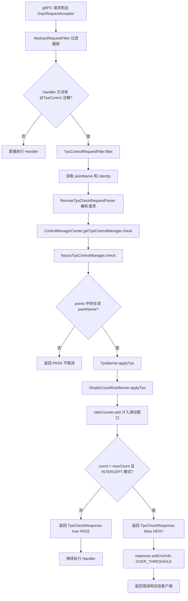
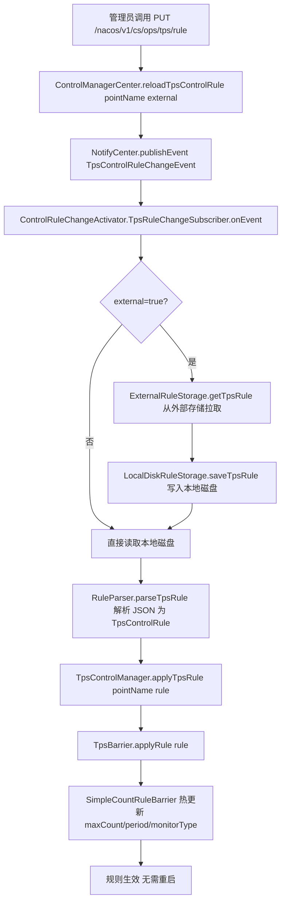
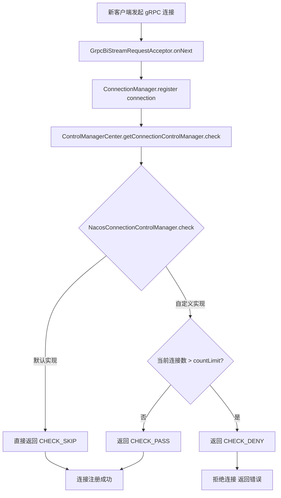
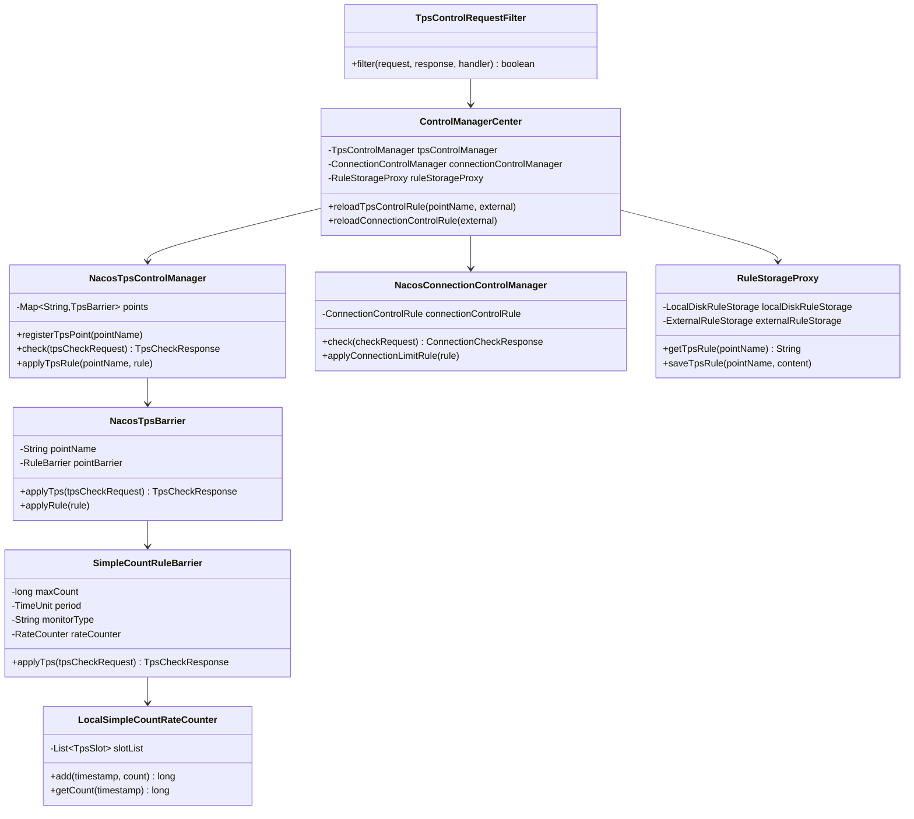

# 第14章：流量控制插件（TPS 限流与连接控制）

> 版本：Nacos 2.2.0  
> 核心类：`ControlManagerCenter` / `NacosTpsControlManager` / `NacosTpsBarrier` / `LocalSimpleCountRateCounter` / `NacosConnectionControlManager` / `TpsControlRequestFilter`  
> 模块路径：`plugin/control/src/main/java/com/alibaba/nacos/plugin/control/`

---

## 第0部分：核心原理（先问题后结构）

### 问题驱动

**Q1：Nacos 的 TPS 限流是在哪一层生效的？**  
→ 在请求处理链的**最前端**生效：gRPC 侧由 `TpsControlRequestFilter`（`AbstractRequestFilter` 子类）拦截，HTTP 侧由 `NacosHttpTpsControlInterceptor`（`HandlerInterceptor`）拦截，两者都通过 `@TpsControl` 注解识别需要限流的接口，在 Handler 方法执行前完成检查。

**Q2：TPS 限流的计数器是如何实现的？会不会有并发问题？**  
→ 使用**环形数组滑动窗口**（`LocalSimpleCountRateCounter`，10个槽位），每个槽位对应一个时间窗口，通过取模运算定位槽位，槽位内使用 `AtomicLong` 无锁计数，不存在并发问题。

**Q3：默认情况下 TPS 限流会拒绝请求吗？**  
→ **不会**。默认模式是 `MONITOR`（只监控，不拒绝），需要显式配置 `monitorType=INTERCEPT` 才会拒绝超阈值请求。这是有意为之的安全设计，避免误配置导致服务不可用。

**Q4：连接数控制默认生效吗？**  
→ **不生效**。`NacosConnectionControlManager`（默认实现）的 `check()` 方法直接返回 `CHECK_SKIP`，需要通过 API 配置 `countLimit` 后才会生效。

**Q5：TPS 规则如何动态更新？需要重启吗？**  
→ 不需要重启。通过 `ControlManagerCenter.reloadTpsControlRule()` 触发 `TpsControlRuleChangeEvent` 事件，`ControlRuleChangeActivator` 监听事件后从磁盘/外部存储读取新规则，调用 `TpsBarrier.applyRule()` 热更新，整个过程无需重启。

**Q6：如何扩展 Nacos 的限流算法（如改为令牌桶）？**  
→ 实现 `RuleBarrierCreator` SPI 接口，在 `createRuleBarrier()` 中返回自定义的 `RuleBarrier`（内部使用令牌桶），在 `META-INF/services/` 中注册，并通过 `nacos.plugin.control.tps.barrier.creator` 配置指定名称即可。

---

## 第1部分：数据结构全景

### 1.1 统一入口：ControlManagerCenter

```java
public class ControlManagerCenter {
    // 单例
    private static volatile ControlManagerCenter instance;

    private TpsControlManager tpsControlManager;
    private ConnectionControlManager connectionControlManager;
    private RuleStorageProxy ruleStorageProxy;
}
```

- **字段含义**：
  - `tpsControlManager`：TPS 限流管理器，通过 SPI 加载，默认 `NacosTpsControlManager`。
  - `connectionControlManager`：连接数控制管理器，通过 SPI 加载，默认 `NacosConnectionControlManager`。
  - `ruleStorageProxy`：规则存储代理，聚合本地磁盘存储和外部存储。
- **初始化时机**：Spring 容器启动时，由 `ControlManagerCenter.init()` 触发，通过 `NacosServiceLoader.load()` 加载 SPI 实现。
- **关键方法**：
  - `reloadTpsControlRule(pointName, external)`：触发 TPS 规则重载。
  - `reloadConnectionControlRule(external)`：触发连接规则重载。

### 1.2 TPS 屏障体系

```
TpsControlManager（接口）
    └── NacosTpsControlManager（默认实现）
            └── Map<String, TpsBarrier> points   // key=pointName
                    └── TpsBarrier（接口）
                            └── NacosTpsBarrier（默认实现）
                                    └── RuleBarrier pointBarrier   // 接口级屏障
                                            └── SimpleCountRuleBarrier（默认实现）
                                                    └── LocalSimpleCountRateCounter rateCounter
```

**TpsBarrier 核心字段**（`NacosTpsBarrier.java`）：

```java
public class NacosTpsBarrier implements TpsBarrier {
    private String pointName;                    // 限流点名称（如 "ConfigPublish"）
    private RuleBarrier pointBarrier;            // 接口级屏障
}
```

**RuleBarrier 核心字段**（`SimpleCountRuleBarrier.java`）：

```java
public class SimpleCountRuleBarrier extends RuleBarrier {
    // 继承自 RuleBarrier：
    // private long maxCount = -1;              // 最大 TPS（-1 表示不限）
    // private TimeUnit period = TimeUnit.SECONDS; // 统计周期
    // private String monitorType = MonitorType.MONITOR.getType(); // 监控类型
    private RateCounter rateCounter;             // 计数器实现
}
```

### 1.3 滑动窗口计数器：LocalSimpleCountRateCounter

```java
public class LocalSimpleCountRateCounter implements RateCounter {
    private static final int DEFAULT_RECORD_SIZE = 10;  // 环形数组大小
    private List<TpsSlot> slotList;                     // 10 个槽位

    static class TpsSlot {
        long time;                    // 该槽位对应的时间窗口起始时间戳（秒级对齐）
        SlotCountHolder countHolder;  // 计数器
    }

    static class SlotCountHolder {
        AtomicLong count;             // 通过请求数
        AtomicLong interceptedCount;  // 被拦截请求数
    }
}
```

- **字段含义**：
  - `slotList`：固定 10 个槽位的环形数组，每个槽位对应一个统计周期（默认秒级）。
  - `TpsSlot.time`：该槽位对应的时间窗口，用于判断槽位是否过期（需要重置）。
  - `count`：该时间窗口内通过的请求数（AtomicLong 无锁）。
  - `interceptedCount`：该时间窗口内被拦截的请求数。
- **槽位定位算法**：
  ```java
  long currentWindowTime = (timeStamp / period.toMillis(1)) * period.toMillis(1); // 时间窗口对齐
  long diff = currentWindowTime - startTime;
  int index = (int) ((diff / period.toMillis(1)) % DEFAULT_RECORD_SIZE);          // 环形索引
  TpsSlot tpsSlot = slotList.get(index);
  if (tpsSlot.time != currentWindowTime) {
      tpsSlot.reset(currentWindowTime);  // 槽位过期，重置
  }
  ```
- **优势**：无锁（AtomicLong）、内存占用固定（10个槽位）、时间复杂度 O(1)。

### 1.4 TPS 控制规则：TpsControlRule

```java
public class TpsControlRule {
    private String pointName;                    // 限流点名称
    private RuleDetail pointRule;                // 接口级规则
}

public class RuleDetail {
    private long maxCount = -1;                  // 最大 TPS（-1 表示不限）
    private String period = "SECONDS";           // 统计周期：SECONDS/MINUTES/HOURS
    private String monitorType = "monitor";      // monitor（只监控）/ intercept（拦截）
}
```

**规则持久化路径**：`${nacos.home}/data/tps/{pointName}`（JSON 格式）

### 1.5 连接控制规则：ConnectionControlRule

```java
public class ConnectionControlRule {
    private int countLimit = -1;                 // 最大连接数（-1 表示不限）
    private Set<String> monitorIpList;           // 需要监控的 IP 列表（用于日志）
}
```

**规则持久化路径**：`${nacos.home}/data/connection/limitRule`

### 1.6 规则存储体系：RuleStorageProxy

```java
public class RuleStorageProxy {
    private LocalDiskRuleStorage localDiskRuleStorage;   // 本地磁盘存储（必选）
    private ExternalRuleStorage externalRuleStorage;     // 外部存储（SPI，可选）
}
```

- **本地磁盘**：`LocalDiskRuleStorage` 将规则以 JSON 文件形式存储在 `${nacos.home}/data/` 下，服务重启后自动加载。
- **外部存储**：`ExternalRuleStorage`（SPI 扩展点），可实现将规则存储到 Nacos 配置中心、数据库等，实现集群规则统一管理。

---

## 第2部分：算法流程

### 2.1 TPS 限流完整调用链（gRPC 侧）



**HTTP 侧**同样有对应拦截器 `NacosHttpTpsControlInterceptor`（`HandlerInterceptor`），在 `preHandle()` 中执行相同的检查逻辑。

### 2.2 TPS 规则动态更新流程



### 2.3 连接数控制流程



### 2.4 TPS 指标上报流程

`NacosTpsControlManager` 内置定时任务（每 900ms 执行一次）：

```java
// 伪代码
scheduledExecutorService.scheduleWithFixedDelay(() -> {
    for (Map.Entry<String, TpsBarrier> entry : points.entrySet()) {
        TpsMetricsReporter.report(entry.getKey(), entry.getValue().getMetrics());
    }
}, 0, 900, TimeUnit.MILLISECONDS);
```

**日志格式**（写入 `${nacos.home}/logs/tps.log`）：
```
{pointName}|point|{period}|{时间}|{passCount}|{deniedCount}
```

示例：
```
ConfigPublish|point|SECONDS|2024-01-01 12:00:00|1024|0
NamingRegisterInstance|point|SECONDS|2024-01-01 12:00:00|512|3
```

---

## 第3部分：SPI 扩展体系

### 3.1 扩展点汇总

| SPI 接口 | 默认实现 | 扩展用途 |
|----------|----------|----------|
| `TpsControlManager` | `NacosTpsControlManager` | 自定义 TPS 管理器（如分布式限流） |
| `TpsBarrierCreator` | `DefaultNacosTpsBarrierCreator` | 自定义屏障创建策略 |
| `RuleBarrierCreator` | `LocalSimpleCountBarrierCreator` | 自定义计数器（令牌桶、漏桶等） |
| `ConnectionControlManager` | `NacosConnectionControlManager` | 自定义连接控制逻辑 |
| `ExternalRuleStorage` | 无（需自行实现） | 规则存储到配置中心/数据库 |
| `RuleParser` | `NacosRuleParser` | 自定义规则解析格式 |
| `ConnectionMetricsCollector` | `DefaultConnectionMetricsCollector` | 自定义连接数统计维度 |

**SPI 注册方式**：在 `META-INF/services/` 下创建以接口全限定名命名的文件，写入实现类全限定名。

### 3.2 自定义令牌桶限流示例

```java
// 1. 实现 RuleBarrierCreator SPI
public class TokenBucketBarrierCreator implements RuleBarrierCreator {
    @Override
    public String name() {
        return "token-bucket";  // 对应配置项的值
    }

    @Override
    public RuleBarrier createRuleBarrier(String pointName, String ruleName, TimeUnit period) {
        return new TokenBucketRuleBarrier(pointName, ruleName, period);
    }
}

// 2. 在 META-INF/services/ 中注册
// 文件名：com.alibaba.nacos.plugin.control.tps.barrier.creator.RuleBarrierCreator
// 内容：com.example.TokenBucketBarrierCreator

// 3. 配置文件中指定
// nacos.plugin.control.tps.barrier.creator=token-bucket
```

---

## 第4部分：关键配置参数

```properties
# ===== TPS 限流配置 =====

# 是否开启 TPS 控制（全局开关）
nacos.plugin.control.tps.enabled=true

# TPS 屏障创建器名称（对应 SPI 实现的 name()）
# 默认值：nacos（使用 LocalSimpleCountRateCounter 滑动窗口）
nacos.plugin.control.tps.barrier.creator=nacos

# ===== 连接数控制配置 =====

# 连接管理器名称（对应 SPI 实现的 name()）
nacos.plugin.control.connection.manager=nacos

# ===== 规则存储配置 =====

# 外部规则存储名称（空=只用本地磁盘）
# 若配置了外部存储，规则会从外部存储同步到本地磁盘
nacos.plugin.control.rule.external.storage=

# 规则文件存储根目录（默认 ${nacos.home}/data/）
# TPS 规则：{root}/tps/{pointName}
# 连接规则：{root}/connection/limitRule
```

---

## 第5部分：运行时验证

### 5.1 验证目标

| 编号 | 目标 | 方法 |
|------|------|------|
| V1 | TPS 限流核心逻辑（滑动窗口计数） | 单测 `NacosTpsControlManagerTest` |
| V2 | TPS 规则动态更新（热更新无需重启） | 单测 `ControlRuleChangeActivatorTest` |
| V3 | 连接数控制规则加载 | 单测 `NacosConnectionControlManagerTest` |
| V4 | 规则存储读写（本地磁盘） | 单测 `LocalDiskRuleStorageTest` |

### 5.2 执行命令

```bash
# 执行 plugin/control 模块所有单测
mvn -pl plugin/control -Dtest=NacosTpsControlManagerTest,ControlRuleChangeActivatorTest test \
    -DfailIfNoTests=false -Dcheckstyle.skip=true

# 验证 TPS 拦截器集成
mvn -pl core -Dtest=TpsControlRequestFilterTest test \
    -DfailIfNoTests=false -Dcheckstyle.skip=true
```

### 5.3 手动验证 TPS 限流（REST API）

```bash
# 1. 查询当前 TPS 规则
curl -X GET 'http://localhost:8848/nacos/v1/cs/ops/tps/rule?pointName=ConfigPublish'

# 2. 设置 TPS 规则（最大 100 TPS，INTERCEPT 模式）
curl -X PUT 'http://localhost:8848/nacos/v1/cs/ops/tps/rule' \
  -H 'Content-Type: application/json' \
  -d '{
    "pointName": "ConfigPublish",
    "pointRule": {
      "maxCount": 100,
      "period": "SECONDS",
      "monitorType": "intercept"
    }
  }'

# 3. 查看 TPS 日志
tail -f ${nacos.home}/logs/tps.log
```

---

## 数据结构关系图



---

## 总结

### 数据结构维度

- **TPS 限流路径**：`TpsControlRequestFilter` → `NacosTpsControlManager` → `NacosTpsBarrier` → `SimpleCountRuleBarrier` → `LocalSimpleCountRateCounter`（环形数组滑动窗口）。
- **连接控制路径**：`ConnectionManager.register()` → `NacosConnectionControlManager.check()`，默认 CHECK_SKIP，需配置后生效。
- **规则存储路径**：`RuleStorageProxy` 聚合本地磁盘（必选）和外部存储（SPI 可选），规则以 JSON 文件持久化。

### 算法维度

- **滑动窗口**：10 个槽位的环形数组，AtomicLong 无锁计数，O(1) 时间复杂度，内存占用固定。
- **两种模式**：`MONITOR`（只监控，不拒绝，默认）/ `INTERCEPT`（超阈值拒绝），安全上线策略。
- **热更新**：规则变更通过事件驱动（`TpsControlRuleChangeEvent`），无需重启，`TpsBarrier.applyRule()` 原子更新。

### 关键纠偏

- 默认情况下 TPS 限流**不会拒绝任何请求**（MONITOR 模式），需要显式配置 `monitorType=intercept` 才会拦截。
- 连接数控制默认实现**直接跳过检查**（CHECK_SKIP），不是默认不限制而是默认不检查，需要自定义实现或配置规则后才生效。
- `@TpsControl` 注解只是**标记**，真正的限流逻辑在 `TpsControlRequestFilter` 中，注解本身不执行任何限流操作。

---

*文档生成时间：2026-03-05*  
*对应源码版本：Nacos 2.x*
