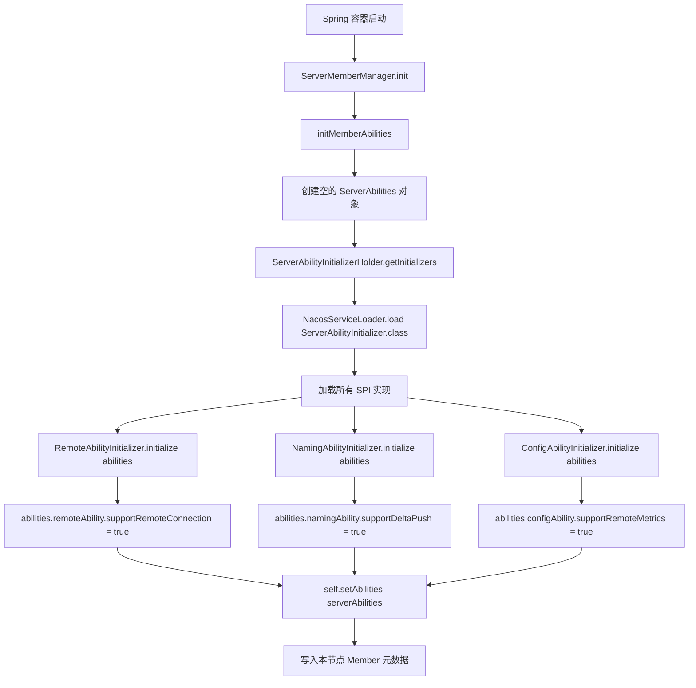
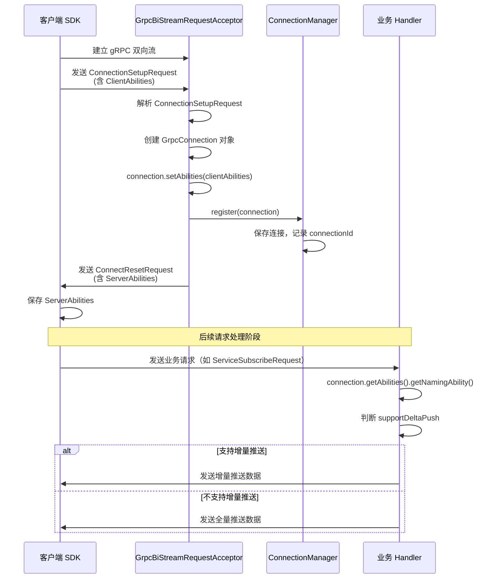
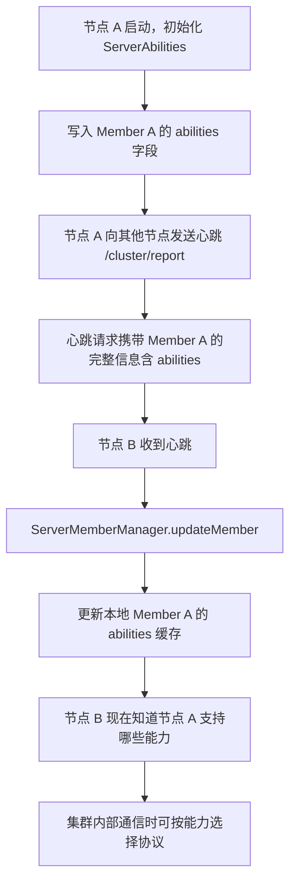
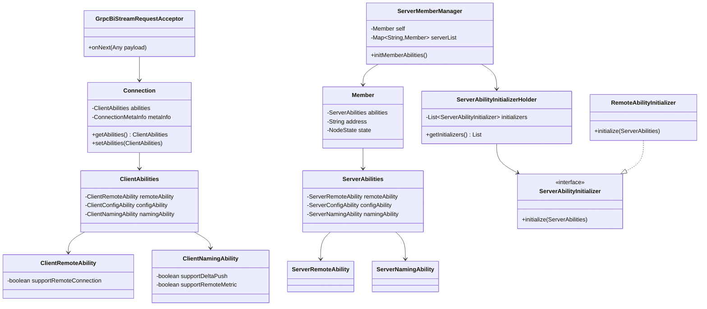

# 第15章：能力协商机制（Ability）

> 版本：Nacos 2.2.0  
> 核心类：`ClientAbilities` / `ServerAbilities` / `ServerAbilityInitializerHolder` / `GrpcBiStreamRequestAcceptor` / `Connection`  
> 模块路径：`api/src/main/java/com/alibaba/nacos/api/ability/`、`core/src/main/java/com/alibaba/nacos/core/ability/`

---

## 第0部分：核心原理（先问题后结构）

### 问题驱动

**Q1：能力协商机制解决了什么问题？**  
→ 解决**客户端/服务端版本不一致时的兼容性问题**。例如：老客户端（不支持增量推送）连接新服务端时，服务端通过 `ClientAbilities.namingAbility.supportDeltaPush=false` 感知到客户端不支持，自动降级为全量推送，避免客户端解析失败。

**Q2：能力协商发生在什么时机？**  
→ 发生在 **gRPC 双向流建立阶段**（`ConnectionSetupRequest`），是连接建立的第一个请求。客户端在此时上报自己的 `ClientAbilities`，服务端将其保存在 `Connection` 对象中，后续所有请求处理都可以通过 `connection.getAbilities()` 获取。

**Q3：服务端的能力（ServerAbilities）是如何构建的？**  
→ 通过 **SPI + 初始化器链**：`ServerAbilityInitializerHolder` 通过 `NacosServiceLoader` 加载所有 `ServerAbilityInitializer` SPI 实现，在 `ServerMemberManager.init()` 时依次调用各初始化器填充 `ServerAbilities` 对象，最终写入本节点的 `Member` 元数据。

**Q4：服务端如何将自己的能力告知客户端？**  
→ 通过 `ConnectResetRequest`（服务端主动推送给客户端的请求）携带 `ServerAbilities`，客户端收到后保存，后续可通过 `serverAbilities` 判断服务端支持哪些功能。

**Q5：能力协商与集群节点间的关系是什么？**  
→ `ServerAbilities` 不仅用于客户端协商，也用于**集群节点间的能力感知**。每个 `Member` 对象携带 `ServerAbilities`，通过心跳（`/cluster/report`）在节点间传播，使集群中每个节点都知道其他节点的能力，从而在集群内部通信时选择最优协议。

**Q6：如何新增一个能力字段？**  
→ 四步：① 在 `ClientXxxAbility` / `ServerXxxAbility` 中添加字段；② 实现 `ServerAbilityInitializer` 设置服务端默认值；③ 在 `META-INF/services/` 中注册初始化器；④ 在业务代码中通过 `connection.getAbilities()` 判断并选择处理路径。无需修改核心代码，符合开闭原则。

---

## 第1部分：数据结构全景

### 1.1 客户端能力：ClientAbilities

```java
// api/src/main/java/com/alibaba/nacos/api/ability/ClientAbilities.java
public class ClientAbilities implements Serializable {
    private ClientRemoteAbility remoteAbility = new ClientRemoteAbility();
    private ClientConfigAbility configAbility = new ClientConfigAbility();
    private ClientNamingAbility namingAbility = new ClientNamingAbility();
}
```

**各能力分组详情**：

| 能力分组 | 类 | 字段 | 含义 |
|----------|-----|------|------|
| 远程通信 | `ClientRemoteAbility` | `supportRemoteConnection` | 是否支持 gRPC 长连接（2.x 客户端为 true） |
| 配置能力 | `ClientConfigAbility` | `supportRemoteMetrics` | 是否支持远程指标上报 |
| 命名能力 | `ClientNamingAbility` | `supportDeltaPush` | 是否支持增量推送（减少数据传输量） |
| 命名能力 | `ClientNamingAbility` | `supportRemoteMetric` | 是否支持远程命名指标上报 |

**字段默认值**：所有 `boolean` 字段默认为 `false`，客户端 SDK 在初始化时根据自身版本显式设置为 `true`。

### 1.2 服务端能力：ServerAbilities

```java
// api/src/main/java/com/alibaba/nacos/api/ability/ServerAbilities.java
public class ServerAbilities implements Serializable {
    private ServerRemoteAbility remoteAbility = new ServerRemoteAbility();
    private ServerConfigAbility configAbility = new ServerConfigAbility();
    private ServerNamingAbility namingAbility = new ServerNamingAbility();
}
```

**各能力分组详情**：

| 能力分组 | 类 | 字段 | 含义 |
|----------|-----|------|------|
| 远程通信 | `ServerRemoteAbility` | `supportRemoteConnection` | 服务端是否支持 gRPC 长连接 |
| 配置能力 | `ServerConfigAbility` | `supportRemoteMetrics` | 服务端是否支持远程指标上报 |
| 命名能力 | `ServerNamingAbility` | `supportDeltaPush` | 服务端是否支持增量推送 |
| 命名能力 | `ServerNamingAbility` | `supportRemoteMetric` | 服务端是否支持远程命名指标上报 |

### 1.3 能力初始化器：ServerAbilityInitializer

```java
// core/src/main/java/com/alibaba/nacos/core/ability/ServerAbilityInitializer.java
public interface ServerAbilityInitializer {
    /**
     * 初始化服务端能力，各模块实现此接口填充自己负责的能力字段
     */
    void initialize(ServerAbilities abilities);
}
```

**已知实现**（通过 SPI 注册）：

| 实现类 | 所在模块 | 设置的能力 |
|--------|----------|------------|
| `RemoteAbilityInitializer` | `core` | `remoteAbility.supportRemoteConnection = true` |
| `NamingAbilityInitializer` | `naming` | `namingAbility.supportDeltaPush = true` 等 |
| `ConfigAbilityInitializer` | `config` | `configAbility.supportRemoteMetrics = true` 等 |

### 1.4 能力初始化器持有者：ServerAbilityInitializerHolder

```java
// core/src/main/java/com/alibaba/nacos/core/ability/ServerAbilityInitializerHolder.java
public class ServerAbilityInitializerHolder {
    private static volatile List<ServerAbilityInitializer> initializers;

    public static List<ServerAbilityInitializer> getInitializers() {
        if (initializers == null) {
            synchronized (ServerAbilityInitializerHolder.class) {
                if (initializers == null) {
                    // 通过 SPI 加载所有实现
                    initializers = new ArrayList<>(
                        NacosServiceLoader.load(ServerAbilityInitializer.class)
                    );
                }
            }
        }
        return initializers;
    }
}
```

- **双重检查锁**：保证线程安全的懒加载。
- **SPI 加载**：`NacosServiceLoader.load()` 扫描所有 `META-INF/services/` 下的注册文件，加载所有实现类。

### 1.5 Connection 对象持有 ClientAbilities

```java
// core/src/main/java/com/alibaba/nacos/core/remote/Connection.java
public abstract class Connection implements Requester {
    private ConnectionMetaInfo metaInfo;
    private ClientAbilities abilities;   // 该连接对应客户端的能力

    public ClientAbilities getAbilities() {
        return abilities;
    }

    public void setAbilities(ClientAbilities abilities) {
        this.abilities = abilities;
    }
}
```

- **生命周期**：`Connection` 对象在 `GrpcBiStreamRequestAcceptor` 处理 `ConnectionSetupRequest` 时创建，`abilities` 字段在此时设置，随连接生命周期存在，连接断开时销毁。
- **使用方式**：业务 Handler 通过 `RequestHandlerContext.getCurrentConnection().getAbilities()` 获取，判断客户端能力后选择处理路径。

---

## 第2部分：算法流程

### 2.1 服务端能力初始化流程



### 2.2 连接建立时的能力交换流程



### 2.3 集群节点间能力同步流程



---

## 第3部分：能力协商在业务中的应用

### 3.1 增量推送场景（Naming 模块）

```java
// 服务端推送时判断客户端是否支持增量推送
public void pushServiceInfo(Connection connection, ServiceInfo serviceInfo) {
    ClientAbilities abilities = connection.getAbilities();
    if (abilities != null
            && abilities.getNamingAbility() != null
            && abilities.getNamingAbility().isSupportDeltaPush()) {
        // 客户端支持增量推送：只发送变更的实例
        pushDeltaServiceInfo(connection, serviceInfo);
    } else {
        // 客户端不支持增量推送：发送全量服务信息
        pushFullServiceInfo(connection, serviceInfo);
    }
}
```

### 3.2 远程指标上报场景（Config 模块）

```java
// 判断客户端是否支持远程指标上报
if (connection.getAbilities().getConfigAbility().isSupportRemoteMetrics()) {
    // 收集并上报配置监听指标
    collectAndReportMetrics(connection);
}
```

### 3.3 服务端能力判断场景（集群内部）

```java
// 集群内部通信时，判断目标节点是否支持某能力
Member targetMember = serverMemberManager.find(targetAddress);
ServerAbilities targetAbilities = targetMember.getAbilities();
if (targetAbilities.getRemoteAbility().isSupportRemoteConnection()) {
    // 目标节点支持 gRPC，使用 gRPC 通信
    grpcClusterClient.request(targetMember, request);
} else {
    // 目标节点不支持 gRPC（老版本），降级为 HTTP
    httpClusterClient.request(targetMember, request);
}
```

---

## 第4部分：扩展指南

### 4.1 如何新增一个能力字段（完整步骤）

以新增「支持批量注册」能力为例：

**Step 1：在 API 模块添加能力字段**

```java
// api/ability/ClientNamingAbility.java
public class ClientNamingAbility implements Serializable {
    private boolean supportDeltaPush;
    private boolean supportRemoteMetric;
    private boolean supportBatchRegister;  // 新增字段
}

// api/ability/ServerNamingAbility.java
public class ServerNamingAbility implements Serializable {
    private boolean supportDeltaPush;
    private boolean supportRemoteMetric;
    private boolean supportBatchRegister;  // 新增字段
}
```

**Step 2：实现 ServerAbilityInitializer**

```java
// naming/ability/NamingBatchRegisterAbilityInitializer.java
public class NamingBatchRegisterAbilityInitializer implements ServerAbilityInitializer {
    @Override
    public void initialize(ServerAbilities abilities) {
        abilities.getNamingAbility().setSupportBatchRegister(true);
    }
}
```

**Step 3：注册 SPI**

```
# 文件：META-INF/services/com.alibaba.nacos.core.ability.ServerAbilityInitializer
# 追加一行：
com.alibaba.nacos.naming.ability.NamingBatchRegisterAbilityInitializer
```

**Step 4：客户端 SDK 设置能力**

```java
// client/naming/NacosNamingService.java 初始化时
ClientAbilities abilities = new ClientAbilities();
abilities.getNamingAbility().setSupportBatchRegister(true);
connection.setAbilities(abilities);
```

**Step 5：服务端业务代码中使用**

```java
// naming/handler/InstanceRequestHandler.java
@Override
public InstanceResponse handle(InstanceRequest request, RequestMeta meta) {
    Connection connection = connectionManager.getConnection(meta.getConnectionId());
    boolean supportBatch = connection.getAbilities() != null
        && connection.getAbilities().getNamingAbility().isSupportBatchRegister();

    if (supportBatch && request.getInstances().size() > 1) {
        return handleBatchRegister(request, meta);
    }
    return handleSingleRegister(request, meta);
}
```

### 4.2 能力字段的向后兼容原则

1. **新字段默认值为 false**：老客户端不设置新字段，默认 false，服务端走老逻辑，保证向后兼容。
2. **服务端先支持，客户端后跟进**：先在服务端实现新能力并设置 `ServerAbilities`，客户端升级后再设置 `ClientAbilities`，中间过渡期两者都能正常工作。
3. **能力字段只增不减**：已发布的能力字段不能删除，否则会导致老版本客户端/服务端解析失败（JSON 反序列化时忽略未知字段，但删除字段会导致老代码中的 getter 返回默认值）。

---

## 第5部分：运行时验证

### 5.1 验证目标

| 编号 | 目标 | 方法 |
|------|------|------|
| V1 | ServerAbilities 初始化正确（各模块能力字段被正确设置） | 单测 `ServerAbilityInitializerHolderTest` |
| V2 | 连接建立时 ClientAbilities 被正确保存到 Connection | 单测 `GrpcBiStreamRequestAcceptorTest` |
| V3 | 集群心跳携带 ServerAbilities 并被正确解析 | 单测 `ServerMemberManagerTest` |
| V4 | 能力字段序列化/反序列化正确（JSON 兼容性） | 单测 `ClientAbilitiesTest` |

### 5.2 执行命令

```bash
# 验证能力初始化
mvn -pl core -Dtest=ServerAbilityInitializerHolderTest test \
    -DfailIfNoTests=false -Dcheckstyle.skip=true

# 验证 API 模块序列化
mvn -pl api -Dtest=ClientAbilitiesTest,ServerAbilitiesTest test \
    -DfailIfNoTests=false -Dcheckstyle.skip=true
```

### 5.3 手动验证（查看节点能力）

```bash
# 查看当前节点的 ServerAbilities（通过集群节点列表接口）
curl -X GET 'http://localhost:8848/nacos/v1/core/cluster/nodes?withInstances=false' | \
    python3 -m json.tool | grep -A 20 '"abilities"'
```

**预期输出**：
```json
{
  "abilities": {
    "remoteAbility": {
      "supportRemoteConnection": true
    },
    "configAbility": {
      "supportRemoteMetrics": true
    },
    "namingAbility": {
      "supportDeltaPush": true,
      "supportRemoteMetric": true
    }
  }
}
```

---

## 数据结构关系图



---

## 总结

### 数据结构维度

- **客户端能力**：`ClientAbilities`（remoteAbility + configAbility + namingAbility），在 `ConnectionSetupRequest` 中上报，保存在 `Connection` 对象中。
- **服务端能力**：`ServerAbilities`（同结构），通过 SPI 初始化器链构建，写入 `Member` 元数据，随心跳在集群间传播。
- **Connection 是能力的载体**：每个 gRPC 连接对应一个 `Connection` 对象，持有该连接客户端的 `ClientAbilities`，业务代码通过它判断客户端能力。

### 算法维度

- **初始化**：`ServerAbilityInitializerHolder` 通过 SPI 加载所有初始化器，在 `ServerMemberManager.init()` 时依次调用，填充 `ServerAbilities`。
- **协商**：`ConnectionSetupRequest` 携带 `ClientAbilities` → `GrpcBiStreamRequestAcceptor` 解析并存入 `Connection` → 业务代码按需读取。
- **传播**：`ServerAbilities` 随心跳（`/cluster/report`）在集群节点间传播，实现集群内能力感知。

### 关键纠偏

- 能力协商**不是握手协议**，不存在"协商失败"的情况——服务端只是读取客户端能力后选择处理路径，不会因为客户端不支持某能力而拒绝连接。
- `ClientAbilities` 中的字段默认值为 `false`，**老客户端不设置新字段时，服务端会走老逻辑**，这是向后兼容的核心保障。
- `ServerAbilities` 的构建遵循**开闭原则**：新增能力只需新增 SPI 实现，无需修改 `ServerAbilities` 类的初始化逻辑。

---

*文档生成时间：2026-03-05*  
*对应源码版本：Nacos 2.x*
